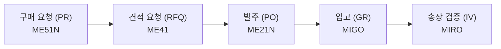

## 오늘 학습 목표

SAP MM 모듈의 전체 구조와 주요 하위 컴포넌트를 파악한다.

---

## SAP MM 모듈 개요

SAP MM(Materials Management)은 SAP ERP의 핵심 모듈 중 하나로, 기업의 **자재 조달부터 재고 관리**까지 전체 공급망 프로세스를 지원합니다.

### MM 모듈의 주요 영역

| 영역 | 설명 | 핵심 T-code |
|------|------|------------|
| Procurement | 구매 요청 → 발주 → 입고 | ME51N, ME21N, MIGO |
| Inventory Management | 재고 이동 및 관리 | MIGO, MB52, MI01 |
| Invoice Verification | 송장 검증 및 처리 | MIRO, MIR4 |
| Master Data | 자재·공급업체 기준정보 | MM01, XK01 |

---

## 핵심 개념: 구매 프로세스 흐름

---

## 오늘 배운 것

1. **MM 모듈의 위치**: SAP의 Logistics 영역에 속하며 SD(영업), PP(생산)와 긴밀히 연계
2. **조직 구조**: Client > Company Code > Plant > Storage Location 계층
3. **자재 유형(Material Type)**: ROH(원자재), HALB(반제품), FERT(완제품), HIBE(소모품)

---

## 다음 학습 계획

- Day 02: 자재 마스터(Material Master) 구조 상세 파악
- 참고: MM01 T-code로 자재 마스터 생성 실습 예정

---

## 메모

> SAP MM의 핵심은 **3-way matching**: PO(발주) + GR(입고) + IR(송장)이 일치해야 대금 지급이 승인됨.
