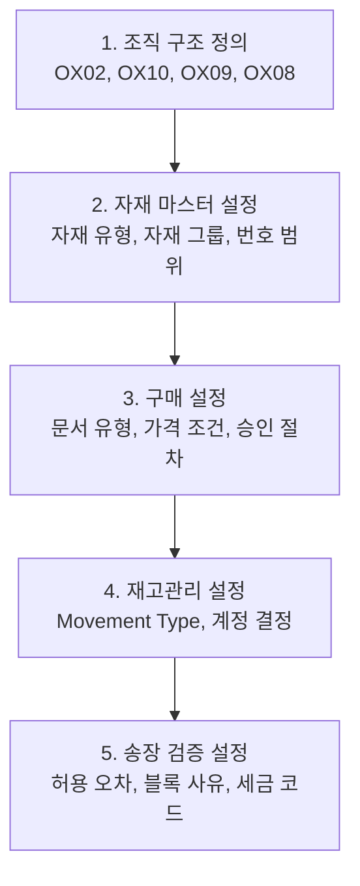

# SAP MM SPRO 설정 가이드

## 개요

SPRO(SAP Project Reference Object)는 SAP 시스템의 Customizing 진입점입니다.
이 가이드는 MM 모듈 운영에 필요한 핵심 설정 경로를 영역별로 정리합니다.

---

## MM 설정 영역 네비게이션

| 설정 영역 | 내용 |
|----------|------|
| [기준 정보 설정]({{ '/config-guide/master-data/' | relative_url }}) | 자재 유형, 평가 클래스, 조직 구조 |
| [구매 설정]({{ '/config-guide/purchasing/' | relative_url }}) | 문서 유형, 번호 범위, 승인 절차, 가격 조건 |
| [재고관리 설정]({{ '/config-guide/inventory/' | relative_url }}) | Movement Type, 재고 유형, 실사 |
| [송장 검증 설정]({{ '/config-guide/invoice/' | relative_url }}) | 허용 오차, 자동 계정, 세금 코드 |

---

## SPRO 전체 경로 구조 (MM)

<pre>
SPRO
└── Materials Management (MM)
    ├── General Settings
    │   ├── Define Organizational Units   ← 조직 구조 (Plant, SLoc)
    │   └── Assign Organizational Units
    ├── Material Master                   ← 자재 마스터 설정
    ├── Purchasing                        ← 구매 설정
    ├── Inventory Management              ← 재고관리 설정
    ├── Logistics Invoice Verification    ← 송장 검증 설정
    └── Valuation and Account Assignment  ← 평가 및 계정 결정 (OBYC)
</pre>

---

## 핵심 T-code (설정 관련)

| T-code | 설명 |
|--------|------|
| SPRO | Customizing 진입점 |
| OMJJ | Movement Type 설정 |
| OBYC | 자동 계정 결정 |
| OX02 | Company Code 정의 |
| OX10 | Plant 정의 |
| OX08 | Purchasing Organization 정의 |
| OME4 | Purchasing Group 생성 |
| CUNI | Unit of Measure 관리 |

---

## 설정 적용 순서 (신규 시스템 구축 시)

