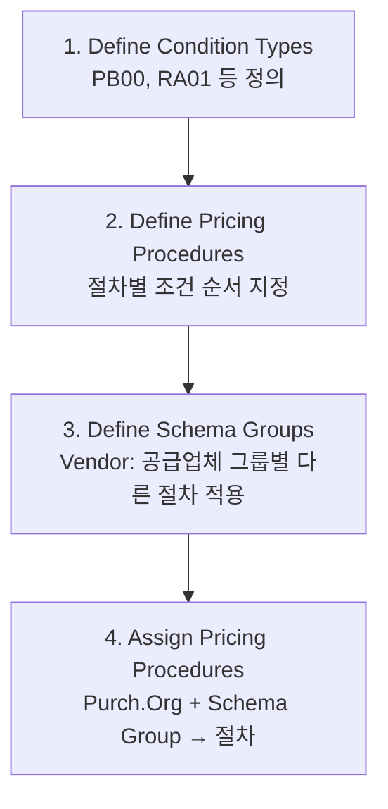

# 구매관리 (Purchasing) SPRO 설정 가이드

## 전체 구조

<pre>
SPRO
└── Materials Management
    └── Purchasing
        ├── Document Types
        │   ├── Define Document Types for PR    ← PR 문서 유형
        │   └── Define Document Types for PO    ← PO 문서 유형: NB, FO, UB
        ├── Number Ranges
        │   ├── Define Number Ranges for PR
        │   └── Define Number Ranges for PO
        ├── Purchasing Groups                   ← 구매 그룹 생성 (OME4)
        ├── Define Tolerance Limits for PO      ← PO 허용 오차
        ├── Account Assignment
        │   └── Define Account Assignment Categories  ← K, F, P, A
        ├── Authorization
        │   └── Release Procedure               ← PR/PO 승인 설정
        └── Conditions (가격 조건)
            ├── Define Condition Types          ← PB00, PBXX, RA01 등
            ├── Define Pricing Procedure        ← 가격 결정 절차
            ├── Define Schema Groups
            │   ├── For Vendor                  ← 공급업체 스키마 그룹
            │   └── For Purchasing Organization
            └── Assign Pricing Procedure        ← 스키마 그룹 → 가격 절차 연결
</pre>

---

## 문서 유형 설정 (PO)

| 유형 코드 | 설명 | 주요 설정 |
|---------|------|---------|
| NB | 표준 발주 | 번호 범위 45xxxxxxxx |
| FO | Framework Order (장기 계약) | 유효 기간 설정 |
| UB | 플랜트 간 이동 (STO) | 공급 플랜트 지정 |

### 문서 유형 주요 설정 항목

- **Number Range**: 채번 범위 (내부/외부 번호 부여)
- **Item Number Interval**: 아이템 번호 증가 단위 (예: 10)
- **Item Category Allowed**: 허용 아이템 카테고리 (공백, L, K, D 등)
- **Account Assignment**: 허용 계정 지정 유형

---

## 계정 지정 카테고리 (Account Assignment)

| 카테고리 | 코드 | 설명 | 필요 정보 |
|---------|------|------|---------|
| 원가 센터 | K | 소모품/운영 비용 | 원가 센터 번호 |
| 내부 오더 | F | 이벤트/프로젝트 비용 | 내부 오더 번호 |
| WBS 요소 | P | PS 프로젝트 구매 | WBS 요소 코드 |
| 자산 | A | 유형 자산 취득 | 자산 번호 |

> SPRO → MM → Purchasing → Account Assignment → Define Account Assignment Categories
{: .callout .callout-note}

---

## 가격 조건 (Conditions) 설정

### 조건 유형 (Condition Types)

| 조건 키 | 설명 | 계산 방식 |
|--------|------|---------|
| PB00 | 총 발주 금액 | 수동 입력 |
| PBXX | 단가 조건 (자동) | Info Record 자동 복사 |
| RA01 | 할인 조건 | % 또는 절대 금액 |
| FRA1 | 운임 조건 | 절대 금액 또는 % |

### 가격 결정 절차 설정 경로

---

## 승인 절차 (Release Procedure)

<pre>
SPRO → MM → Purchasing → Authorization → Release Procedure
├── Define Release Groups           ← 릴리스 그룹 정의
├── Define Release Codes            ← 릴리스 코드 (담당자/직급)
├── Define Release Indicators       ← 상태 표시 (블록/릴리스)
├── Define Release Strategies       ← 조건 (금액, 조직 등)
└── Workflow Settings               ← 알림 설정
</pre>

### 릴리스 전략 조건 예시

| 조건 | 설명 |
|------|------|
| 금액 기준 | 1,000만원 초과 → 부장 승인 |
| 구매 그룹 | 특정 구매 그룹 PR만 승인 |
| Plant | 특정 플랜트 PO 별도 승인 |

---

## 관련 트랜잭션 페이지

- [구매 요청서 (ME51N)](/mm/purchasing/01-purchase-requisition/)
- [RFQ & 견적 비교 (ME41)](/mm/purchasing/02-rfq-quotation/)
- [구매 발주서 (ME21N)](/mm/purchasing/03-purchase-order/)
- [입고 처리 (MIGO)](/mm/purchasing/04-goods-receipt/)
- [특수 조달](/mm/purchasing/05-special-procurement/)
