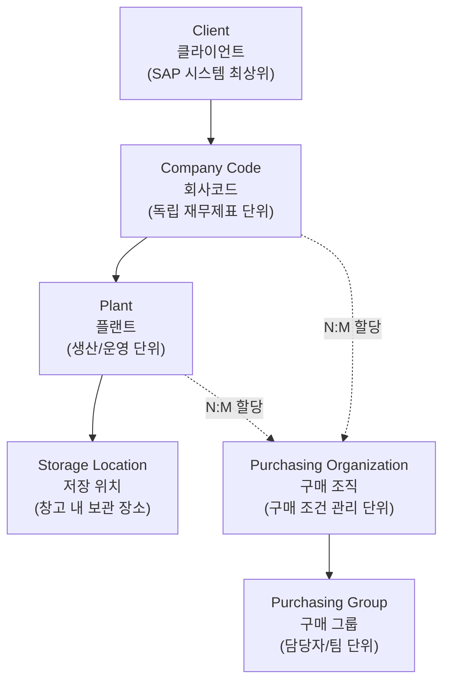
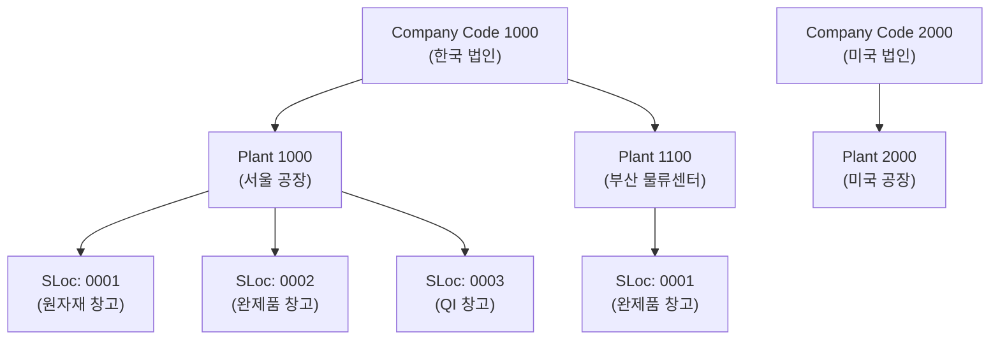
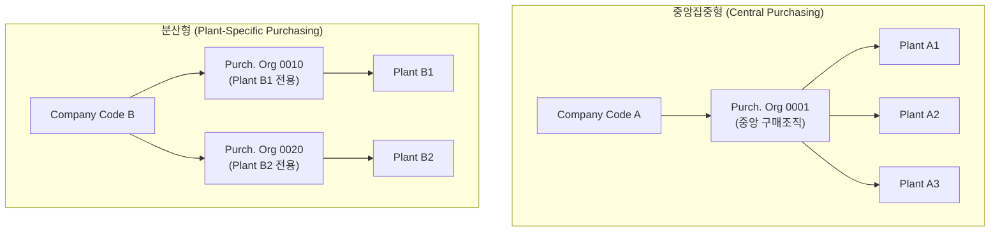
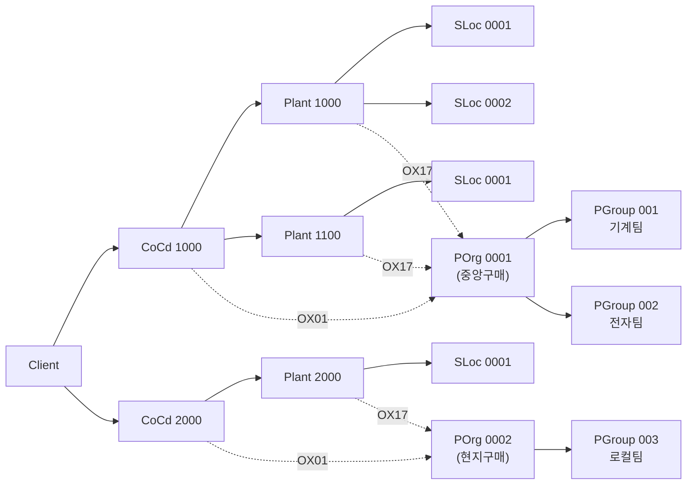

# SAP 기업 구조 (Enterprise Structure)

SAP MM에서 모든 프로세스의 기반이 되는 조직 단위들의 계층 구조와 할당 관계를 정리합니다.

---

## 1. 전체 조직 계층

| 조직 단위 | 레벨 | 설명 | 예시 |
|----------|------|------|------|
| Client | 최상위 | SAP 시스템 내 독립 환경. 데이터 완전 분리 | 그룹사 전체 |
| Company Code | 2 | 독립 재무제표 작성 단위 (1:N Plant) | 각 법인 |
| Plant | 3 | 재고 평가/MRP 기준 단위 (1:N SLoc) | 서울 공장, 부산 물류센터 |
| Storage Location | 4 | Plant 내 구체적 보관 위치 | 원자재창고, 완제품창고 |
| Purch. Org | 별도 계층 | 구매 협상/조건 관리 (N:M CoCd/Plant) | 중앙구매조직, 현지구매조직 |
| Purch. Group | Purch. Org 하위 | 실무 구매 담당 단위 | 기계팀, 전자팀 |

> **Plant**는 단순 공장 외에 물류센터, 판매지사, 본부도 될 수 있습니다. 재고 평가(Valuation Area)의 기준 단위이므로 초기 정의가 매우 중요합니다.
{: .callout .callout-important}

---

## 2. Company Code - Plant 할당 관계

- Company Code 1개는 여러 Plant를 가질 수 있음 (1:N)
- Plant 1개는 1개의 Company Code에만 속함 (N:1)
- Storage Location은 반드시 특정 Plant에 속함

---

## 3. Purchasing Organization 유형

| 유형 | 설명 | 특징 |
|------|------|------|
| 중앙집중형 | Company Code 레벨에 구매조직 1개 | 협상력 강화, 가격 경쟁력, Global Procurement 적합 |
| 분산형 | Plant별 전용 구매조직 | 로컬 구매 비율 높음, 배송 정보 획득 용이 |
| 표준 구매조직 | 여러 구매조직이 조달하는 Plant의 대표 구매조직 | STO, Consignment 소스 자동 결정에 사용 |
| 기준 구매조직 | 유리한 계약 조건을 다른 구매조직이 공유 | 기준 구매조직의 조건 레코드를 가격 결정에 활용 |

---

## 4. 전체 할당 맵

---

## 5. SPRO 설정 T-code

### 정의 (Definition)

| T-code | SPRO 경로 | 설명 |
|--------|----------|------|
| OX02 | ES - Definition - FI - Edit, Copy... Company Code | 회사코드 생성/변경 |
| OX10 | ES - Definition - Logistics - Define, Copy... Plant | 플랜트 생성 |
| OX09 | ES - Definition - MM - Maintain Storage Locations | 저장위치 생성 |
| OMKJ | ES - Definition - MM - Maintain Purchasing Organizations | 구매조직 생성 |
| OME4 | MM - Purchasing - Create Purchasing Groups | 구매그룹 생성 |

### 할당 (Assignment)

| T-code | SPRO 경로 | 설명 |
|--------|----------|------|
| OX18 | ES - Assignment - Logistics - Assign Plant to Company Code | 플랜트 - 회사코드 지정 |
| OX01 | ES - Assignment - MM - Assign Purch. Org to Company Code | 구매조직 - 회사코드 지정 |
| OX17 | ES - Assignment - MM - Assign Purch. Org to Plant | 구매조직 - 플랜트 지정 |
| OMKI | ES - Assignment - MM - Assign Standard Purch. Org to Plant | 표준 구매조직 지정 |

---

필드 - 마스터 연관 (SPRO 세부 경로)

| 화면 필드 | 데이터 출처 | SPRO 경로 | T-code |
|---------|-----------|----------|--------|
| Company Code | 회사코드 마스터 | Enterprise Structure - Definition - Financial Accounting - Edit, Copy... CC | OX02 |
| Plant | 플랜트 마스터 | Enterprise Structure - Definition - Logistics - Define, Copy... Plant | OX10 |
| Storage Location | 저장위치 마스터 | Enterprise Structure - Definition - MM - Maintain Storage Locations | OX09 |
| Purch. Organization | 구매조직 마스터 | Enterprise Structure - Definition - MM - Maintain Purchasing Organizations | OMKJ |
| Purch. Group | 구매그룹 마스터 | MM - Purchasing - Create Purchasing Groups | OME4 |

---

## 관련 문서

- [MM 모듈 개요]({{ '/process/01-overview/' | relative_url }}) - MM 전체 개념 및 조직 구조 요약
- [SPRO 설정 가이드]({{ '/config-guide/index/' | relative_url }}) - Customizing 설정 경로 정리
- [SAP MM 조직구조 완벽 가이드]({{ '/enterprise-structure/lib/mm_organization_structure/' | relative_url }}) - Plant/Storage Location/Purchasing Org 심화 정리 및 실무 사례
