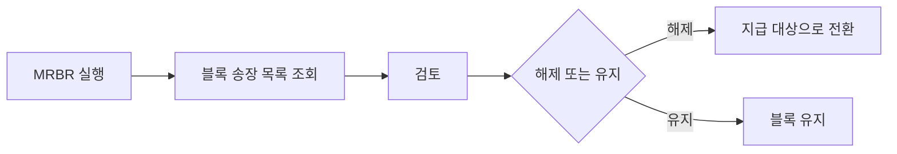

# 송장 블록 (Invoice Blocks)

## 개요

송장 블록은 검증 과정에서 **허용 오차를 초과하거나 특정 조건**이 충족될 때 지급을 보류하는 기능입니다.
블록된 송장은 검토 후 해제(MRBR)하거나 취소(MR8M)합니다.

---

## 블록 유형

### 자동 블록 (System Block)

SAP가 자동으로 설정하는 블록:

| 블록 코드 | 설명 | 원인 |
|---------|------|------|
| R | 가격 차이 블록 | PO 단가 vs 청구 단가 허용 오차 초과 |
| Q | 수량 차이 블록 | GR 수량 vs 청구 수량 불일치 |
| D | 날짜 블록 | 납기일 편차 초과 |
| W | 검수 필요 | QM 연계 검수 미완료 |

### 수동 블록 (Manual Block)

담당자가 직접 설정:

- MIRO 입력 시 **Payment Block** 필드에 수동 입력
- 분쟁, 추가 확인 필요, 부서 승인 대기 등

---

## 블록 해제 프로세스 (MRBR)

### MRBR 화면
- 블록 사유별 필터링 가능
- 대량 해제 지원
- 해제 후 자동 지급 대상으로 전환

---

## 블록 관련 T-code

| T-code | 설명 |
|--------|------|
| MRBR | 블록 송장 해제 |
| MIR4 | 송장 문서 조회 (블록 상태 확인) |
| MR8M | 송장 취소 |
| MIR6 | 송장 개요 (블록 목록) |

---

## 블록 예방 방법

1. **Info Record 최신화**: 실제 거래 단가를 Info Record에 업데이트
2. **허용 오차 적절 설정**: SPRO → MM → LIV → Invoice Block
3. **GR-Based IV 활성화**: 입고 수량 기준 매칭으로 수량 불일치 예방
4. **공급업체 소통**: 청구서 번호, 금액, 수량 사전 확인

---

## 자동 지급 정산 (ERS - Evaluated Receipt Settlement)

블록의 반대 개념으로, 검증을 생략하고 GR 기준으로 자동 송장 생성:

- **조건**: PO와 Info Record의 단가가 동일하고 신뢰할 수 있는 공급업체
- **T-code**: MRRL (ERS 실행)
- **장점**: 송장 처리 업무 제거, 자동화
- **설정**: PO 아이템 Invoice 탭 → ERS 체크

---

## 3-way Matching 오차 허용 설정

> SPRO → MM → Logistics Invoice Verification → Invoice Block → Set Tolerance Limits
{: .callout .callout-note}

| 허용 키 | 적용 |
|--------|------|
| PP | 단가 편차 (%) |
| BD | 총액 편차 (절대 금액) |
| DQ | 수량 초과 (%) |
| ST | 소액 차이 자동 처리 |

---

## 스크린샷

> 스크린샷은 실제 SAP 시스템에서 캡쳐 후 아래에 추가합니다.
> 이미지 경로: `assets/img/invoice/mrbr-{순번}-{설명}.png`

<!-- 예시:  -->
<!-- 예시:  -->

---

필드 → 마스터 연관

| 화면 필드 | 데이터 출처 | 설정/관리 위치 | 비고 |
|---------|-----------|-------------|------|
| Tolerance Key (PP/BD/DQ/ST) | 허용 오차 설정 | SPRO → MM → LIV → Invoice Block → Set Tolerance Limits | 초과 시 자동 블록 |
| Block Reason Code | 블록 사유 마스터 | SPRO → MM → LIV → Invoice Block → Define Blocking Reason | R, Q, D, W 등 |
| Payment Block | MIRO 화면 수동 입력 | - | 수동 블록 시 담당자 입력 |
| ERS 설정 | PO / Info Record | ME21N → Item → Invoice 탭 / ME11 Control Data | ERS 체크 시 자동 정산 |

---

## 관련 SPRO 설정

→ [송장 설정 가이드](/mm/config-guide/invoice/) 참조
