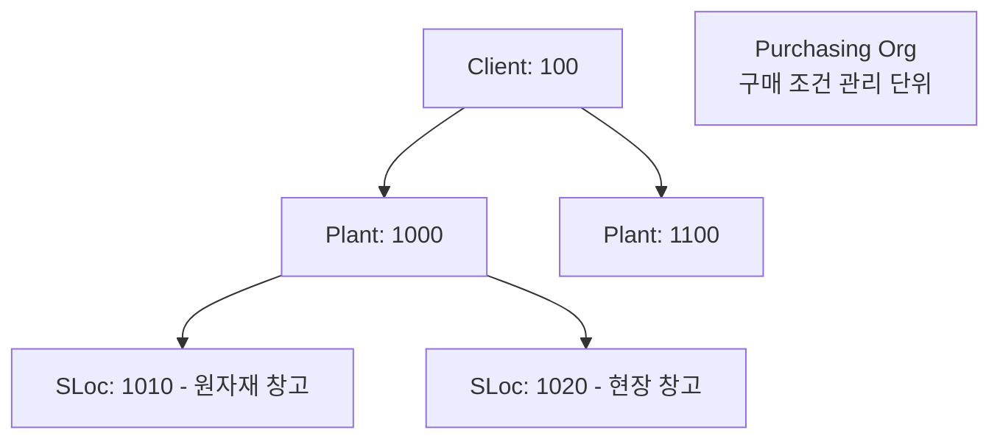

# 자재 기준 정보 (Material Master)

## 데이터 유형 (Type of Data)

SAP에서 데이터는 크게 세 가지로 구분됩니다.

| 유형 | 설명 | 예시 |
|------|------|------|
| **Master Data** | 자체 고유 번호를 가지며 프로세스에 의해 변화하지 않는 데이터. 업무 수행의 근간 | Vendor Master, Material Master |
| **Transaction Data** | Master Data와 Code를 이용하여 업무를 실행했을 때 발생하는 데이터 | Purchase Order (PO: 4500000010) |
| **Code (Metadata)** | 단위 업무 프로세스에서 공유하는 코드 성격의 데이터. Code Key + Value로 구성 | Purchase Group (P01: 포장자재 담당, P02: 설비자재 담당) |

> **Master Data란?** 자신의 고유한 Number를 가지고, Process에 의해 변화하지 않으며, 업무수행에 근간이 되는 Data. Master가 부정확 시 경영에 대한 계획 및 실적 관리가 불가능합니다.
{: .callout .callout-important}

### 기준 정보의 4가지 요건

프로세스가 효과적으로 실행되려면 Master Data가 다음 4가지 요건을 충족해야 합니다:

| 요건 | 설명 |
|------|------|
| **정확성 (Accuracy)** | 데이터가 실제 비즈니스 현실을 정확하게 반영 |
| **신속성 (Timeliness)** | 필요한 시점에 최신 데이터를 제공 |
| **신뢰성 (Reliability)** | 일관성 있게 동일한 결과를 제공 |
| **활용성 (Utilization)** | 여러 업무 프로세스에서 효율적으로 재사용 가능 |

---

## MDM (Master Data Management)

| 기준정보 영역 | 주요 대상 |
|------------|---------|
| 제품/자재 | 자재 특성, 규격, 중량, 색상 등 |
| 고객 | 고객 이름, 주소, 전화번호 등 |
| 공급업체 | 공급업체 이름, 상위조직, 주소, 전화번호 등 |
| 임직원 | 사번, 이름, 직책/직급, 부서 등 |

### 전사 기준정보 vs 모듈 기준정보

| 구분 | 설명 | 대표 예시 |
|------|------|---------|
| **전사 기준정보 (General Master Data)** | 모든 모듈에서 공통으로 활용 | Material Master, Customer Master, Vendor Master |
| **모듈 기준정보 (Module Master Data)** | 각 모듈 단위로 사용 | (MM) Info Record, Source List, Quota Arrangement |

### 모듈별 기준정보 (Module Master Data)

| 모듈 | 기준정보 | 설명 |
|------|---------|------|
| **FI** | Chart of Account | 재무회계상의 계정과목표 |
| **FI** | Vendor Master | 공급업체 업무 거래 정보 |
| **FI** | Customer Master | 고객 업무 거래 정보 |
| **FI** | Asset Master | 고정 자산 마스터 (유형, 무형) |
| **CO** | Profit Center | 기업 내부 책임 영역별 손익 관리 단위 |
| **CO** | Cost Center | 비용을 집계하는 최소단위 |
| **PP** | BOM | 자재명세서 |
| **PP** | Routing | 자재 생산의 단계별 작업 순서 |
| **PP** | Work Center | 생산 작업장, 코스트센터 지정 |
| **MM** | Material Master | 회사 내 모든 자재 데이터 관리 |
| **MM** | Vendor Master | 공급처 업무 거래 정보 |
| **MM** | Info Record | 자재-업체간 구매 단가 정보 |
| **MM** | Source List | 자재별 고정 협력업체 목록 |
| **MM** | Quota Arrangement | 협력업체별 물량 배분율 |

---

## Material Master 개요

Material Master는 SAP MM의 **핵심 기준 정보**입니다.
구매, 생산, 재고, 회계 등 모든 모듈이 공유하는 자재 데이터 저장소입니다.

- SAP의 모든 물류 관리 시스템에서 공통으로 사용 가능한 **단일 데이터베이스 (Single DB)**
- 기업 내 여러 부서가 동일한 자재 번호를 함께 사용
- 부서별로 필요한 정보를 View 단위로 분리 관리

### Material Master의 주요 활용

| 활용 영역 | 설명 |
|----------|------|
| 구매 발주 생성 | 구매 그룹, 납기일, 발주 단위 등 기본값 제공 |
| MRP 실행 | 소요량 계획, 안전재고, 리드타임 기준 |
| 표준 원가 계산 | BOM + Routing과 연계하여 원가 계산 |
| 영업 수주 | 제품 정보, Division, 아이템 범주 결정 |
| 재고 평가 | 평가 클래스, 가격 통제 방식 |

---

## 조직 구조 (Data Levels)

Material Master 데이터는 3개의 조직 레벨에서 관리됩니다:

| 레벨 | 설명 | 해당 뷰 예시 |
|------|------|------------|
| **Client (전사)** | 전사 공통 데이터, 자재번호 채번 단위 | Basic Data, Classification |
| **Plant (플랜트)** | 플랜트별 생산/구매 조건 | Purchasing, MRP, Accounting, Work Scheduling |
| **Storage Location (저장위치)** | 재고 수량 관리 단위 | Storage Location Stock |



---

## 뷰 구조 (View Structure)

Material Master 구조는 약 **29개 Main View + 8개 Additional Data = 37개 View**, 총 **500여 개 이상의 필드**로 구성됩니다.

MM01 실행 시 필요한 **뷰(View)**를 선택하여 데이터 입력:

| 뷰 | Status 코드 | 조직 레벨 | 주요 필드 |
|----|------------|----------|----------|
| Basic Data 1/2 | K | Client | 자재 설명, 기본 단위, 자재 그룹, Division |
| Classification | C | Client | 분류 특성 |
| Sales | V | Sales Org/Dist.Ch | 판매 관련 데이터 (SD 연계) |
| Purchasing | E | Plant | 구매 그룹, 계획 납기일, GR 처리 시간 |
| MRP 1~4 | D | Plant | MRP 방식, 로트 크기, 안전 재고 |
| Forecasting | P | Plant | 수요 예측 파라미터 |
| Work Scheduling | A | Plant | 생산 일정 (PP 관련) |
| Quality Management | Q | Plant | 품질 검사 데이터 |
| Accounting 1/2 | B | Plant | 평가 클래스, 이동평균 단가/표준 단가 |
| Costing | G | Plant | 원가 계산 관련 |
| Storage | L | Plant/SLoc | 재고 단위, 보관 조건, 재고 수량 |
| Warehouse Management | S | Warehouse | 창고 관리 |

---

## 산업부문 & 자재 유형

### 산업부문 (Industry Sector)

Material Master에서 특정 산업에 특화된 데이터가 표시되도록 결정합니다.
- **M**: Mechanical Engineering (기계)
- **P**: Plant Engineering (플랜트 엔지니어링)
- **A**: Aerospace & Defense (항공방위)
- 등 산업별 필드 설정이 다름

### 자재유형 (Material Type)

비슷한 성격의 자재를 그룹화. 자재 생성 시 필수 선택 항목.

| 유형 | 코드 | 설명 | 수량 관리 | 금액 관리 |
|------|------|------|----------|----------|
| 원자재 | ROH | Raw Material | O | O |
| 반제품 | HALB | Semi-Finished Product | O | O |
| 완제품 | FERT | Finished Product | O | O |
| 상품 | HAWA | Trading Goods | O | O |
| 서비스 | DIEN | Service | - | - |
| 비재고품 | NLAG | Non-Stock Material (소비 직접 처리) | - | - |
| 비평가품 | UNBW | Non-Valuated Material | O | - |
| 포장재 | VERP | Packaging | O | O |
| 가격관리 | WERT | Value-Only Materials | - | O |

**자재유형에 따라 결정되는 항목:**
- Material 생성 시 사용 가능한 View
- 필드 속성 (필수/선택/표시)
- 자재번호 채번 범위 (Number Range)
- 재고관리 유형 (수량/금액 재고자산 관리 여부)
- 구매 유형 (내부 생산 / 외부 조달)
- 계정 지정 범주

> SPRO `[OMS2]` Logistics - General - Material Master - Basic Settings - Material Types - Define Attributes of Material Types
{: .callout .callout-tip}

### 수량 관리 vs 금액 관리

자재유형에 따라 자재 이동(Material Movement) 시 생성되는 문서가 결정됩니다:

| 설정 | 생성 문서 |
|------|----------|
| 수량 관리 O + 금액 관리 O | 자재 문서 (재고수량 증감) + 회계 문서 (재고자산 변동) |
| 수량 관리 O + 금액 관리 X | 자재 문서만 생성 |
| 수량 관리 X + 금액 관리 X | 문서 미생성 |

---

## 자재 생성 (Creation)

자재마스터는 **View 별로 생성**해야 합니다. 일부 View만 생성해 자재코드(Material Number)가 채번되었어도, 새로운 View를 추가하려면 다시 MM01을 실행해야 합니다.

### 생성 순서


**자재 생성 시 최소 1개 이상의 View 생성 필수**

---

## 자재마스터 확장 (Extending)

기존 자재마스터를 다른 플랜트나 조직 단위에서 사용하거나, 새로운 View를 추가하려면 **확장(Extension)**이 필요합니다.

| 상황 | 처리 방법 |
|------|---------|
| 새 플랜트에서 동일 자재 사용 | MM01 실행 → 기존 자재번호 입력 → 신규 플랜트 View 생성 |
| 기존 자재에 View 추가 | MM01 실행 → 기존 자재번호 입력 → 추가할 View 선택 |

> 이미 존재하는 자재번호로 MM01을 실행하면 "이미 존재하는 자재" 안내 메시지가 표시됩니다. 이는 오류가 아니며, 새로운 View/조직에 확장하는 정상 처리입니다.
{: .callout .callout-note}

**확장 예시:**

| 자재 | 기존 View | 추가 내용 | T-code |
|------|----------|---------|--------|
| 4711 | Basic, Purchasing (Plant 1000) | Plant 3000용 Purchasing View 추가 | MM01 (Create) |
| 4711 | Basic, MRP (Plant 1000) | SLoc 0001 저장위치 데이터 추가 | MM01 (Create) |

---

## Basic View 주요 필드

| 필드 | 설명 |
|------|------|
| **기본 단위 (Base Unit of Measure)** | 재고를 관리하는 단위. 재고단가의 측정 기준. 변경 시 이력 주의 |
| **자재 설명 (Description)** | 언어 코드와 조합해 다국어 관리 가능 |
| **자재 그룹 (Material Group)** | 자재를 업무 목적으로 분류 (구매 통계, 계정 결정 등) |
| **Division** | 자재/제품을 그룹으로 할당. SD의 Sales Area와 Business Area를 결정하는 기준 |
| **Item Category Group** | 영업 처리 시 Item Category를 결정하는 Material Grouping<br>NORM: 일반품목, ERLA: 상위자재구조, BANS: 제3자 거래품목 |
| **총중량 (Gross Weight)** | 기본 단위당 총중량. SD 운송 Capacity 또는 WM Bin Capacity 점검에 사용 |

### 기본단위 외 추가 단위 관리

| 단위 | 설명 |
|------|------|
| Base Unit of Measure | 재고 관리 기본 단위 (예: EA). **모든 재고 수량은 이 단위로 환산되어 저장** |
| Order Unit | 구매 발주 단위 (예: BOX). Info Record 값이 우선 적용 |
| Sales Unit | 영업 판매 단위 |
| Delivery Unit | 납품 단위 |

### 단위 환산 (Unit of Measure Conversion)

기본 단위와 다른 단위를 사용할 때는 **단위 환산 비율**을 자재마스터에 등록해야 합니다. 환산 비율은 시스템이 다른 단위의 수량을 기본 단위로 자동 변환하는 데 사용됩니다.

**예시: 기본 단위 EA, 발주 단위 BOX**

```
BOX (발주 단위)  =  24 EA (기본 단위)

→ PO 수량 10 BOX 발주 시 → 재고에 240 EA 입고됨
```

| 필드 | 설명 |
|------|------|
| 기준 단위 수량 | 환산 비율 설정 시 기준이 되는 단위의 수량 (예: 1 BOX) |
| 기본 단위 수량 | 이에 대응하는 기본 단위 수량 (예: 24 EA) |
| 환산 카테고리 | Global (전사 공통) / Plant-Specific (플랜트별 다른 환산) |

> 기본 단위(Base UoM)는 자재마스터에 이미 재고 문서가 존재하면 변경이 매우 어렵습니다. 자재 생성 초기에 올바르게 설정하는 것이 중요합니다.
{: .callout .callout-important}

---

## Purchasing View 주요 필드

구매 프로세스에서 가장 중요한 뷰:

| 필드 | 설명 |
|------|------|
| Purchasing Group | 구매 담당 그룹 (PR/PO 기본값으로 자동 복사) |
| Planned Deliv. Time | 계획 납기일 (일수) - MRP 납품일 계산 기준 |
| Over Delivery Tolerance | 과다 납품 허용 비율 (%) |
| Under Delivery Tolerance | 과소 납품 허용 비율 (%) |
| GR Processing Time | 입고 후 사용 가능까지 소요일수 - MRP 기준 |
| Order Unit | 발주 단위 (기본 단위와 다를 수 있음) |
| Source List | 소스 리스트 필수 여부 (체크 시 Source List에 없는 업체로 PO 불가) |
| Quota Arrangement Usage | 쿼터 조정 사용 여부 (자재별 업체 배분율 관리 시 설정 필요) |

---

## MRP View 주요 필드

### MRP 유형 (MRP Type)

| MRP 유형 | 로트 크기 | 설명 |
|---------|---------|------|
| ND | EX | 로트별 주문 - 수작업으로 PR 수량 입력 |
| VB | FX | 고정 로트 - 재주문점 이하 시 고정 수량 PR 생성 |
| HB | - | 최대 재고 레벨 - 재주문점 이하 시 최대 재고까지 PR 생성 |
| PD | TB | 일별 로트 - 일일 필요량 단위 PR 생성 |
| PD | WB | 주별 로트 - 1주일 필요량 합산 PR 생성 |
| PD | MB | 월별 로트 - 월별 필요량 합산 PR 생성 |

### MRP Lot Size 방식

| 방식 | 설명 |
|------|------|
| **Static - Lot-for-lot** | 필요한 수요만큼만 공급량 제시 |
| **Static - Fixed Lot Size** | 일정 수량의 배수로 제시 |
| **Static - Replenish to Max** | Tank/Silo 등 보충 가능한 한계까지 제시 |
| **Period - Daily/Weekly/Monthly** | 일/주/월 단위 수요를 합산하여 공급 |
| **Optimum - Least Unit Cost** | 재고 유지비용과 주문비용을 계산하여 최적 공급량 결정 |

### 일정 관련 필드 (MRP Scheduling)

| 필드 | 설명 |
|------|------|
| In-house Production Time | 내부 생산 소요 기본일수 |
| Planned Delivery Time | 구매 리드타임 (구매품 기준) |
| GR Processing Time | 입고 후 사용 가능까지 소요일수 |
| Scheduling Margin Key | PO 오픈 기간, 생산 전후 플로트 정의 키 |
| Safety Stock | 결품 방지용 안전 재고량 |
| Reorder Point | 재주문점 (이 수량 이하 시 자동 PR 생성 - VB 방식) |

### 올림값 (Rounding Value) 예시

올림값 `10` 설정 시:

| 소요량 | MRP 계획 수량 |
|--------|-------------|
| 3 EA | 10 EA |
| 14 EA | 20 EA |
| 18 EA | 20 EA |
| 22 EA | 30 EA |

---

## Accounting View 주요 필드

| 필드 | 설명 |
|------|------|
| Valuation Class | 평가 클래스 - 자동 계정 결정 기준 (GR 시 어느 재고 계정에 전기할지 결정) |
| Price Control | V (이동평균) / S (표준) |
| Moving Avg. Price | 현재 이동 평균 단가 |
| Standard Price | 표준 단가 |

### 가격 통제 (Price Control)

| 구분 | 코드 | 사용 대상 | 특징 |
|------|------|----------|------|
| Moving Average Price | V | 원자재, 구매품 | 입고마다 단가 재계산 (가중평균). 시장 가격 변동 반영 |
| Standard Price | S | 완제품, 반제품 | 월/연간 표준원가 추정 후 고정. 차이(Variance) 별도 관리 |

**이동평균 계산 예시:**
- 1차 입고: 단가 80원 x 10개 = 800원
- 2차 입고: 단가 60원 x 40개 = 2,400원
- 재고 평균단가: (800 + 2,400) / 50개 = **64원**

---

## T-code

| T-code | 설명 |
|--------|------|
| MM01 | 자재 마스터 생성 (신규 생성 및 기존 자재 View 확장 모두 사용) |
| MM02 | 자재 마스터 변경 |
| MM03 | 자재 마스터 조회 |
| MM06 | 삭제 플래그 설정 |
| MM50 | 자재 마스터 확장 (뷰 일괄 추가) |
| MM60 | 자재 목록 조회 (평가된 자재만 필터 가능) |
| MMBE | 재고 현황 조회 (플랜트별) |
| OMS2 | 자재 유형 속성 설정 (SPRO) |

---

## 실습 포인트 (개념 이해)

1. **자재 유형 결정** - ROH vs NLAG: 재고로 쌓을지, 바로 소비할지?
2. **기본 단위 vs 발주 단위**: 개(EA) 기준이지만 박스(BOX) 단위로 발주
3. **Planned Deliv. Time**: 이 값이 MRP에서 PR 생성 일자를 결정함
4. **평가 클래스**: GR 시 어떤 재고 계정에 자동 전기할지 결정
5. **자재 확장**: 새 플랜트에서 동일 자재 사용 시 반드시 MM01로 해당 플랜트 View 생성 필요
6. **Quota Arrangement Usage**: 복수 공급업체 자동 배분 사용 시 자재마스터에 반드시 설정

---

## 스크린샷

> 스크린샷은 실제 SAP 시스템에서 캡쳐 후 아래에 추가합니다.
> 이미지 경로: `assets/img/master-data/mm01-{순번}-{설명}.png`

<!-- 예시:  -->
<!-- 예시:  -->
<!-- 예시:  -->

---

<details markdown="1">
<summary>필드 - 마스터 연관</summary>

| 화면 필드 | 데이터 출처 | 설정/관리 위치 | 비고 |
|---------|-----------|-------------|------|
| Material Type | 자재 유형 커스터마이징 | SPRO - MM - Basic Settings - Material Types | 신규 생성 시 선택 |
| Industry Sector | 산업부문 마스터 | SPRO - MM - Basic Settings - Industry Sectors | 화면 필드 구성 결정 |
| Material Group | 자재 그룹 마스터 | SPRO - MM - Material Master - Define Material Groups | |
| Unit of Measure | UoM 마스터 | CUNI (단위 관리) | |
| Purchasing Group | 구매 그룹 마스터 | SPRO - MM - Purchasing - Create Purch. Groups | Purchasing View 기본값 |
| Valuation Class | 평가 클래스 | SPRO - MM - Valuation - Account Determination | 계정 자동 결정 핵심 키 |
| MRP Type | MRP 유형 | SPRO - MM - MRP - Planning - Define MRP Types | MRP 실행 방식 결정 |
| Plant | 조직 구조 | SPRO - Enterprise Structure - Logistics | 뷰 확장 시 기준 단위 |

</details>

---

## 관련 SPRO 설정

- [기준 정보 설정 가이드](/mm/config-guide/master-data/) 참조
