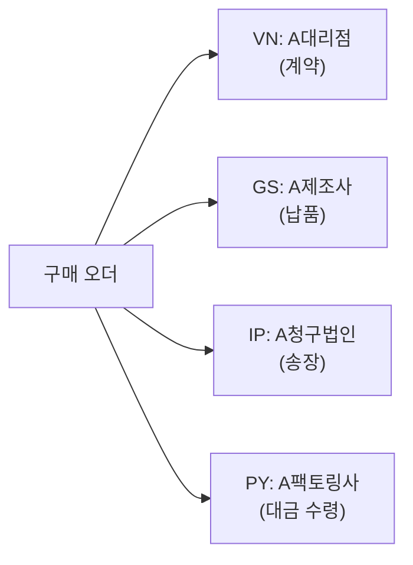

# 공급업체 기준 정보 (Vendor Master)

## ⚠️ S/4HANA 변경사항

SAP S/4HANA에서 공급업체 기준 정보는 **BP (Business Partner)** 트랜잭션으로 통합 관리됩니다.
구버전 XK01/XK02/XK03은 Deprecated (일부 시스템에서 작동하나 신규 학습은 BP 기준).

| 구버전 (ECC) | S/4HANA | 설명 |
|------------|---------|------|
| XK01 | BP | 공급업체 생성 |
| XK02 | BP | 공급업체 변경 |
| XK03 | BP (조회) | 공급업체 조회 |
| MK01 | BP | 구매 조직 기준 생성 |

---

## BP (Business Partner) 트랜잭션

BP 실행 → **역할(Role)** 선택하여 순차적으로 확장:

| BP Role | 코드 | 설명 |
|---------|------|------|
| 비즈니스 파트너 (일반) | 000000 | 주소, 연락처 등 기본 일반 데이터 |
| 공급업체 (재무회계) | FLVN00 | 회사코드 확장 - 조정계정, 지급조건, 원천세 |
| 공급업체 | FLVN01 | 구매조직 확장 - 발주통화, 인코텀즈, 납기조건 |

**생성 순서**: `000000` (일반 생성) → `FLVN00` (회사코드 확장) → `FLVN01` (구매조직 확장)

> BP에서 구매 조직 데이터는: BP → Role `FLVN01` 선택 → 구매조직 번호 입력 후 진입
{: .callout .callout-tip}

---

## 계정 그룹 (Account Group)

공급업체를 생성할 때 반드시 지정하는 **계정 그룹(Account Group)**은 이후 공급업체 마스터의 동작 방식 전반을 결정하는 중요한 설정입니다. 한 번 지정하면 변경이 매우 어렵기 때문에 **초기 설계 시 신중하게 결정**해야 합니다.

### 계정 그룹이 결정하는 항목

| 결정 사항 | 설명 |
|----------|------|
| **번호 범위 (Number Range)** | 공급업체 번호를 내부 자동 채번할지, 외부 직접 입력할지. 계정 그룹마다 다른 번호 범위 할당 가능 |
| **필드 선택 (Field Selection)** | 각 입력 필드가 필수(Required) / 선택(Optional) / 숨김(Suppressed) 중 어느 속성으로 표시될지 결정 |
| **일회성 공급업체 (One-Time Vendor)** | 계정 그룹에 one-time flag 설정 시 매번 주소를 입력하는 일회성 거래 방식 적용 (MIRO 시 이름/주소 직접 입력) |

### 대표 계정 그룹 예시 (Standard SAP 기준)

| 계정 그룹 | 설명 | 번호 범위 예시 | 채번 방식 |
|----------|------|--------------|---------|
| 0001 | 국내 공급업체 | 0000000001 ~ 0000099999 | 내부 (자동) |
| 0002 | 해외 공급업체 | 0000100000 ~ 0000199999 | 내부 (자동) |
| 0003 | 일회성 공급업체 | 0000900000 ~ 0000999999 | 내부 (자동) |
| LIEF | 일반 공급업체 (표준) | 사용자 정의 | 내부 (자동) |

> 실제 프로젝트에서는 회사 유형(국내/해외), 거래 방식(일반/외주/위탁), 파트너 유형 등에 따라 계정 그룹을 세분화하여 설계합니다. Field Selection을 계정 그룹 단위로 다르게 구성할 수 있어, 예를 들어 일회성 공급업체는 은행 계좌 정보 필드를 숨김(Suppressed)으로 설정하는 것이 가능합니다.
{: .callout .callout-note}

> SPRO `[OBD7]` Financial Accounting - Accounts Receivable and Payable - Vendor Accounts - Master Records - Preparations for Creating Vendor Master Data - Define Account Groups with Screen Layout
{: .callout .callout-tip}

---

### With Reference 버튼으로 기존 BP 복사 생성

기존 공급업체와 유사한 새 공급업체를 생성할 때 **With Reference** 버튼을 사용하면 기존 BP 데이터를 복사하여 빠르게 생성할 수 있습니다.


> **With Reference 버튼이 보이지 않는 경우**: `Create in BP role` 필드가 기본값(`000000` 일반)으로 되어 있으면 버튼이 표시되지 않습니다. **`FLVN01 Supplier (New)`로 변경**해야 With Reference 버튼이 활성화됩니다.
{: .callout .callout-important}

**With Reference 생성 절차:**
1. BP 트랜잭션 실행
2. `Create in BP role` 드롭다운에서 **`FLVN01 Supplier (New)`** 선택
3. 상단에 **With Reference** 버튼 확인
4. With Reference 클릭 → 참조할 기존 BP 번호 입력
5. 복사된 데이터를 기반으로 신규 공급업체 정보 수정 후 저장

---

## 데이터 레벨 구조

| 레벨 | 저장 위치 | 주요 데이터 |
|------|----------|-----------|
| General Data | Client | 이름, 주소, 연락처, 언어, 세금 번호 |
| Company Code Data | Company Code | 재조정 계정, 지급 조건, 원천징수 |
| Purchasing Org Data | Purch. Org | 주문 통화, 인코텀즈, 납품 조건, 최소 주문금액 |

---

## General Data 주요 필드

| 필드 | 설명 |
|------|------|
| Name | 공급업체 상호명 |
| Country / Region | 국가, 지역 |
| Language | 출력 언어 |
| Tax Number | 세금 번호 (사업자 등록번호) |
| Bank Details | 계좌 정보 |

---

## Company Code Data 주요 필드

| 필드 | 설명 |
|------|------|
| Reconciliation Account | 재조정 계정 (채무 집계 계정) |
| Payment Terms | 지급 조건 (예: ZB30 = 30일 내 지급) |
| Payment Methods | 지급 방법 (은행 이체, 수표 등) |
| Withholding Tax | 원천징수 정보 |

---

## Purchasing Org Data 주요 필드

| 필드 | 설명 |
|------|------|
| Order Currency | 주문 통화 (KRW, USD, JPY 등) |
| Payment Terms | 구매 관점 지급 조건 |
| Incoterms | 무역 조건 (FOB, CIF, EXW 등) |
| Schema Group (Vendor) | 가격 조건 스키마 그룹 - 조건레코드 결정 키 |
| Min. Order Value | 최소 주문 금액 (정보용) |
| GR-Based IV | 입고 기반 송장 검증 여부 |
| Purchasing Group | 구매 담당자 |
| Planned Deliv. Time | 업체 납품 소요 시간 (일수) |
| Auto PO | 구매의뢰 → 구매오더 자동 전환 여부 (자재마스터도 동일 설정 필요) |
| ERS (자동 정산) | 체크 시 월 합계 계산서 자동 발행 (입고 기준 자동 정산) |

### 공급업체 하부범위 (Vendor Sub Range, VSR)

특정 공급업체의 사업부별로 구매 관련 기준 정보가 다른 경우, 플랜트/하부 조직별 데이터를 별도 관리할 수 있습니다. 예) 같은 공급업체라도 A사업부 vs B사업부 납기 조건이 다른 경우.

---

## 파트너 기능 (Partner Functions)

구매 프로세스에서 하나의 거래에는 여러 역할을 맡는 회사가 관여할 수 있습니다. SAP에서는 이를 **파트너 기능(Partner Functions)**으로 구분합니다.

### 개념 설명

일반적으로는 공급업체(VN) 하나가 주문 수신, 납품, 송장 발행, 대금 수령을 모두 담당합니다. 하지만 다음 같은 상황에서는 역할이 분리됩니다:

- **대형 그룹사와 거래**: A그룹과 계약하지만, 실제 납품은 A그룹 자회사가 수행
- **팩토링(Factoring)**: 대금은 공급업체가 아닌 금융회사가 수령
- **구매대행**: 발주서는 중간 대리점이 받지만, 물건은 제조사에서 직접 출하

### 주요 파트너 기능

| 파트너 기능 코드 | 명칭 | 설명 |
|---------------|------|------|
| **VN** | 공급업체 (Vendor) | 계약 당사자. PO 헤더의 기준 공급업체 번호 |
| **OA** | 주문 수신처 (Ordering Address) | 실제 발주서를 수신하는 주소. VN과 동일하거나 다른 사업장 지정 가능 |
| **GS** | 공급자 (Goods Supplier) | 실제 납품을 수행하는 업체. 자회사, 제조사 등 VN과 다를 수 있음 |
| **IP** | 청구처 (Invoicing Party) | 송장을 제출하는 업체. 지주사 또는 별도 청구 법인이 될 수 있음 |
| **PY** | 지급처 (Payee) | 실제 대금을 수령하는 업체. 팩토링 회사 등 VN과 다를 수 있음 |

> 파트너 기능별 BP가 별도 지정되지 않으면 VN(공급업체)과 동일한 BP로 자동 설정됩니다. 대부분의 소규모 거래에서는 VN 하나가 모든 역할을 수행합니다.
{: .callout .callout-note}

### 파트너 기능 사용 예시

```
[거래 예시: 대리점을 통한 부품 구매]

VN (공급업체):    A대리점     (BP 1000) - 계약 당사자, 발주 기준
OA (주문 수신처): A대리점 서울 (BP 1000) - 동일 BP, 다른 주소로 PO 발송
GS (공급자):      A부품 제조사 (BP 2000) - 실제 납품 주체
IP (청구처):      A그룹 청구법인 (BP 3000) - 그룹사 공용 송장 발행
PY (지급처):      A팩토링사 (BP 4000) - 대금 수령 (채권 양도)
```



### 파트너 기능 확인 위치

| 위치 | 경로 |
|------|------|
| BP 마스터 설정 | BP → Role `FLVN01` → "Partners" 탭 → 파트너 기능별 BP 번호 지정 |
| PO 문서 확인 | ME23N → 헤더 → "Additional Data" 탭 → Partners 섹션 |

---

## 인코텀즈 (Incoterms) 주요 유형

| 코드 | 설명 |
|------|------|
| EXW | Ex Works - 공장 인도 |
| FOB | Free On Board - 선적 항구 인도 |
| CIF | Cost, Insurance, Freight - 운임·보험 포함 |
| DAP | Delivered at Place - 목적지 인도 |
| DDP | Delivered Duty Paid - 관세 포함 목적지 인도 |

---

## T-code (S/4HANA 기준)

| T-code | 설명 |
|--------|------|
| BP | 비즈니스 파트너 생성/변경/조회 (주 사용) |
| MKVZ | 공급업체 목록 조회 (구매조직 기준) |
| XK03 | 공급업체 마스터 조회 (Read-only, 구버전 호환) |
| XK99 | 공급업체 마스터 대량 변경 |
| MK03 | 구매 조직 기준 공급업체 조회 |
| FK03 | 회계 기준 공급업체 조회 |

---

## 실습 포인트 (개념 이해)

1. **BP = XK01 + FK01의 통합**: 하나의 화면에서 구매·회계 데이터 모두 관리
2. **Role 확장 순서 중요**: `000000` 생성 후 반드시 `FLVN00`(회계) → `FLVN01`(구매) 순으로 확장
3. **재조정 계정**: 모든 공급업체 채무가 이 계정으로 집계됨 (FI 관점)
4. **GR-Based IV**: 체크 시 GR 수량 기준으로만 송장 검증 - 3-way matching 강제
5. **지급 조건**: `ZB30` = "30일 내 지급", `ZB001` = "즉시 지급" 등 커스텀 정의
6. **삭제 표시**: BP에서 변경 모드 진입 → 상태 탭 → 아카이빙 플래그 체크 후 저장

---

## 스크린샷

> 스크린샷은 실제 SAP 시스템에서 캡쳐 후 아래에 추가합니다.
> 이미지 경로: `assets/img/master-data/bp-{순번}-{설명}.png`

<!-- 예시:  -->
<!-- 예시:  -->
<!-- 예시:  -->

---

<details markdown="1">
<summary>필드 → 마스터 연관</summary>

| 화면 필드 | 데이터 출처 | 설정/관리 위치 | 비고 |
|---------|-----------|-------------|------|
| Reconciliation Account | FI 계정 마스터 | FS00 (계정 생성) | 채무 집계 계정, FI 담당자가 정의 |
| Payment Terms | 지급 조건 마스터 | SPRO → FI → AR/AP → Define Payment Terms | 코드 예: ZB30 = 30일 지급 |
| Order Currency | 통화 마스터 | SPRO → General Settings → Currencies | PO 생성 시 자동 로드 |
| Incoterms | 인코텀즈 마스터 | SPRO → MM → Purchasing → Define Incoterms | PO 헤더에 기본값 |
| Schema Group (Vendor) | 가격 조건 스키마 그룹 | SPRO → MM → Purchasing → Conditions → Schema Groups | 가격 결정 스키마 연결 |
| GR-Based IV | BP 설정 값 | BP → Vendor: Purch. Org → GR-Based IV 체크 | PO Invoice 탭에도 반영 |

</details>

---

## 관련 SPRO 설정

→ [기준 정보 설정 가이드](/mm/config-guide/master-data/) 참조
