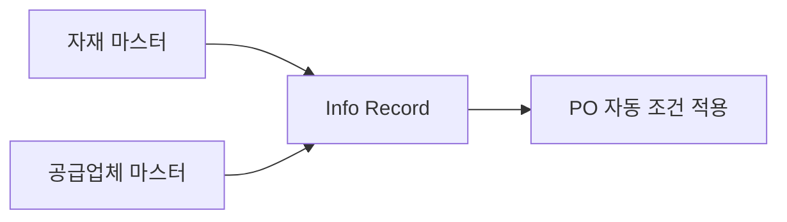

# Purchasing Info Record & Source List

## Purchasing Info Record 개요

**Info Record**는 특정 **자재 + 공급업체** 조합의 구매 조건을 저장하는 기준 정보입니다.
PO 생성 시 자동으로 단가, 납기 조건을 가져와 입력 시간을 단축합니다.

---

## Info Record 유형

| 유형 | 코드 | 설명 |
|------|------|------|
| Standard | 0 | 일반 구매 (외부 조달) |
| Subcontracting | 1 | 외주 가공 |
| Pipeline | 2 | 파이프라인 자재 (전기, 수도, 가스) |
| Consignment | 3 | 위탁 재고 (공급업체 소유) |

---

## Info Record 주요 필드

### General Data (일반)

| 필드 | 설명 |
|------|------|
| Net Price | 순 단가 |
| Per | 가격 기준 수량 (1개, 100개 등) |
| Currency | 통화 |
| Planned Delivery Time | 계획 납기일 (일수) |
| Purchasing Group | 담당 구매 그룹 |

### Conditions (조건)

| 조건 키 | 설명 |
|--------|------|
| PB00 | 총 발주 금액 |
| PBXX | 단가 조건 |
| FRA1 | 운임 조건 |
| RA01 | 할인 조건 |

### Control Data

| 필드 | 설명 |
|------|------|
| Over Delivery Tolerance | 과다 납품 허용 % |
| Under Delivery Tolerance | 과소 납품 허용 % |
| GR-Based IV | 입고 기반 송장 검증 |
| No ERS | 자동 정산 제외 여부 |

---

## T-code

| T-code | 설명 |
|--------|------|
| ME11 | Info Record 생성 |
| ME12 | Info Record 변경 |
| ME13 | Info Record 조회 |
| ME1M | 자재별 Info Record 목록 |
| ME1L | 공급업체별 Info Record 목록 |

---

## Source List

### 개요

Source List는 특정 자재에 대해 **허가된 공급업체 목록**을 관리합니다.

- 유효 기간 지정 가능
- MRP 연계 시 자동 소스 결정에 활용
- 특정 기간에 특정 공급업체만 사용하도록 강제 가능

### Source List 주요 필드

| 필드 | 설명 |
|------|------|
| Validity Period | 유효 기간 (From ~ To) |
| Vendor | 공급업체 번호 |
| Purch. Org | 구매 조직 |
| Fixed | 고정 소스 여부 (MRP 우선 사용) |
| Blocked | 차단 여부 |
| Agreement | 연결된 계약 (장기 계약) |

### T-code

| T-code | 설명 |
|--------|------|
| ME01 | Source List 생성/변경 |
| ME03 | Source List 조회 |
| ME0M | 자재별 Source List 목록 |

---

## Info Record vs Source List 비교

| 항목 | Info Record | Source List |
|------|------------|------------|
| 목적 | 가격/납기 조건 저장 | 허가 공급업체 관리 |
| 기준 | 자재 + 공급업체 | 자재 (공급업체 목록) |
| PO 연계 | 자동 조건 복사 | MRP 소스 결정 |
| 필수 여부 | 선택 (있으면 자동 적용) | 자재 마스터 설정 시 필수 |

---

## 실습 포인트

1. **Info Record 없이도 PO 생성 가능** - 단, 매번 수동 단가 입력 필요
2. **Info Record 있으면** PO 생성 시 자동으로 단가, 납기일, 허용 오차 복사
3. **Source List 필수 설정**: 자재 마스터 Purchasing View의 `Source List` 체크 시
   → Source List 없는 공급업체로는 PO 생성 불가
4. **MRP 자동 PR 생성 시**: Source List의 Fixed 공급업체가 PR 소스로 자동 결정

---

## 스크린샷

> 스크린샷은 실제 SAP 시스템에서 캡쳐 후 아래에 추가합니다.
> 이미지 경로: `assets/img/master-data/me11-{순번}-{설명}.png`

<!-- 예시:  -->
<!-- 예시:  -->
<!-- 예시:  -->

---

필드 → 마스터 연관

| 화면 필드 | 데이터 출처 | 설정/관리 위치 | 비고 |
|---------|-----------|-------------|------|
| Net Price | 수동 입력 / 계약 조건 | ME11 직접 입력 | PO 생성 시 자동 복사 |
| Planned Delivery Time | 자재 마스터 기본값 | MM01 Purchasing View | Info Record 값이 자재 마스터보다 우선 |
| Purchasing Group | 자재 마스터 / 수동 | MM01 Purchasing View | |
| Condition Type (PB00) | 가격 조건 마스터 | SPRO → MM → Purchasing → Conditions → Define Condition Types | 가격 결정 스키마에서 활성화 |
| Over/Under Delivery Tol. | 자재 마스터 기본값 | MM01 Purchasing View | Info Record 설정이 PO에 복사 |
| GR-Based IV | BP 또는 수동 | BP Purch. Org / ME11 Control Data | Info Record 설정이 PO에 복사 |

---

## 관련 SPRO 설정

→ [기준 정보 설정 가이드](/mm/config-guide/master-data/) 참조
