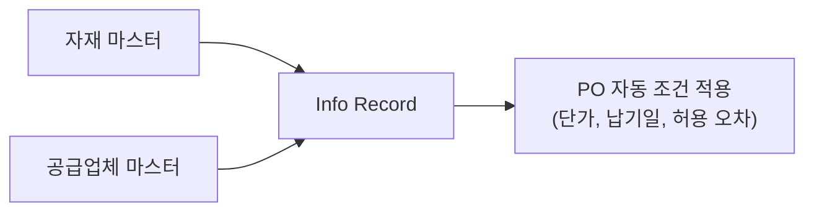
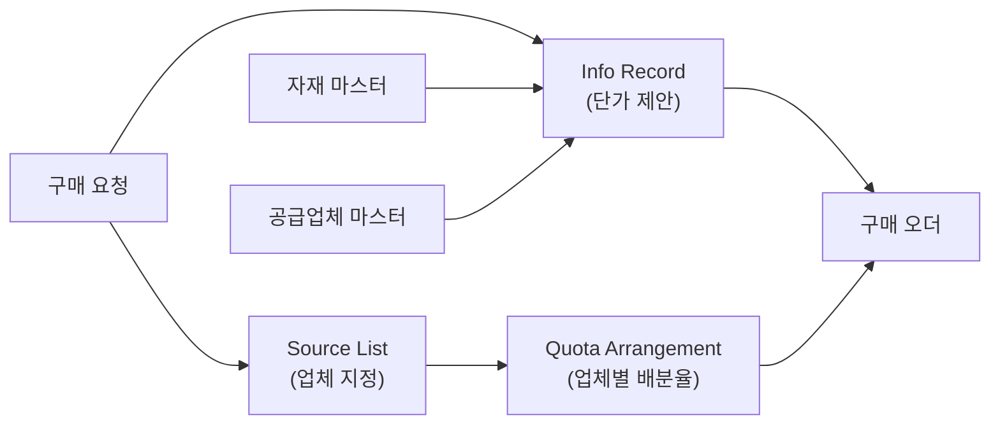

# Purchasing Info Record / Source List / Quota Arrangement

---

## Purchasing Info Record (구매 정보레코드)

### 개요

**Info Record**는 특정 **자재 + 공급업체** 조합의 구매 조건을 저장하는 기준 정보입니다.

- 자재를 특정 업체에서 구매하는 **단가, 납기일, 구매담당자** 등의 정보를 관리
- PO 생성 시 자동으로 단가, 납기 조건을 가져와 입력 시간 단축
- 각 구매 문서로부터 **자동 Update** 가능
- 이후 생성되는 구매 문서의 **기본값 (Default Value)** 제공



### Info Record 유형 (Info Category)

| 유형 | ESOKZ 코드 | 설명 |
|------|-----------|------|
| Standard (표준) | 0 | 일반 구매 오더 (외부 조달) |
| Subcontracting (외주) | 3 | 외주 가공 오더 - 사급 단가 관리 |
| Pipeline (파이프라인) | 1 | 파이프라인 공급 자재 구매 (전기, 수도, 가스) |
| Consignment (위탁) | 2 | 위탁 재고 구매 - 출고 시점에 단가 결정 |

> 구매 Item의 특성에 따라 Info Category를 구분하여 별도 생성해야 합니다. Subcontracting 단가는 ESOKZ=3, Consignment 단가는 ESOKZ=2에서 관리됩니다.
{: .callout .callout-note}

---

### ME11 - Info Record 생성

#### 초기 화면 입력 항목

| 번호 | 항목 | 설명 |
|------|------|------|
| 1 | **공급업체** | 공급업체 번호 입력 |
| 2 | **자재** | 자재번호 입력 |
| 3 | **구매조직** | 구매조직 입력 |
| 4 | **플랜트** | 플랜트 입력 (플랜트별 다른 가격 관리 가능) |
| 5 | **정보 범주** | Standard / 외주 / 파이프라인 / 위탁 중 선택 |

#### 일반 데이터 1/2 (General Data) 주요 필드

| 번호 | 필드명 | 설명 |
|------|-------|------|
| 1 | **독촉장 1, 2, 3** | 독촉장 발행일. 납품 지연 시 단계별 독촉 일정 |
| 2 | **업체자재번호** | 공급업체에서 사용하는 자재 번호 (발주서에 표시 가능) |
| 3 | **공급업체 하위 범주 (Vendor Subrange)** | 자재에 따라 주문 주소가 다를 경우 하위 범주를 생성하여 개별 지정 |
| 4 | **VSR 정렬 번호** | 공급업체가 희망하는 순서대로 PO Item을 정렬할 때 사용 |
| 5 | **효력 종료일** | 원산지증명서의 유효 기간 마지막 날짜 |
| 6 | **원산국** | 원산지증명서 발행 국가 |

#### 일반 데이터 2/2 (General Data) 주요 필드

| 번호 | 필드명 | 설명 |
|------|-------|------|
| 7 | **가용 시작일 (Available from)** | 이 Info Record가 유효한 기간의 시작일 |
| 8 | **가용 종료일** | 이 Info Record가 유효한 기간의 종료일 |
| 9 | **오더 단위 (Order Unit)** | 이 자재를 이 공급업체에 주문할 때의 단위. 자재 마스터의 Order Unit보다 우선 적용 |
| 10 | **가변 오더 단위** | PO 입력 시 Info Record 설정 단위 외 다른 단위 변경 허용 여부 (1 입력 시 변경 가능, 공백 시 변경 불가). 예: 개수 단위로 설정된 것을 BOX 단위로 변경 가능 |

#### 구매조직 데이터 1/3 (Purchasing Org. Data) 주요 필드

| 번호 | 필드명 | 설명 |
|------|-------|------|
| 1 | **계획 납품 시간 (Planned Delivery Time)** | 공급업체에서 자재를 조달하는 데 소요되는 시간 (일수). MRP 납기 계산 기준 |
| 2 | **구매 그룹 (Purchasing Group)** | 구매 담당자 지정 |
| 3 | **표준 PO 수량** | 업체가 주문을 받는 표준 단위 수량 |
| 4 | **최소 오더 수량** | 공급업체가 주문을 받는 최소 주문 수량 (정보용) |
| 5 | **최대 수량** | 공급업체가 주문을 받는 최대 주문 수량 (정보용) |

#### 구매조직 데이터 2/3 (Purchasing Org. Data) 주요 필드

| 번호 | 필드명 | 설명 |
|------|-------|------|
| 6 | **총 미달 납품 %** | 자재 Delivery 허용 한계 설정 |
| 7 | **입고 기준 송장 (GR-Based IV)** | 입고를 기준으로 송장검증 진행 여부 설정. 체크 시 GR 수량 범위 내에서만 IV 가능 |
| 8 | **No ERS** | 월 단위 IV를 수행하는 ERS 설정 업체이지만 특정 자재에는 적용하지 않을 경우 해제 |
| 9 | **확정 제어** | PO 항목에 대한 확정 범주 결정 (예: 주문확인, 인바운드 납품) |
| 10 | **세금 코드** | 세금 코드 지정 |

#### 구매조직 데이터 3/3 - 단가 및 가격조건

| 번호 | 필드명 | 설명 |
|------|-------|------|
| 11 | **단가** | 공급업체와 합의된 자재 가격 입력 |
| 12 | **(가격) 조건** | 가격결정 조건 지정. Application Menu에서 조건 선택 시 가격조건 입력 화면으로 이동 |
| 13 | **가격 결정일 관리** | 가격 결정 시기로 사용할 날짜 지정 |

#### 가격 조건 (Price Conditions) 유효기간 관리

Info Record에서 설정한 가격 조건의 **유효기간**을 기간별로 관리할 수 있습니다.

| 항목 | 설명 |
|------|------|
| 유효기간 목록 | 현재까지 가격 조건이 설정된 기간 표시. 더블클릭으로 상세 조회 |
| 현재 적용 가격 | **마지막 유효기간**의 가격이 현재 적용 가격 |
| 신규 유효기간 추가 | 화면 하단 "신규" 버튼 클릭 - 금액 참조 없이 신규 등록 |
| 신규 (참조 포함) | 선택한 효력일자의 금액을 참조하여 신규 등록 |

**조건 키 예시:**

| 조건 키 | 설명 |
|--------|------|
| PB00 | 총 발주 금액 (단가) |
| PBXX | 단가 조건 |
| FRA1 | 운임 조건 (운송료 %) |
| RA00 / RA01 | 할인 조건 |

---

### T-code

| T-code | 설명 |
|--------|------|
| ME11 | Info Record 생성 |
| ME12 | Info Record 변경 (공급업체, 자재, 구매조직, 플랜트, 정보 범주 입력 또는 Info Record 번호 직접 입력) |
| ME13 | Info Record 조회 |
| ME1M | 자재별 Info Record 목록 조회 |
| ME1L | 공급업체별 Info Record 목록 조회 |
| ME15 | Info Record 삭제 표시 (Flag for Deletion). 삭제 대상 조직 레벨에 체크 후 저장 |

---

## Source List (소스리스트 / 공급원 목록)

### 개요

Source List는 특정 자재에 대해 **허가된 공급원(공급업체) 목록**을 관리합니다.

- 공급원(Source)으로는 **업체, 업체의 구매 실적, 단가계약** 등이 자동/수동으로 등록 가능
- 특정 공급원으로부터의 공급을 **차단(Block)**하거나, **일정 기간 독점 허용**하는 통제 가능
- **고정 공급원(Fixed Source)**: MRP 실행 시 우선 공급원으로 자동 선정
- **차단 공급원(Blocked Source)**: 해당 공급원으로 PO 생성 불가

```
Plant 1000 - Material A001 - Source List
Vendor A: 2010.01.01 ~ 2021.12.31 (일반)
Vendor B: 2021.01.01 ~ 2022.12.31 (Fixed - 고정 공급원)
Vendor C: 2021.06.01 ~ 2022.06.30 (Blocked - 차단)
Vendor D: 2022.01.01 ~ 2999.12.31 (일반)
```

---

### ME01 - Source List 관리 주요 필드

| 번호 | 필드명 | 설명 |
|------|-------|------|
| 2 | **효력시작일** | 이 자재를 이 공급원으로부터 조달이 유효한 기간의 시작일 |
| 3 | **효력종료일** | 이 자재를 이 공급원으로부터 조달이 유효한 기간의 종료일 |
| 4 | **공급업체** | 자재를 공급할 수 있는 공급업체 번호 |
| 5 | **POrg** | 구매조직 |
| 6 | **PPl (Procurement Plant)** | 자재조달 플랜트. 공장간 재고이동(STO) 시 지정 가능 |
| 7 | **계약 (Outline Agreement)** | Contract 또는 Scheduling Agreement 번호 지정 |
| 8 | **Fix (Fixed Source)** | MRP 실행 시 우선 공급원으로 설정. 쿼터 조정 없을 경우 이 공급원 우선 사용 |
| 9 | **Blk (Blocked)** | 특정 공급원에 PO 생성을 제한할 때 설정 |
| 10 | **MRP** | MRP 실행 관련 여부 표시. 여러 공급원에 1 표시 시 쿼터 조정에 따라 공급원 자동 선택 |

---

### T-code

| T-code | 설명 |
|--------|------|
| ME01 | Source List 생성/변경/삭제 |
| ME03 | Source List 조회 |
| ME0M | 자재별 Source List 목록 조회 |

---

## Quota Arrangement (쿼터 조정)

### 개요

**Quota Arrangement**는 특정 자재에 대해 복수의 공급업체(또는 내부 생산)에 발주 물량 비율을 **% 단위로 관리**하는 기준 정보입니다.

- 쿼터가 지정된 자재는 **자동 거래처 지정** 시 현재까지의 누적 물량 대비 업체별 쿼터비를 비교하여 공급업체가 자동 결정
- 외부 업체 간 비율뿐만 아니라 **외부 조달 vs 내부 생산**의 비율도 할당 가능
- 쿼터 조정 사용을 위해서는 **자재 마스터 MRP View에서 "쿼터조정 사용(Quota Arrangement Usage)"** indicator 값 설정 필요

### 쿼터 조정 예시

```
자재 1 / 플랜트 1000 / 유효기간: 01.01 ~ 12.31

공급업체                    쿼타   누적수량
Vendor A (외부)            50%    10
Vendor B (외부)            30%    15
Plant Atlanta (내부 생산)   70%   120
Vendor K1 (외부)           10%     0
```

- 소요량 1,000 pc 발생 시: A=500 pc, B=300 pc, C=200 pc 자동 배분
- 최소분할 수량 200 pc 설정 시: 소요량이 200 pc 미만인 경우 분할하지 않고 가장 비율이 높은 공급원에 전량 배정

### 쿼터 조정 사용 시점

| 시점 | 설명 |
|------|------|
| MRP 실행 시 | 계획 구매요청 생성 시 공급업체 자동 배분 |
| 구매요청 생성 시 | 소스 자동 결정 |
| 계획오더 생성 시 | 내부/외부 조달 비율 결정 |
| 스케쥴라인 생성 시 | Scheduling Agreement 납품 일정 배분 |
| 구매오더 입력 시 | 수동 PO 생성 시에도 적용 가능 |

> **사전 설정 필수**: 자재 마스터 MRP View의 "쿼터조정 사용(Quota Arrangement Usage)" 지시자에 값을 설정해야 합니다.
{: .callout .callout-important}

---

## 기준 정보 연관 관계



| 기준정보 | 목적 | T-code |
|---------|------|--------|
| Info Record | 자재-업체 조합의 단가/납기 조건 저장 | ME11/12/13 |
| Source List | 자재별 허가 공급업체 목록 관리 | ME01/03 |
| Quota Arrangement | 업체별 물량 배분율 관리 (자동화) | MEQ1/MEQ6 |

---

## 실습 포인트

1. **Info Record 없이도 PO 생성 가능** - 단, 매번 수동 단가 입력 필요
2. **Info Record 있으면** PO 생성 시 자동으로 단가, 납기일, 허용 오차 복사
3. **오더 단위 우선 순위**: Info Record 오더 단위 > 자재 마스터 오더 단위
4. **Source List 필수 설정**: 자재 마스터 Purchasing View의 `Source List` 체크 시 Source List 없는 공급업체로는 PO 생성 불가
5. **MRP 자동 PR 생성 시**: Source List의 Fixed 공급업체가 PR 소스로 자동 결정
6. **Quota Arrangement**: 복수 업체 자동 배분 기능. 자재 마스터 MRP View에서 "쿼터조정 사용" 먼저 설정 필수
7. **Info Record 가격 조건 이력**: 동일 Info Record에서 유효기간별 가격 이력 관리 가능. 현재 적용 가격은 마지막 유효기간의 금액

---

## 스크린샷

> 스크린샷은 실제 SAP 시스템에서 캡쳐 후 아래에 추가합니다.
> 이미지 경로: `assets/img/master-data/me11-{순번}-{설명}.png`

<!-- 예시:  -->
<!-- 예시:  -->
<!-- 예시:  -->

---

<details markdown="1">
<summary>필드 - 마스터 연관</summary>

| 화면 필드 | 데이터 출처 | 설정/관리 위치 | 비고 |
|---------|-----------|-------------|------|
| Net Price | 수동 입력 / 계약 조건 | ME11 직접 입력 | PO 생성 시 자동 복사 |
| Planned Delivery Time | 자재 마스터 기본값 | MM01 Purchasing View | Info Record 값이 자재 마스터보다 우선 |
| Purchasing Group | 자재 마스터 / 수동 | MM01 Purchasing View | |
| Condition Type (PB00) | 가격 조건 마스터 | SPRO - MM - Purchasing - Conditions - Define Condition Types | 가격 결정 스키마에서 활성화 |
| Over/Under Delivery Tol. | 자재 마스터 기본값 | MM01 Purchasing View | Info Record 설정이 PO에 복사 |
| GR-Based IV | BP 또는 수동 | BP Purch. Org / ME11 Control Data | Info Record 설정이 PO에 복사 |
| Source List Fixed/Blk | ME01 직접 설정 | ME01 Maintain Source List | MRP 소스 결정에 활용 |

</details>

---

## 관련 SPRO 설정

- [기준 정보 설정 가이드](/mm/config-guide/master-data/) 참조
