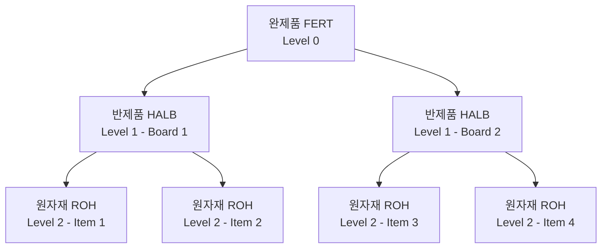

# 자재명세서 (BOM - Bill of Materials)

## 개요

BOM(Bill of Materials)은 제품/반제품을 생산하는 데 필요한 **원자재, 반제품, 부품의 목록과 소요량**을 정의하는 기준 정보입니다.

SAP에서는 사용 목적에 따라 여러 유형의 BOM을 지원하며, 플랜트(Plant)와 연결되어 관리됩니다.

**BOM의 주요 활용:**
- 표준 원가 계산 (Costing)
- MRP 소요량 산출
- 생산 오더 자재 불출
- 영업 BOM (판매 구성품 납품)

---

## BOM 구조 (Production BOM)

| 레벨 | 자재 유형 | 설명 |
|------|----------|------|
| Level 0 | FERT | 완제품 - 최상위 |
| Level 1 | HALB | 반제품 / 중간 조립품 |
| Level 2+ | ROH | 원자재 / 구매 부품 |

---

## 품목 범주 (Item Category)

| 범주 | 코드 | 설명 |
|------|------|------|
| 재고 관리 품목 | L | 자재마스터에 등록된 일반 원/부자재. 재고 관리 |
| 비재고 관리 품목 | N | 자재마스터 없이도 사용 가능. 작업지시서 발생 시 구매 |
| 가변 규격 품목 | R | 철판, 합판, 전기선 등 현장에서 절단 사용. 공식으로 소요량 계산 |
| 텍스트/문서 품목 | T / D | 실제 자재 아님. 생산 현장 정보 제공용 참고 자료 |
| 분류 품목 | K | 구성형 제품에서 분류(Class)를 지정해 투입 자재 결정 |
| 가상 품목 | P | Phantom 자재 - 재고 없이 BOM 그룹화 목적. MRP에서 상위로 폭발 |

---

## BOM 용도 (BOM Usage)

| 코드 | 용도 | 주요 특징 |
|------|------|----------|
| 1 | 생산 BOM | PP - 생산 오더 자재 불출 기준 |
| 2 | 엔지니어링/설계 BOM | 설계 부서 관리용 |
| 3 | 일반 BOM | 범용 |
| 4 | 설비관리 BOM | PM - 설비 부품 관리 |
| 5 | 영업 BOM | SD - 판매 세트 구성품 납품 |
| 6 | 원가계산 BOM | CO - 표준원가 계산 기준 |

> 같은 제품이라도 생산과 원가 BOM에서 구성이 다를 수 있습니다. 예) 외주 자재는 원가에는 포함하되, 생산 출고는 하지 않는 경우.
{: .callout .callout-note}

---

## BOM 기술 유형 (Technical Type)

| 유형 | 설명 | 예시 |
|------|------|------|
| Simple BOM | 상위 품목에 대해 하나의 BOM | 일반적인 경우 |
| Alternative BOM | 동일 상위 품목에 하위 구성이 다른 복수 BOM | 계절 처방 변경, 고객별 구성 변경 |
| Variant BOM | 유사 제품 군에 공통 부분과 차이 부분을 통합 관리 | 모델별 옵션 차이 |

**대체 BOM 예시:**

| BOM 대안 | 구성 | 사용 상황 |
|---------|------|---------|
| Alt. 1 | Item 1 + Item 2 + Item 3 | 일반 시즌 |
| Alt. 2 | Item 1 + Item 2 + Item 4 | 특별 시즌 (Item 3 대신 Item 4) |

---

## 영업 BOM (Sales BOM)

고객이 세트 제품을 주문하면, 상위 품목으로 수주하고 하위 품목을 실제 납품하는 구조:

---

## T-code

| T-code | 설명 |
|--------|------|
| CS01 | BOM 생성 |
| CS02 | BOM 변경 |
| CS03 | BOM 조회 |
| CS11 | BOM 폭발 (단계별 구성 조회) |
| CS15 | BOM 사용처 조회 (어느 상위 품목에 사용되는지) |

---

## 실습 포인트

1. **BOM 용도 1(생산) vs 6(원가)**: 두 BOM이 다를 수 있음. 원가 BOM에만 외주 비용 자재 포함하는 경우
2. **Alternative BOM**: 별도 사용자 정의 없으면 시스템이 `1`부터 자동 부여
3. **Phantom 자재**: 재고를 갖지 않고 MRP 폭발 시 바로 하위 자재로 내려감
4. **가변 규격 품목**: 공식 정의로 절단량을 소요량으로 자동 계산

---

필드 - 마스터 연관

| 화면 필드 | 데이터 출처 | 설정/관리 위치 | 비고 |
|---------|-----------|-------------|------|
| BOM Usage | BOM 용도 정의 | SPRO - PP - Basic Data - BOM - Define BOM Usage | 1=생산, 5=영업 등 |
| Item Category | BOM 품목 범주 | SPRO - PP - Basic Data - BOM - Item Data - Define Item Categories | L, N, R, T 등 |
| Alternative BOM | BOM 대안 관리 | CS01 생성 시 자동 채번 (1부터) | |

---

## 관련 문서

- [자재 기준 정보](/mm/master-data/01-material-master/) - 자재유형 (FERT/HALB/ROH)
- [구매관리 - 특수 조달](/mm/purchasing/05-special-procurement/) - 외주 조달과 BOM 연계
