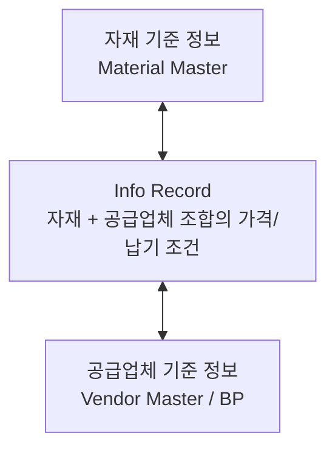

# SAP MM 기준 정보

모든 MM 프로세스의 **출발점**이 되는 기준 데이터입니다.
PR, PO, GR, MIRO - 모든 거래는 기준 정보를 참조합니다.

---

## 기준 정보 유형

| 문서 | 설명 | T-code |
|------|------|--------|
| [자재 기준 정보]({{ '/master-data/01-material-master/' | relative_url }}) | 구매/생산/재고의 기준 | MM01/02/03 |
| [공급업체 기준 정보]({{ '/master-data/02-vendor-master/' | relative_url }}) | S/4HANA 비즈니스 파트너 | BP |
| [Info Record & Source List]({{ '/master-data/03-purchasing-info/' | relative_url }}) | 자재-공급업체 연결 | ME11/ME01 |
| [자재명세서 BOM]({{ '/master-data/04-bom/' | relative_url }}) | 생산/원가 구성 자재 목록 | CS01/02/03 |

---

## 데이터 레벨 개념

> **Client 레벨**: 자재 기본 설명, 공급업체 이름/주소 
> **Company Code 레벨**: 공급업체 회계 데이터 (지급 조건, 재조정 계정) 
> **Plant 레벨**: 자재 MRP, 구매 조건, 평가 데이터 
> **Purch. Org 레벨**: 공급업체 구매 조건 (통화, 인코텀즈)
{: .callout .callout-note}

---

## 기준 정보 간 관계

Source List: 특정 자재에 허가된 공급업체 목록 관리
