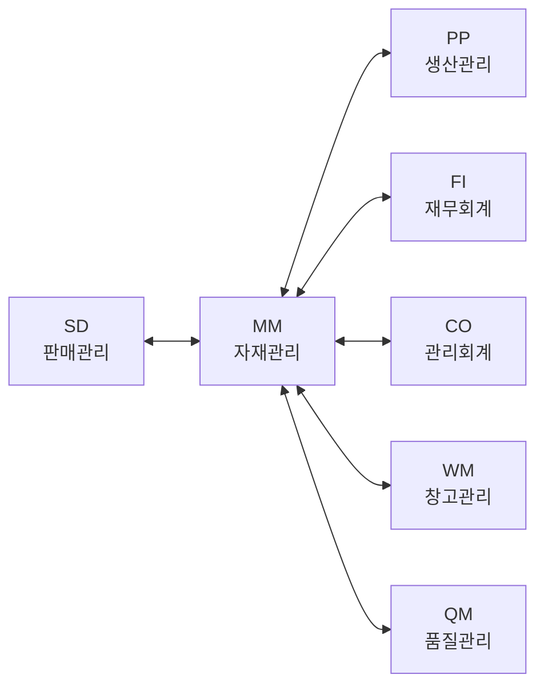
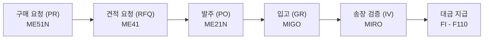
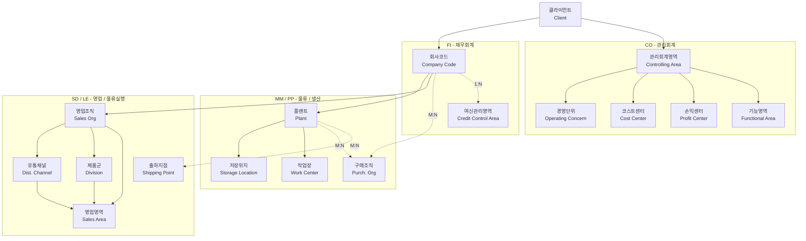
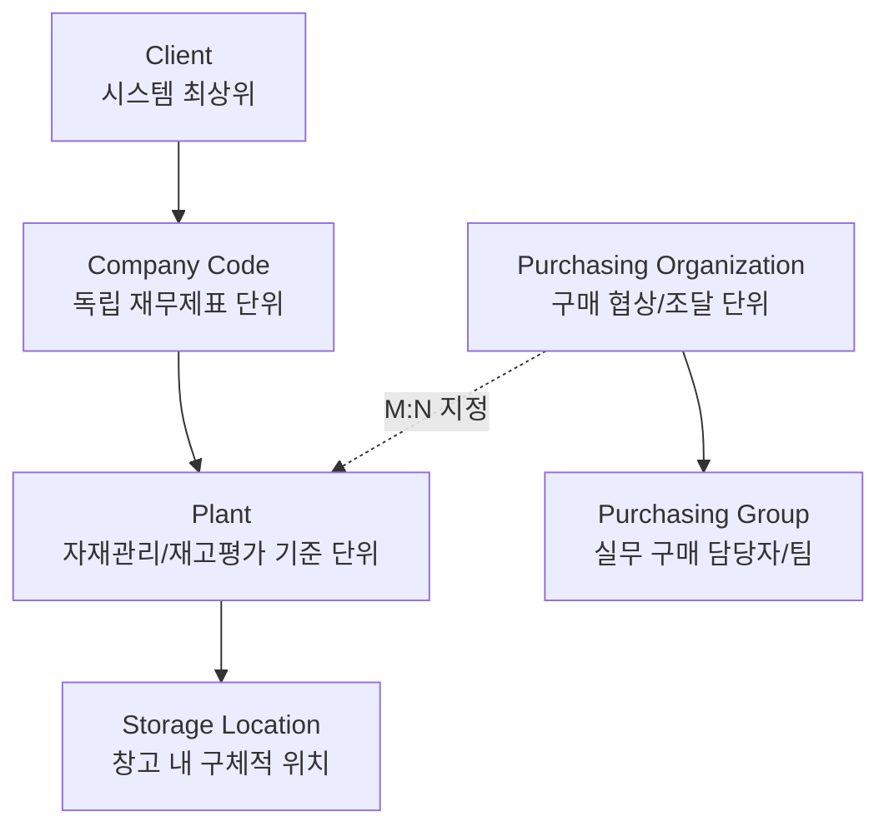

## 오늘 학습 목표

SAP MM 모듈의 전체 구조와 주요 하위 컴포넌트를 파악한다.

---

## SAP MM 모듈 개요

SAP MM(Materials Management)은 SAP ERP의 핵심 모듈 중 하나로, 기업의 **자재 조달부터 재고 관리**까지 전체 공급망 프로세스를 지원합니다.

### MM 모듈의 주요 영역

| 영역 | 설명 | 핵심 T-code |
|------|------|------------|
| Procurement | 구매 요청 - 발주 - 입고 | ME51N, ME21N, MIGO |
| Inventory Management | 재고 이동 및 관리 | MIGO, MB52, MI01 |
| Invoice Verification | 송장 검증 및 처리 | MIRO, MIR4 |
| Master Data | 자재·공급업체 기준정보 | MM01, BP |

### SAP 데이터 유형 3가지

SAP 시스템에서 다루는 데이터는 크게 세 가지로 구분됩니다.

| 유형 | 설명 | 예시 |
|------|------|------|
| **Master Data** (기준정보) | 고유 번호를 가지고, 프로세스에 의해 변화하지 않는 업무의 근간 데이터 | 자재마스터, 공급업체마스터 |
| **Transaction Data** (전표) | Master Data와 Code를 이용해 업무 실행 시 발생하는 데이터 | 구매발주 PO 4500000010 |
| **Code / Meta Data** | 단위 업무에서 공유하는 코드성 데이터 | 구매그룹 P01, P02 |

> **Master Data가 부정확하면** 경영에 대한 계획 및 실적 관리가 불가능합니다. 모든 프로세스는 기준정보를 참조해서 실행됩니다.
{: .callout .callout-important}

### MM과 다른 모듈의 연계

- **MM - FI**: 입고(GR) 시 자동 회계 전표 생성 (재고 계정 차변, GR/IR 계정 대변)
- **MM - PP**: 생산 오더 발행 시 자재 소요량 산출, 생산 출고 (Movement Type 261)
- **MM - SD**: 고객 납품 시 재고 출고 (Movement Type 601)
- **MM - CO**: 자재 원가 정보가 관리회계 손익 분석에 활용

---

## 핵심 개념: 구매 프로세스 흐름 (P2P)

---

## 조직 구조 (Enterprise Structure)

SAP MM을 설정하려면 조직 구조를 먼저 정의해야 합니다. 조직 구조는 **SPRO - Enterprise Structure** 메뉴에서 Definition(정의)과 Assignment(지정) 두 단계로 설정합니다.

### 전체 조직 구조 개요 (ES Overview - 전 모듈 통합)

SAP 전체 모듈에 걸친 조직 단위와 그 연관 관계. 실선은 1:N, 점선은 M:N 관계를 나타냅니다.

### MM 관점 조직 구조

### 모듈별 조직 단위 매핑

각 모듈에서 사용하는 조직 단위 구분 (ES PDF p.4 기준):

| 조직 단위 | FI | CO | MM | PP | SD | LE |
|----------|:--:|:--:|:--:|:--:|:--:|:--:|
| 회사코드 Company Code | O | O | O | | O | |
| 관리회계영역 Controlling Area | | O | | | | |
| 경영단위 Operating Concern | | O | | | | |
| 코스트센터 Cost Center | | O | | O | | |
| 손익센터 Profit Center | O | O | | | | |
| 기능영역 Functional Area | O | O | | | | |
| 여신관리영역 Credit Control Area | O | | | | O | |
| 플랜트 Plant | | | O | O | O | |
| 저장위치 Storage Location | | | O | O | | |
| 구매조직 Purch. Org | | | O | | | |
| 작업장 Work Center | | | | O | | |
| 영업조직 Sales Org | | | | | O | |
| 유통채널 Dist. Channel | | | | | O | |
| 제품군 Division | | | | | O | |
| 영업영역 Sales Area | | | | | O | |
| 출하지점 Shipping Point | | | | | | O |

> MM에서 핵심 조직 단위는 **구매조직 - 플랜트 - 저장위치** 3단계입니다. 구매조직은 구매 조건을, 플랜트는 재고와 평가를, 저장위치는 창고 위치를 각각 관리합니다.
{: .callout .callout-note}

### 핵심 조직 단위 상세 설명

**Client**
- SAP 시스템 최상위 단위. 그룹사 전체를 하나의 Client로 운영.
- Client 레벨 데이터(자재 기본명, 공급업체 주소 등)는 전 조직에서 공유.

**Company Code (회사코드)**
- 독립적인 회계 단위. 법률상 요구되는 재무상태표(B/S)와 손익계산서(P/L)를 작성하는 기준.
- 사후 변경 불가 - 시스템 전체 구조에 영향을 주므로 초기 설정이 매우 중요.
- 설정 T-code: `OX02`

**Plant (플랜트)**
- MM의 **핵심 조직 단위**. 단순 공장 외에 물류센터, 판매지사, 그룹 본부도 Plant로 정의 가능.
- **재고 평가(Valuation Area)의 기준 단위** - Plant별로 자재 단가를 관리.
- **MRP Area의 기본 단위** - 생산/구매 계획의 기준.
- 플랜트 정의가 달라지면 전체 물류 부문에 절대적인 영향을 줌.
- 설정 T-code: `OX10` (정의), `OX18` (회사코드에 지정)

**Storage Location (저장위치)**
- Plant 내 재고를 구별해서 관리하는 조직 요소. 자재 유형별 또는 불량/A/S 재고 등 목적별로 구분.
- 설정 T-code: `OX09`

**Purchasing Organization (구매조직)**
- 구매 활동을 위한 기본 단위. 구매 조건(단가, 납기, 통화 등)을 협상하고 관리.
- Company Code와 M:N 관계 - 하나의 구매조직이 여러 회사코드에 지정 가능.
- 설정 T-code: `OMKJ` (정의), `OX01` (회사코드 지정), `OX17` (플랜트 지정)

### 구매조직 운영 유형

| 유형 | 구조 | 특징 |
|------|------|------|
| 중앙 집중 구매조직 | Company Code 레벨 1개 | 협상력 강화, 가격경쟁력, Global Procurement 가능 |
| 분산 구매조직 | Plant별 별도 구매조직 | 로컬 구매 비율 높음, 납기 파악 용이 |
| 표준 구매조직 | 여러 구매조직 중 Plant 대표 지정 | STO/위탁(Consignment) 시 소스 자동 결정에 사용. T-code: `OMKI` |
| 기준 구매조직 | 유리한 계약 조건 공유 | 기준 구매조직의 조건레코드를 다른 구매조직이 가격 결정에 활용 |

---

## 자재 유형 (Material Type)

Material Master는 **산업부문(Industry Sector)** 과 **자재유형(Material Type)** 으로 구분 관리됩니다.

- **산업부문**: 화면에 표시되는 필드와 형식을 결정 (예: M = 기계, P = 플랜트 엔지니어링)
- **자재유형**: 수량/금액 재고 관리 여부, 번호 범위, 조달 유형, 계정 지정 등을 제어

| 코드 | 한국어 | 설명 | 수량 관리 | 금액 관리 |
|------|--------|------|:--------:|:--------:|
| ROH | 원자재 | Raw Material | O | O |
| HALB | 반제품 | Semi-Finished | O | O |
| FERT | 완제품 | Finished Product | O | O |
| HAWA | 상품 | Trading Goods | O | O |
| VERP | 포장재 | Packaging | O | O |
| NLAG | 비재고품 | Non-Stock (소비 직접 처리) | - | - |
| UNBW | 비평가품 | Non-Valuated Material | O | - |
| DIEN | 서비스 | Service | - | - |

**자재 이동 시 생성 문서:**

| 수량 관리 | 금액 관리 | 생성 문서 |
|:--------:|:--------:|---------|
| O | O | 자재 문서 + 회계 문서 (재고 계정 자동 전기) |
| O | - | 자재 문서만 (수량만 추적, 금액 전기 없음) |
| - | - | 문서 미생성 |

> 자재유형 설정 위치: SPRO `[OMS2]` - Logistics General - Material Master - Basic Settings - Material Types
{: .callout .callout-note}

---

## 오늘 배운 것

1. **MM 모듈의 위치**: SAP Logistics 영역에 속하며 FI/CO/SD/PP 등 전 모듈과 연계. 특히 GR 시 FI 회계 전표가 자동 생성되는 구조가 핵심.

2. **조직 구조의 중요성**: Client - Company Code - Plant - Storage Location 계층 구조는 초기 설계 후 변경이 매우 어려움. 특히 Plant는 재고 평가(Valuation Area)와 MRP의 기준 단위이므로 신중히 정의해야 함.

3. **자재 유형(Material Type)**: ROH/HALB/FERT 구분이 중요. 자재유형에 따라 수량/금액 재고 관리 여부가 결정되고, 이것이 자재 이동 시 회계 전표 자동 생성 여부를 좌우함.

4. **데이터 3분류**: Master Data(변하지 않는 기준) - Transaction Data(실행 결과 전표) - Code(공유 코드값). Master Data가 부정확하면 모든 프로세스에 오류 발생.

5. **구매조직 설계**: 중앙 집중 vs 분산 구조 선택이 전략적 의사결정. 중앙은 협상력, 분산은 유연성이 장점.

---

## 다음 학습 계획

- Day 02: 자재 마스터(Material Master) 구조 상세 파악 - MM01 뷰 구조, 각 뷰별 주요 필드
- Day 03: 공급업체 마스터(Business Partner) - BP 역할별 데이터 구조

---

## 메모

> SAP MM의 핵심은 **3-way matching**: PO(발주) + GR(입고) + IR(송장)이 일치해야 대금 지급이 승인됨.

> **Plant = Valuation Area**: 재고 단가는 Plant 단위로 관리됨. 같은 자재라도 Plant가 다르면 단가가 다를 수 있음.

> **Master Data 품질이 전부**: 공급업체 마스터의 지급 조건이 틀리면 대금이 잘못 지급되고, 자재 마스터의 리드타임이 틀리면 MRP 계획 전체가 어긋남.
