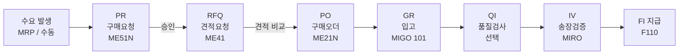

## 오늘 학습 목표

- SAP/ERP 개념과 ECC vs S/4HANA 차이를 이해한다
- SAP MM의 **P2P (Purchase to Pay) 전체 흐름**을 큰 그림으로 파악한다
- 각 단계의 역할과 T-code를 연결해서 기억한다

---

## 1. SAP 기초 - ERP와 SAP

**ERP(Enterprise Resource Planning)**: 기업의 구매, 생산, 회계, HR 등 모든 업무를 **하나의 통합 시스템**으로 관리. 부서 간 데이터가 실시간으로 연결되어 중복 입력, 오류가 줄어든다.

SAP는 세계 1위 ERP 소프트웨어 기업이며, SAP MM은 그 안의 **구매/재고 관리 모듈**이다.

### ECC 6.0 vs S/4HANA

| 구분 | SAP ECC 6.0 | SAP S/4HANA |
|------|-------------|-------------|
| DB | 일반 RDBMS (Oracle, MSSQL 등) | SAP HANA (In-Memory DB) |
| UI | SAP GUI (전통적인 화면) | Fiori (웹/모바일 기반) |
| 처리 속도 | 상대적으로 느림 | 대용량 데이터 실시간 처리 |
| 출시 | 2006년 | 2015년 (현재 표준) |
| 유지보수 | 2027년 종료 예정 | 현재 주력 |
| 현장 현황 | 아직 많은 기업이 사용 중 | 신규 도입 및 전환 진행 중 |

> 실무에서는 ECC 환경이 많이 남아 있어 두 버전 모두 알아두는 게 유리하다.

---

## 2. P2P 프로세스 전체 흐름

P2P는 **수요 발생부터 대금 지급까지** 구매의 전 과정을 뜻한다.

흐름의 핵심: **서류 → 실물 이동 → 회계 처리** 순서로 진행된다.

---

## 3. 각 단계별 핵심 정리

### 수요 발생 / MRP (MD01N, MD02)

- **무엇**: 자재가 필요하다는 신호가 발생하는 출발점
- **방법 1 - MRP 자동**: 시스템이 재고 부족을 감지해 PR을 자동 생성
- **방법 2 - 수동**: 담당자가 직접 ME51N으로 PR 작성
- **MRP 핵심**: 수요 요소(PIR, 판매오더, 예약) vs. 공급 요소(재고, PO) 비교 후 부족분 계획

### PR - 구매요청 (ME51N)

| 항목 | 내용 |
|------|------|
| 역할 | "이 자재를 구매해 주세요"라는 내부 요청 문서 |
| 생성자 | MRP 자동 or 현업 담당자 |
| 주요 필드 | 자재번호, 수량, 납기일, 플랜트 |
| 다음 단계 | 승인 후 RFQ 또는 직접 PO 전환 (ME57) |

### RFQ - 견적요청 (ME41)

| 항목 | 내용 |
|------|------|
| 역할 | 공급업체에 가격/납기를 물어보는 문서 |
| 비교 | ME47 (견적 입력) - ME49 (가격 비교) |
| 선택 | 가장 유리한 공급업체 선정 후 PO 발행 |

> 기존 거래처나 단가계약이 있으면 RFQ 없이 바로 PO 발행 가능.

### PO - 구매오더 (ME21N)

| 항목 | 내용 |
|------|------|
| 역할 | 공급업체와의 법적 구매 계약 문서 |
| 구성 | Header (공급업체, 납기) + Line Item (자재, 수량, 단가) |
| 주요 필드 | 구매조직, 구매그룹, 납품처 플랜트, 결제조건 |
| 연결 | PR 번호가 PO에 이어짐 (추적 가능) |

### GR - 입고 (MIGO, 이동유형 101)

| 항목 | 내용 |
|------|------|
| 역할 | 실물 자재가 창고에 입고되는 물리적 이동 |
| 이동유형 | **101** - PO 기준 입고 (가장 기본) |
| 자동 회계 | 재고 계정(BSX) 증가, GR/IR 정산 계정(WRX) 발생 |
| 결과 | 재고 수량 증가 + 회계 전표 자동 생성 |

**3-Way Matching**의 첫 번째 요소: PO - **GR** - Invoice

### QI - 품질검사 (선택)

- GR 후 자재를 **검사재고(QI Stock)**에 먼저 놓고 품질 합격 시 비제한 재고로 이동
- 자재 마스터 설정에 따라 자동 적용 여부 결정
- QM 모듈과 연동

### IV - 송장검증 (MIRO)

| 항목 | 내용 |
|------|------|
| 역할 | 공급업체 청구서와 PO/GR을 대조하는 검증 단계 |
| 3-Way Matching | **PO 단가 = GR 수량 = Invoice 금액** 일치 확인 |
| 불일치 시 | 송장 블록 (가격 허용차, 수량 차이) |
| 결과 | 회계 지급 채무 발생 |

### FI 지급 (F110)

- 검증된 송장을 기준으로 **공급업체에 실제 대금 지급**
- 지급 방법: 자동 지급 프로그램 (F110) 또는 수동
- 결제조건(Payment Terms)에 따라 지급 일자 결정

---

## 4. 핵심 용어 정리

| 용어 | 영문 | 설명 |
|------|------|------|
| P2P | Purchase to Pay | 구매요청부터 대금지급까지 전 구매 프로세스 |
| MRP | Material Requirements Planning | 수요-재고 분석 후 자동 계획 생성 |
| PR | Purchase Requisition | 구매요청서 (내부 문서) |
| RFQ | Request for Quotation | 견적요청서 (공급업체 대상) |
| PO | Purchase Order | 구매오더 (법적 계약) |
| GR | Goods Receipt | 입고 처리 |
| QI | Quality Inspection | 품질검사 |
| IV | Invoice Verification | 송장검증 |
| GR/IR | GR/IR Clearing Account | 입고와 송장 사이 임시 정산 계정 |
| 3-Way Match | - | PO + GR + Invoice 3가지 일치 확인 |
| 이동 유형 | Movement Type | SAP 재고 이동 유형 코드 (101: 입고, 261: 출고 등) |

---

## 5. 오늘 정리

**P2P 흐름을 한 줄로**: 필요 발생 → 요청 → 견적 → 계약 → 납품 → 검증 → 지급

각 단계가 독립된 문서(PR, PO, GR 전표, Invoice)로 남아 **감사 추적(Audit Trail)**이 가능하다는 것이 SAP의 핵심 강점이다.

## 6. 다음 공부 계획

- **Day 02**: 조직 구조 심화 - Company Code, Plant, Purchasing Org 설정 관계
- **Day 03**: 자재 마스터 (Material Master) - MM01, 주요 View별 필드 의미
- 참고: [커리큘럼 Phase 1 Week 1]({{ "/curriculum" | relative_url }})
