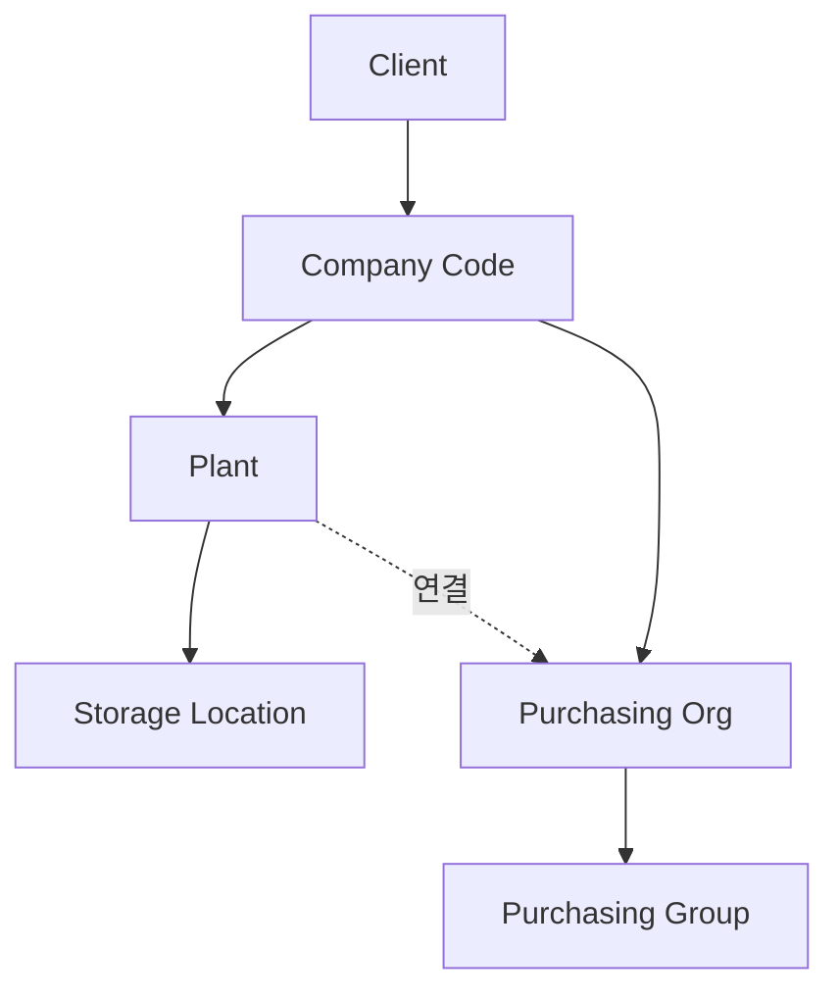

## 오늘 학습 목표

- Plant와 Storage Location의 역할을 이해한다
- Purchasing Organization이 Plant에 어떻게 연결되는지 파악한다
- SAP MM의 핵심 조직 단위 전체 구조를 그릴 수 있다

---

## 1. Plant (플랜트)

| 항목 | 내용 |
|------|------|
| 정의 | 생산, 조달, 재고 관리의 **핵심 조직 단위** |
| 특징 | 자재 마스터, 재고, MRP 모두 Plant 단위로 관리됨 |
| 연결 | 반드시 하나의 Company Code에 속해야 함 |
| 예 | 수원 사업장(1001), 구미 사업장(1002) |

**Plant T-code:**

| T-code | 설명 |
|--------|------|
| OX10 | Plant 생성/변경 |
| OX18 | Plant - Company Code 연결 |
| EC01 | Plant 복사 (기존 Plant 설정 복제) |

**Plant에서 관리되는 것들:**

- 자재 마스터의 조달/MRP/창고 관련 View
- 재고 (Unrestricted, QI, Blocked)
- MRP 실행 단위
- Purchasing Organization 연결

---

## 2. Storage Location (보관 위치)

| 항목 | 내용 |
|------|------|
| 정의 | Plant 안의 **물리적 창고/보관 공간 구분** |
| 특징 | 재고는 Plant + Storage Location 조합으로 관리됨 |
| 예 | 0001: 원자재 창고, 0002: 완제품 창고, 0003: 불량품 보관 |

**Storage Location T-code:**

| T-code | 설명 |
|--------|------|
| OX09 | Storage Location 생성 |
| MMSC | 자재에 Storage Location 확장 |
| MB52 | 창고별 재고 조회 (Plant + SLoc) |

> 재고를 조회할 때 "Plant 1001, SLoc 0001에 몇 개 있나"와 같이 두 단위를 함께 지정한다.

---

## 3. Purchasing Organization (구매 조직)

| 항목 | 내용 |
|------|------|
| 정의 | 공급업체와 가격/조건을 **협상하고 계약하는 단위** |
| 특징 | PO 발행 권한 보유. Info Record, 계약도 구매 조직 단위로 관리 |
| 유형 | 중앙 구매 조직(전사 공통) vs 플랜트별 구매 조직 |

**Purchasing Organization 운영 모델:**

| 모델 | 설명 |
|------|------|
| 중앙 구매 | 하나의 구매 조직이 여러 Plant 담당. 스케일 협상 유리 |
| 분산 구매 | Plant마다 별도 구매 조직. 현지 대응 유리 |
| 레퍼런스 구매 조직 | 단가 마스터만 관리, 실제 발주는 하위 조직이 수행 |

**Purchasing Group (구매 그룹):**
- 구매 조직 안의 **담당자/팀 단위**
- PO에 필수 입력값. 담당자 추적 및 권한 분리에 사용

---

## 4. 전체 조직 구조 정리

**Plant - Purchasing Org 연결 방식:**

| 방식 | 설명 |
|------|------|
| Plant에 구매 조직 직접 연결 | Plant별 전용 구매 조직 |
| Company Code 레벨 구매 조직 | 해당 Company Code의 모든 Plant에 적용 |
| 크로스 Company Code | 여러 Company Code에 걸쳐 사용 (특수 케이스) |

---

## 5. 조직 단위별 역할 비교

| 단위 | 영문 | 주요 역할 | 키 T-code |
|------|------|----------|----------|
| Client | Client | 시스템 최상위, 데이터 공유 범위 | - |
| 회사 코드 | Company Code | 법인, 재무제표 단위 | OX02 |
| 플랜트 | Plant | 재고/MRP/생산 단위 | OX10 |
| 보관 위치 | Storage Location | 물리적 창고 구분 | OX09 |
| 구매 조직 | Purchasing Org | PO 발행, 공급업체 협상 단위 | OX08 |
| 구매 그룹 | Purchasing Group | 담당자/팀 단위 | OME4 |

---

## 6. 오늘 정리

- **Plant**: MM의 핵심. 재고, MRP, 구매 모두 Plant 기준
- **Storage Location**: Plant 안의 창고 구분. 재고는 항상 Plant + SLoc 단위
- **Purchasing Org**: PO 발행 권한을 가진 구매 단위. Plant와 연결됨

## 7. 다음 공부 계획

- **Day 05**: Week 1 전체 복습 - 조직 구조 다이어그램 한 번에 그려보기
