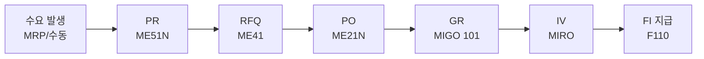
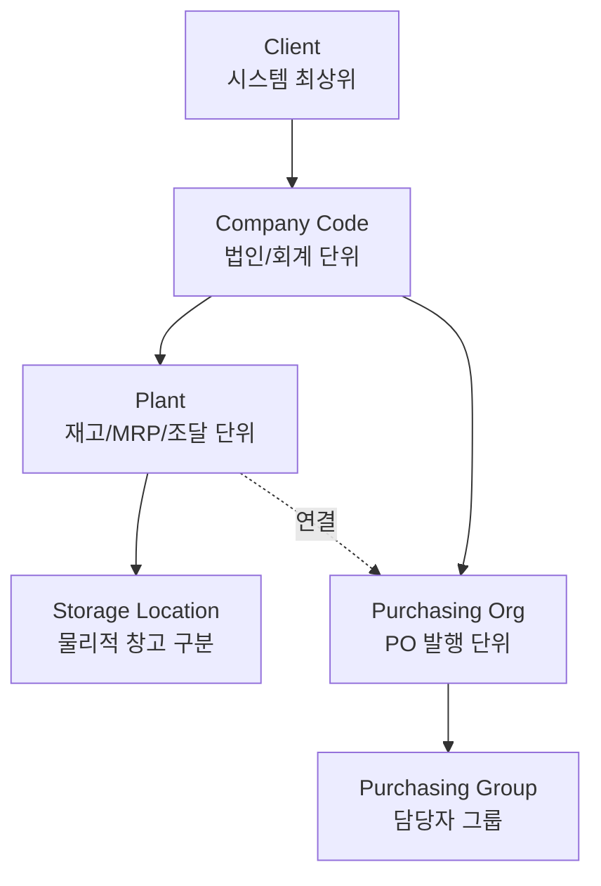

## 오늘 학습 목표

- Day 01~04에서 배운 내용을 빠짐없이 복습한다
- SAP MM 조직 구조를 다이어그램으로 직접 그릴 수 있다
- 헷갈렸던 개념을 Q&A로 정리한다

---

## 1. Week 1 복습 체크리스트

아래 항목을 보지 않고 설명할 수 있으면 체크.

**Day 01 - SAP 기초 & P2P 흐름**
- [ ] ERP가 무엇인지 한 문장으로 설명할 수 있다
- [ ] ECC 6.0 vs S/4HANA: DB, UI, 유지보수 차이를 말할 수 있다
- [ ] P2P 8단계를 순서대로 말할 수 있다 (MRP → PR → ... → FI)
- [ ] 각 단계의 T-code를 연결할 수 있다
- [ ] 3-Way Matching이 무엇인지 설명할 수 있다

**Day 02 - SAP GUI**
- [ ] SAP GUI 화면 5가지 구성 요소를 말할 수 있다
- [ ] `/n`, `/o`, `/i` 명령어 차이를 설명할 수 있다
- [ ] Favorites에 T-code를 등록하는 방법을 안다

**Day 03 - Client / Company Code**
- [ ] Client와 Company Code의 차이를 설명할 수 있다
- [ ] Company Code가 재무제표의 기준 단위임을 안다
- [ ] OX02, OBY6 T-code 용도를 안다

**Day 04 - Plant / Storage Location**
- [ ] Plant가 MM에서 핵심 조직 단위인 이유를 설명할 수 있다
- [ ] Storage Location이 Plant 안의 창고 구분임을 안다
- [ ] Purchasing Org와 Plant의 연결 방식을 안다

---

## 2. Week 1 핵심 내용 요약

### SAP ECC vs S/4HANA

| 구분 | ECC 6.0 | S/4HANA |
|------|---------|---------|
| DB | RDBMS | HANA (In-Memory) |
| UI | SAP GUI | Fiori |
| 유지보수 | 2027년 종료 | 현재 주력 |

### P2P 전체 흐름

### SAP 조직 구조 전체

---

## 3. 헷갈리는 개념 Q&A

**Q1. Client와 Company Code는 뭐가 다른가?**
- Client: SAP 시스템 전체의 최상위 단위. 운영/개발/테스트 환경 구분
- Company Code: 법인/회계 단위. 재무제표(B/S, P/L)가 여기서 만들어짐
- 1개 Client 안에 여러 Company Code 존재 가능

**Q2. Plant가 왜 MM에서 가장 중요한가?**
- 자재 마스터의 재고/MRP/구매 View가 Plant 단위
- 재고 수량도 Plant 단위로 집계
- MRP 실행 단위가 Plant
- PO 발행 시 납품처 Plant를 반드시 지정

**Q3. Storage Location이 없으면?**
- Plant 레벨에서만 재고가 잡힘. 창고 내 위치 구분 불가
- SLoc를 쓰면 "Plant 1001의 원자재 창고(0001)에 100개" 같이 세분화 가능

**Q4. Purchasing Org가 Company Code에 연결되는 건가, Plant에 연결되는 건가?**
- 둘 다 가능. 설정 방식에 따라:
  1. Plant 전용: Plant에 직접 연결
  2. Company Code 레벨: 해당 Company Code의 모든 Plant에 적용
  3. 크로스 Company Code: 여러 법인에 걸쳐 사용

---

## 4. 조직 단위 한눈에 비교

| 단위 | 범위 | 주요 용도 | T-code |
|------|------|----------|--------|
| Client | 시스템 전체 | 환경 분리 (운영/개발/테스트) | - |
| Company Code | 법인 | 재무제표, 법인세 신고 기준 | OX02 |
| Plant | 사업장 | 재고, MRP, 구매 핵심 단위 | OX10 |
| Storage Location | 창고 | 물리적 재고 위치 구분 | OX09 |
| Purchasing Org | 구매 조직 | PO 발행, 공급업체 계약 | OX08 |
| Purchasing Group | 구매 담당 | 담당자/팀 구분 | OME4 |

---

## 5. Week 1 마무리

**이번 주 배운 것 한 줄 요약:**

- ERP/SAP 기초 이해
- SAP GUI로 T-code 입력하고 Favorites 활용
- SAP 조직 계층: Client → Company Code → Plant → SLoc
- P2P 전체 흐름과 각 단계 T-code

## 6. Week 2 예고 (Day 06~)

커리큘럼 Phase 1 Week 2:
- **Day 06**: Purchasing Organization 심화 - 구매 조직 유형, 설정 방법
- **Day 07**: Vendor Master (BP) 개요 - 공급업체 마스터 데이터
- **Day 08**: Vendor Master 상세 View 별 주요 필드
