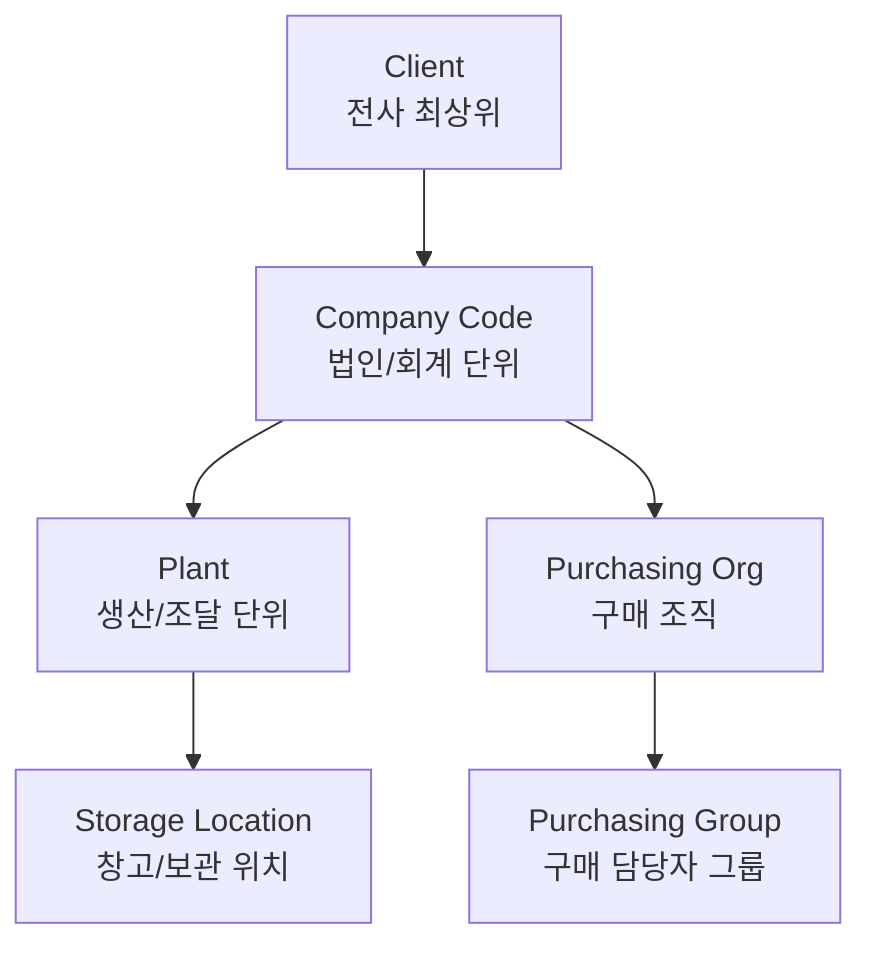

## 오늘 학습 목표

- SAP 조직 계층의 전체 구조를 이해한다
- Client와 Company Code의 역할 차이를 명확히 구분한다
- T-code로 조직 단위를 조회하는 방법을 익힌다

---

## 1. SAP 조직 계층 전체 구조

SAP MM은 아래 계층 구조 안에서 동작한다. **위로 갈수록 범위가 크고, 아래로 갈수록 구체적**이다.

---

## 2. Client

| 항목 | 내용 |
|------|------|
| 정의 | SAP 시스템 내 **최상위 독립 단위** |
| 특징 | 동일 Client 내에서 마스터 데이터(자재, 벤더) 공유 |
| 용도 구분 | Client 100: 운영, Client 200: 개발, Client 300: 테스트 (예시) |
| 예 | 삼성전자 전체가 하나의 Client |

> Client가 다르면 **데이터가 완전히 분리**된다. 운영 Client에서 실수하면 실제 업무에 영향이 생기므로 테스트는 별도 Client에서 진행한다.

---

## 3. Company Code (회사 코드)

| 항목 | 내용 |
|------|------|
| 정의 | **독립적인 회계(FI) 단위**. 재무제표(B/S, P/L)가 Company Code 기준으로 생성 |
| 특징 | 하나의 Client 아래 여러 Company Code 가능 |
| 예 | 삼성전자(주): 1000, 삼성전자 베트남법인: 2000 |
| T-code | OX02 (생성/변경), OBY6 (글로벌 파라미터 설정) |

**Company Code의 핵심 설정값 (Global Parameters):**

| 설정 | 의미 |
|------|------|
| 통화 (Currency) | 재무 보고 기준 통화 (KRW, USD 등) |
| 회계연도 변형 (FY Variant) | 회계연도 기간 정의 (K4: 1월~12월) |
| 계정 기표 방식 | 자동 전표 생성 방식 |

---

## 4. Client vs Company Code 비교

| 구분 | Client | Company Code |
|------|--------|-------------|
| 범위 | 시스템 전체 최상위 | 법인/회계 단위 |
| 마스터 데이터 | Client 전체 공유 가능 | Company Code 단위로 관리 |
| 재무제표 | 해당 없음 | B/S, P/L 기준 단위 |
| 개수 | 시스템당 보통 3~4개 | Client당 여러 개 |
| 예 | 삼성전자 SAP 시스템 전체 | 삼성전자(주), 삼성전자 베트남법인 |

---

## 5. 조직 계층 실무 예시

<pre style="color:#24292e; background:#f6f8fa; padding:16px; border-radius:6px; border:1px solid #e1e4e8; font-size:0.9em;">Client 100 (운영)
├── Company Code 1000 (삼성전자 한국)
│   ├── Plant 1001 (수원 사업장)
│   └── Plant 1002 (구미 사업장)
└── Company Code 2000 (삼성전자 베트남)
    └── Plant 2001 (하노이 공장)</pre>

---

## 6. 핵심 용어 정리

| 용어 | 영문 | 설명 |
|------|------|------|
| Client | Client | SAP 최상위 독립 단위 |
| 회사 코드 | Company Code | 독립 회계/법인 단위 |
| 회계연도 변형 | Fiscal Year Variant | 회계연도 기간 정의 설정 |
| 전표 | Document | SAP에서 거래를 기록하는 단위 (자재전표, 회계전표) |

---

## 7. 오늘 정리

- **Client**: 시스템 전체 최상위. 보통 운영/개발/테스트로 분리
- **Company Code**: 법인 단위. 재무제표가 여기서 만들어짐
- 1개 Client 안에 여러 Company Code, 1개 Company Code 안에 여러 Plant

## 8. 다음 공부 계획

- **Day 04**: Plant / Storage Location - 재고 관리의 핵심 단위
- **Day 05**: Week 1 전체 복습 및 조직 구조 완전 정리
