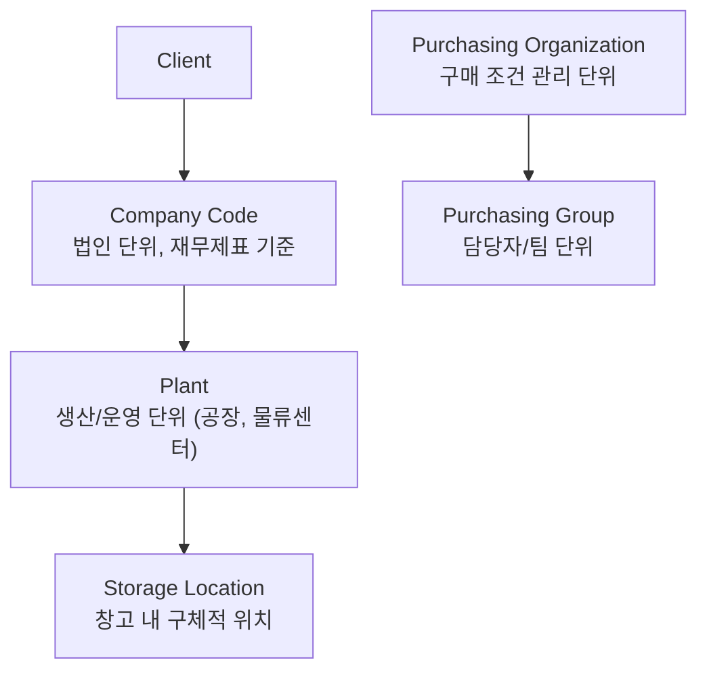
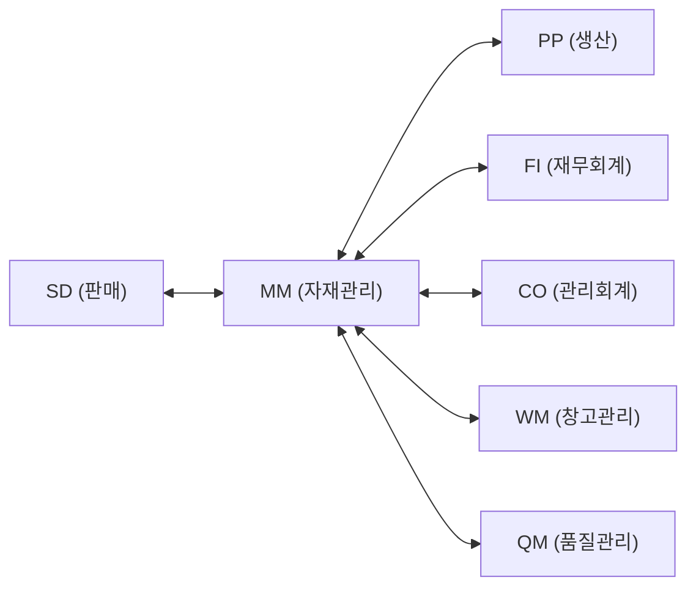

# SAP MM 모듈 개요

## MM 모듈이란?

SAP MM(Materials Management)은 구매에서 재고관리, 송장 검증까지 **자재 흐름** 전반을 관리하는 모듈입니다.

**주요 기능 영역:**
- 구매 관리 (Purchasing)
- 재고 관리 (Inventory Management)
- 물류 송장 검증 (Logistics Invoice Verification)
- 기준 정보 관리 (Master Data)

---

## 조직 구조 (Organizational Structure)

### 핵심 조직 단위 설명

| 단위 | 설명 | 예시 |
|------|------|------|
| Client | SAP 시스템 최상위 단위 | 그룹사 전체 |
| Company Code | 독립 재무제표 작성 단위 | 각 법인 |
| Plant | 자재 관리 기준 단위 | 서울 공장, 부산 물류 |
| Storage Location | Plant 내 보관 장소 | 원자재 창고, 완제품 창고 |
| Purch. Org | 구매 협상/조건 관리 | 중앙구매, 현지구매 |
| Purch. Group | 실무 구매 담당 단위 | 기계팀, 전자팀 |

---

## MM과 다른 모듈의 연계

- **MM-FI**: GR 시 자동 회계 전표 생성 (BSX, WRX 계정)
- **MM-PP**: 생산 오더 → 자재 출고 (Movement Type 261)
- **MM-SD**: 고객 납품 → 출고 (Movement Type 601)
- **MM-QM**: 검수(QI) 재고 연계

---

## MM 문서 유형 구조

| 문서 유형 | 번호 범위 | 설명 |
|----------|----------|------|
| 구매 요청 (PR) | 1xxxxxxxxx | ME51N |
| 구매 발주 (PO) | 45xxxxxxxx | ME21N, NB/FO/UB |
| 자재 문서 | 5xxxxxxxxx | MIGO, 입출고 기록 |
| 회계 문서 | 5xxxxxxxxx | GR/IV 시 자동 생성 |
| 물류 송장 | 51xxxxxxxx | MIRO |

---

## 핵심 T-code (개요)

| T-code | 설명 |
|--------|------|
| SPRO | 설정 (Customizing) |
| MM01 | 자재 마스터 생성 |
| BP | 비즈니스 파트너 (공급업체) |
| ME21N | 구매 발주 생성 |
| MIGO | 입/출고 처리 |
| MIRO | 송장 검증 |
| MMBE | 재고 현황 조회 |

---

## 스크린샷

> 스크린샷은 실제 SAP 시스템에서 캡쳐 후 아래에 추가합니다.
> 이미지 경로: `assets/img/process/overview-{순번}-{설명}.png`

<!-- 예시:  -->
<!-- 예시:  -->

---

## 필드 → 마스터 연관

| 화면 필드 | 데이터 출처 | 설정/관리 위치 | 비고 |
|---------|-----------|-------------|------|
| Company Code | 회사 코드 마스터 | SPRO → Enterprise Structure → Financial Accounting → Define CC | OX02 |
| Plant | 플랜트 마스터 | SPRO → Enterprise Structure → Logistics → Define Plant | OX10 |
| Storage Location | 보관 위치 마스터 | SPRO → Enterprise Structure → Logistics → Define SLoc | OX09 |
| Purch. Organization | 구매 조직 마스터 | SPRO → Enterprise Structure → Purchasing → Define Purch. Org | OX08 |
| Purch. Group | 구매 그룹 마스터 | SPRO → MM → Purchasing → Create Purch. Groups | OME4 |

---

## 관련 SPRO 설정

→ [기준 정보 설정 가이드](/mm/config-guide/master-data/) 참조
