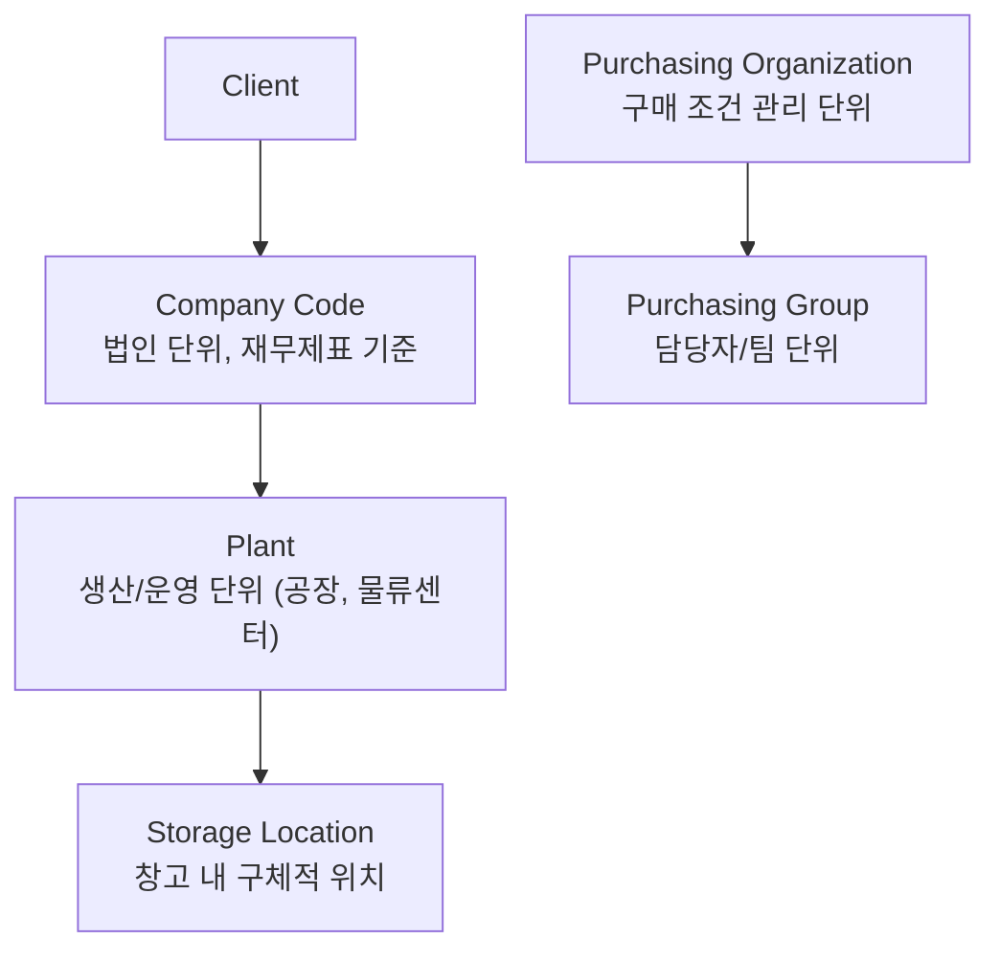
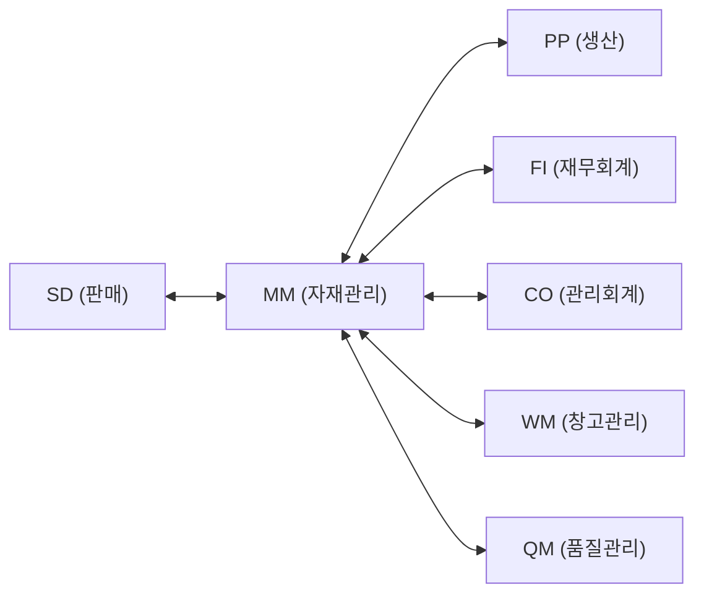

# SAP MM 모듈 개요

## MM 모듈이란?

SAP MM(Materials Management)은 구매에서 재고관리, 송장 검증까지 **자재 흐름** 전반을 관리하는 모듈입니다.

구매계획에서부터 구매요청, 발주, 입고, 출고 및 대금지불까지 일련의 구매자재 관리 업무를 최적화/효율화할 수 있도록 **Best Practice** 기반의 풍부한 기능을 제공합니다.

### MM 모듈 구성 요소 (Components)

| 구성 요소 | 코드 | 설명 |
|----------|------|------|
| **기준 정보 관리** | MM-MD | 자재마스터, 공급업체마스터, Info Record 등 관리 |
| **소비기준 계획** | MM-CBP | 재주문점 방식(Reorder Point) 등으로 소요량 산출 |
| **구매 관리** | MM-PUR | 구매요청 접수 - 견적 관리 - 구매오더 관리 |
| **서비스 관리** | MM-SRV | 용역 구매요청 - 구매오더 관리 |
| **재고 관리** | MM-IM | 자재 이동을 통한 재고 관리 |
| **물류 송장 검증** | MM-LIV | 공급업체 송장 검증 및 대금 지불 처리 |

### MM 주요 기능

| 기능 | 설명 |
|------|------|
| **기준정보 관리** | 업체 및 자재마스터, 자동화/최적화를 위한 다양한 구매 기준정보 관리 |
| **구매 관리** | 일반자재, 공사, VMI, 외주가공 등 다양한 형태의 구매 기능 지원 |
| **구매 계획** | MRP, 통계적 방법에 의한 소비기준 계획 등 다양한 구매계획 지원 |
| **재고 관리** | 다양한 자재 이동 관리 기능 |
| **송장 검증** | 회계와 실시간 통합된 송장검증 기능 |
| **정보 분석** | 유연한 다차원 구매 및 자재 분석, 업체 평가 |

---

## 조직 구조 (Organizational Structure)

### 핵심 조직 단위 설명

| 단위 | 설명 | 예시 |
|------|------|------|
| Client | SAP 시스템 최상위 단위 | 그룹사 전체 |
| Company Code | 독립 재무제표 작성 단위 (1:N Plant) | 각 법인 |
| Plant | 자재 관리/재고 평가/MRP 기준 단위 (1:N SLoc) | 서울 공장, 부산 물류 |
| Storage Location | Plant 내 보관 장소 (N:M Plant) | 원자재 창고, 완제품 창고 |
| Purch. Org | 구매 협상/조건 관리 (N:M Company Code) | 중앙구매, 현지구매 |
| Purch. Group | 실무 구매 담당 단위 | 기계팀, 전자팀 |

### 구매 조직 운영 유형

| 유형 | 설명 | 특징 |
|------|------|------|
| 중앙 집중 구매조직 | Company Code 레벨에 하나의 구매조직 | 협상력 강화, 가격경쟁력, Global Procurement |
| 분산 구매조직 | Plant별로 별도 구매조직 | 로컬 구매 비율 높음, 배송 정보 획득 용이 |
| 표준 구매조직 | 여러 구매조직이 특정 Plant에 조달 시 대표로 지정 | STO, Consignment 소스 자동 결정에 사용 |
| 기준 구매조직 | 유리한 계약 조건을 다른 구매조직이 공유 | 기준 구매조직의 조건레코드를 가격 결정에 활용 |

> **Plant**는 단순 공장 외에 물류센터, 판매지사, 본부도 될 수 있습니다. 또한 재고 평가(Valuation Area)의 기준 단위이므로 초기 정의가 매우 중요합니다.
{: .callout .callout-important}

### 조직 구조 설정 T-code (SPRO)

| T-code | 경로 | 설명 |
|--------|------|------|
| OX02 | ES - Definition - FI - Edit Company Code | 회사코드 생성/변경 |
| OX10 | ES - Definition - Logistics - Define Plant | 플랜트 생성 |
| OX18 | ES - Assignment - Logistics - Assign Plant to CoCd | 플랜트 - 회사코드 지정 |
| OX09 | ES - Definition - MM - Maintain Storage Location | 저장위치 생성 |
| OMKJ | ES - Definition - MM - Maintain Purch. Org | 구매조직 생성 |
| OX01 | ES - Assignment - MM - Assign POrg to CoCd | 구매조직 - 회사코드 지정 |
| OX17 | ES - Assignment - MM - Assign POrg to Plant | 구매조직 - 플랜트 지정 |
| OMKI | ES - Assignment - MM - Assign Standard POrg to Plant | 표준 구매조직 지정 |

---

## 주요 용어 (MM Terminology)

| 용어 | 설명 |
|------|------|
| **MRP** (Material Requirement Planning) | 자재 소요 계획. 자재별로 소요량과 공급량을 비교하여 자재소요 계획을 작성하는 것 |
| **Info Record** (구매정보레코드) | 구매 부서를 위한 특정 자재와 협력업체 관계 및 가격에 대한 기준 정보. 일반 데이터, 구매 데이터를 포함 |
| **Source List** (소스리스트) | 특정 자재에 대해 유효시작/종료일을 기준으로 자재를 공급하는 공급업체를 관리 |
| **Quota Arrangement** (쿼터 조정) | 특정 자재에 대해 복수 공급업체의 물량 배분율을 % 단위로 관리 |
| **Stock Transfer** (재고이전) | 재고관리 자재를 타 플랜트(Plant)나 저장위치로 재고를 이전 처리 |
| **Transfer Posting** (이전전기) | 재고관리 자재의 재고 특성을 변화시킴 (예: 가용재고 - 보류재고) |
| **Stock Material** (저장성 자재) | 재고 관리를 하는 자재 (자재 재고 계정에서 재고 금액이 관리됨) |
| **Consumable Material** (소모성 자재) | 코스트센터나 자산 계정으로 전기되는 구매 자재/서비스. 대부분 입고와 동시에 출고 처리 |

---

## MM과 다른 모듈의 연계

- **MM-FI**: GR 시 자동 회계 전표 생성 (BSX, WRX 계정). PO, IV, Payment 시 자금계획에 반영
- **MM-PP**: 생산 오더 → 자재 출고 (Movement Type 261). MRP 소요량 계획 연계
- **MM-SD**: 고객 납품 → 출고 (Movement Type 601)
- **MM-QM**: 검수(QI) 재고 연계
- **MM-PS**: PR/PO/IV/GR 시 프로젝트 예산에 반영. Budget 내 관리 가능
- **MM-TR**: PO, IV, Payment 시 자금계획에 반영되어 자금수지 계획 가능

> **핵심 통합 원칙**: 구매오더를 참조한 자재 입고 처리를 하면 재고 수량을 증가시키는 **자재문서**와 재고자산을 증가시키는 **회계문서**가 동시에 자동 생성됩니다. 物의 흐름과 財의 흐름이 일치됩니다.
{: .callout .callout-important}

### MM-FI 연계 상세: 3단계 전기 구조

MM 구매 프로세스에서 FI로의 자동 전표 생성은 아래 3단계를 거칩니다:

| 단계 | 이벤트 | 생성 전표 | 주요 계정 |
|------|--------|----------|---------|
| 1. GR (입고) | MIGO - 구매오더 기준 입고 | 자재문서 + 회계문서 | BSX(재고) Dr / WRX(미결항목) Cr |
| 2. IV (송장검증) | MIRO - 공급업체 송장 입력 | 회계문서 | WRX(미결항목) Dr / 미지급금 Cr |
| 3. Payment (지급) | F110 - 자동 지급 실행 | 회계문서 | 미지급금 Dr / 은행계좌 Cr |

- **WRX 계정 (GR/IR)**: GR과 IV 사이에 존재하는 임시 미결 계정. GR 시 생성되고 IV 시 상계됨
- **BSX 계정 (재고자산)**: 자재 유형과 평가 클래스에 따라 자동 결정됨 (Account Determination - OBYC)

---

## MM 문서 유형 구조

| 문서 유형 | 번호 범위 | 설명 |
|----------|----------|------|
| 구매 요청 (PR) | 1xxxxxxxxx | ME51N |
| 구매 발주 (PO) | 45xxxxxxxx | ME21N, NB/FO/UB |
| 자재 문서 | 5xxxxxxxxx | MIGO, 입출고 기록 |
| 회계 문서 | 5xxxxxxxxx | GR/IV 시 자동 생성 |
| 물류 송장 | 51xxxxxxxx | MIRO |

---

## 핵심 T-code (개요)

| T-code | 설명 |
|--------|------|
| SPRO | 설정 (Customizing) |
| MM01 | 자재 마스터 생성 |
| BP | 비즈니스 파트너 (공급업체) |
| ME21N | 구매 발주 생성 |
| MIGO | 입/출고 처리 |
| MIRO | 송장 검증 |
| MMBE | 재고 현황 조회 |

---

## 스크린샷

> 스크린샷은 실제 SAP 시스템에서 캡쳐 후 아래에 추가합니다.
> 이미지 경로: `assets/img/process/overview-{순번}-{설명}.png`

<!-- 예시:  -->
<!-- 예시:  -->

---

필드 → 마스터 연관

| 화면 필드 | 데이터 출처 | 설정/관리 위치 | 비고 |
|---------|-----------|-------------|------|
| Company Code | 회사 코드 마스터 | SPRO → Enterprise Structure → Financial Accounting → Define CC | OX02 |
| Plant | 플랜트 마스터 | SPRO → Enterprise Structure → Logistics → Define Plant | OX10 |
| Storage Location | 보관 위치 마스터 | SPRO → Enterprise Structure → Logistics → Define SLoc | OX09 |
| Purch. Organization | 구매 조직 마스터 | SPRO → Enterprise Structure → Purchasing → Define Purch. Org | OX08 |
| Purch. Group | 구매 그룹 마스터 | SPRO → MM → Purchasing → Create Purch. Groups | OME4 |

---

## 관련 SPRO 설정

→ [기준 정보 설정 가이드](/mm/config-guide/master-data/) 참조
