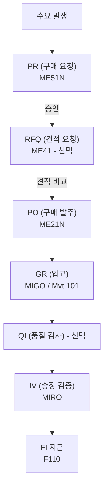

# P2P (Purchase to Pay) 전체 흐름

## 흐름 개요

---

## 단계별 상세

### 1. PR - 구매 요청서 (Purchase Requisition)

- **목적**: 내부 부서에서 구매 필요 시 구매팀에 요청
- **T-code**: ME51N (생성), ME52N (변경), ME53N (조회)
- **문서 유형**: NB (표준), 기타 커스텀
- **주요 필드**: 자재번호, 수량, 납기일, 구매 그룹, Plant

### 2. RFQ - 견적 요청 (Request for Quotation)

- **목적**: 공급업체에 가격 및 납기 조건 요청
- **T-code**: ME41 (RFQ 생성), ME47 (견적 입력), ME49 (가격 비교)
- **문서 유형**: AN
- **결과**: 최적 공급업체 선정 → PO 전환

### 3. PO - 구매 발주서 (Purchase Order)

- **목적**: 공급업체와의 공식 구매 계약
- **T-code**: ME21N (생성), ME22N (변경), ME23N (조회)

**PO 문서 유형:**

| 유형 | 코드 | 설명 |
|------|------|------|
| 표준 발주 | NB | 일반 외부 구매 |
| 장기 계약 | FO | Framework Order |
| 재고 이동 | UB | 플랜트 간 이동 |

**PO 구조:**
- **헤더**: 공급업체, 통화, 지급 조건, 인코텀즈
- **아이템**: 자재, 수량, 단가, 납기일, Plant

### 4. GR - 입고 (Goods Receipt)

- **목적**: 공급업체로부터 자재 수령, 재고 증가
- **T-code**: MIGO (Movement Type 101)
- **자동 생성**: 자재 문서 + 회계 전표 (BSX 차변, WRX 대변)

**GR 후 상태:**
- PO의 `GR Quantity` 업데이트
- 3-way Matching 기준 데이터 생성

### 5. IV - 송장 검증 (Invoice Verification)

- **목적**: 공급업체 청구서 검증 및 지급 채무 계상
- **T-code**: MIRO (입력), MIR4 (조회), MIR7 (임시 저장)
- **3-way Matching**: PO ↔ GR ↔ Invoice 수량/금액 비교

**자동 생성 전표:**
- 채무 계정 대변 (Vendor payable)
- GR/IR 정산 계정 차변

---

## 주요 체크포인트

| 단계 | 확인 사항 |
|------|----------|
| PR→PO | 승인 완료 여부, 소스 지정 |
| PO→GR | PO 수량 대비 GR 수량 |
| GR→IV | 3-way Matching 허용 오차 |
| IV→지급 | 지급 조건 (Payment Terms) |

---

## 스크린샷

> 스크린샷은 실제 SAP 시스템에서 캡쳐 후 아래에 추가합니다.
> 이미지 경로: `assets/img/process/flow-{순번}-{설명}.png`

<!-- 예시:  -->
<!-- 예시:  -->
<!-- 예시:  -->

---

## 필드 → 마스터 연관

| 화면 필드 | 데이터 출처 | 설정/관리 위치 | 비고 |
|---------|-----------|-------------|------|
| Document Type (PR/PO) | 문서 유형 마스터 | SPRO → MM → Purchasing → Define Document Types | NB, FO, UB 등 |
| Number Range | 번호 범위 설정 | SPRO → MM → Purchasing → Define Number Ranges for PO | 채번 방식 결정 |
| Release Strategy (승인) | 릴리스 전략 | SPRO → MM → Purchasing → Authorization → Release Procedure | 금액/조직 기준 |
| Payment Terms | 지급 조건 마스터 | SPRO → FI → AR/AP → Define Payment Terms | IV 후 지급 스케줄 결정 |

---

## 관련 SPRO 설정

→ [구매 설정 가이드](/mm/config-guide/purchasing/) 참조
