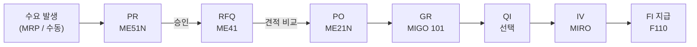
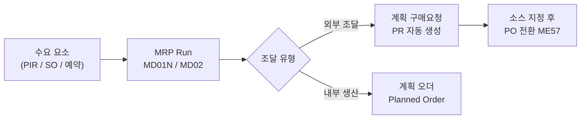

# P2P (Purchase to Pay) 전체 흐름

## 흐름 개요

---

## MRP (자재 소요량 계획 / Material Requirements Planning)

MRP는 **수요와 재고를 분석하여 구매 요청(PR) 또는 계획 오더를 자동 생성**하는 SAP의 자동 조달 계획 기능입니다.
PR을 수동으로 생성하는 대신, MRP 실행 시 부족 자재에 대해 PR이 자동 생성되어 P2P 프로세스를 시작합니다.

### MRP 유형 (MRP Type - 자재 마스터 MRP 1 View)

| MRP 유형 | 코드 | 설명 |
|---------|------|------|
| MRP (수요 기반) | PD | 종속/독립 수요에 따라 계획. 가장 일반적 |
| 재발주점 계획 | VB | 재고가 재발주점 이하로 떨어질 때 보충 계획 |
| 자동 재발주점 | VM | 과거 소비량 기반으로 재발주점 자동 계산 |
| MRP 미적용 | ND | MRP 실행 대상에서 제외 |

### MRP 핵심 파라미터

| 파라미터 | 위치 | 설명 |
|---------|------|------|
| **로트 크기 (Lot Size)** | MRP 1 View | EX: 순소요량, FX: 고정수량, HB: 최대재고까지 보충 |
| **재발주점 (Reorder Point)** | MRP 1 View | VB 유형 - 이 수량 이하로 떨어지면 조달 시작 |
| **안전 재고 (Safety Stock)** | MRP 2 View | 리드타임 변동성 대비 여유 재고 |
| **계획 납기 시간 (PDT)** | MRP 2 / Info Record | 발주 후 입고까지 소요 일수. MRP 납기 역산 기준 |
| **GR 처리 시간** | MRP 2 View | 입고 후 재고 사용 가능까지 소요 일수 |
| **MRP 콘트롤러** | MRP 1 View | MRP 결과를 검토하고 처리하는 담당자 |

### MRP 수급 요소 (MRP Elements)

MRP는 수요 요소와 공급 요소를 비교하여 **순소요량(Net Requirement)**을 계산합니다.

**수요 요소 (Demand Elements):**

| 요소 | 약어 | 설명 |
|------|------|------|
| 계획 독립 소요량 | PIR | MD61에서 입력하는 예측 수요 |
| 고객 주문 | SO | SD 판매 오더에서 발생 |
| 예약 | Res | 생산 오더, 유지보수 오더 등에서 생성 |
| 종속 소요량 | DepReq | BOM 전개 후 하위 자재에 생성되는 수요 |

**공급 요소 (Supply Elements):**

| 요소 | 약어 | 설명 |
|------|------|------|
| 현재고 | Stock | 현재 창고 보유 재고 |
| 구매 오더 | PO | 이미 발주된 오더 (미입고 수량) |
| 계획 구매요청 | PReq | MRP가 자동 생성한 구매 요청 |
| 계획 오더 | PlOrd | MRP가 자동 생성한 내부 생산 계획 |
| 입고 예정 | SchedA | Scheduling Agreement 납품 일정 |

### MRP 실행 절차

### 예외 메시지 (Exception Messages)

MRP 실행 후 `MD04` 또는 `MD05`에서 반드시 검토해야 합니다.

| 번호 | 내용 | 조치 |
|------|------|------|
| 10 | 납기일 내 조달 불가 | 공급업체와 납기 협의 |
| 20 | 납기 앞당기기 가능 | 기존 PO 납기 조정 |
| 25 | 납기 늦추기 가능 | 기존 PO 납기 조정 |
| 30 | 초과 재고 발생 | PO 취소 또는 수량 조정 검토 |
| 50 | 계획 기간 범위 초과 | 계획 기간 설정 확인 |

### T-code

| T-code | 설명 |
|--------|------|
| MD01N | MRP 실행 (플랜트 단위, 신규 UI) |
| MD02 | 단일 자재 MRP 실행 |
| MDBT | 백그라운드 MRP 일괄 실행 |
| MD04 | 수급 목록 - 실시간 현황 조회 |
| MD05 | MRP List - MRP 실행 시점 스냅샷 |
| MD06 | MRP List 집계 조회 |
| MD11 | 계획 오더 수동 생성 |
| MD12 | 계획 오더 변경 |
| MD61 | 계획 독립 소요량 (PIR) 입력 |
| ME57 | 계획 PR 소스 지정 및 PO 전환 |

> **MD04 vs MD05**: MD04는 현재 시점 실시간 수급 현황, MD05는 마지막 MRP 실행 시점의 스냅샷입니다. 일반적으로 MD04를 주로 사용합니다.
{: .callout .callout-note}

---

## 단계별 상세

### 1. PR - 구매 요청서 (Purchase Requisition)

- **목적**: 내부 부서에서 구매 필요 시 구매팀에 요청
- **T-code**: ME51N (생성), ME52N (변경), ME53N (조회)
- **문서 유형**: NB (표준), 기타 커스텀
- **주요 필드**: 자재번호, 수량, 납기일, 구매 그룹, Plant

### 2. RFQ - 견적 요청 (Request for Quotation)

- **목적**: 공급업체에 가격 및 납기 조건 요청
- **T-code**: ME41 (RFQ 생성), ME47 (견적 입력), ME49 (가격 비교)
- **문서 유형**: AN
- **결과**: 최적 공급업체 선정 → PO 전환

### 3. PO - 구매 발주서 (Purchase Order)

- **목적**: 공급업체와의 공식 구매 계약
- **T-code**: ME21N (생성), ME22N (변경), ME23N (조회)

**PO 문서 유형:**

| 유형 | 코드 | 설명 |
|------|------|------|
| 표준 발주 | NB | 일반 외부 구매 |
| 장기 계약 | FO | Framework Order |
| 재고 이동 | UB | 플랜트 간 이동 |

**PO 구조:**
- **헤더**: 공급업체, 통화, 지급 조건, 인코텀즈
- **아이템**: 자재, 수량, 단가, 납기일, Plant

### 4. GR - 입고 (Goods Receipt)

- **목적**: 공급업체로부터 자재 수령, 재고 증가
- **T-code**: MIGO (Movement Type 101)
- **자동 생성**: 자재 문서 + 회계 전표 (BSX 차변, WRX 대변)

**GR 후 상태:**
- PO의 `GR Quantity` 업데이트
- 3-way Matching 기준 데이터 생성

### 5. IV - 송장 검증 (Invoice Verification)

- **목적**: 공급업체 청구서 검증 및 지급 채무 계상
- **T-code**: MIRO (입력), MIR4 (조회), MIR7 (임시 저장)
- **3-way Matching**: PO ↔ GR ↔ Invoice 수량/금액 비교

**자동 생성 전표:**
- 채무 계정 대변 (Vendor payable)
- GR/IR 정산 계정 차변

---

## 주요 체크포인트

| 단계 | 확인 사항 |
|------|----------|
| PR→PO | 승인 완료 여부, 소스 지정 |
| PO→GR | PO 수량 대비 GR 수량 |
| GR→IV | 3-way Matching 허용 오차 |
| IV→지급 | 지급 조건 (Payment Terms) |

---

## 스크린샷

> 스크린샷은 실제 SAP 시스템에서 캡쳐 후 아래에 추가합니다.
> 이미지 경로: `assets/img/process/flow-{순번}-{설명}.png`

<!-- 예시:  -->
<!-- 예시:  -->
<!-- 예시:  -->

---

필드 → 마스터 연관

| 화면 필드 | 데이터 출처 | 설정/관리 위치 | 비고 |
|---------|-----------|-------------|------|
| Document Type (PR/PO) | 문서 유형 마스터 | SPRO → MM → Purchasing → Define Document Types | NB, FO, UB 등 |
| Number Range | 번호 범위 설정 | SPRO → MM → Purchasing → Define Number Ranges for PO | 채번 방식 결정 |
| Release Strategy (승인) | 릴리스 전략 | SPRO → MM → Purchasing → Authorization → Release Procedure | 금액/조직 기준 |
| Payment Terms | 지급 조건 마스터 | SPRO → FI → AR/AP → Define Payment Terms | IV 후 지급 스케줄 결정 |

---

## 관련 SPRO 설정

→ [구매 설정 가이드](/mm/config-guide/purchasing/) 참조
