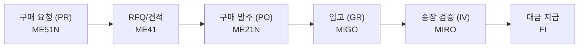

# SAP MM 전체 프로세스 허브

SAP MM(Materials Management) 모듈의 전체 흐름을 파악하고, 각 세부 섹션으로 연결하는 허브 페이지입니다.

---

## MM 모듈 핵심 프로세스 (P2P)

---

## 학습 섹션 연결

| 섹션 | 설명 |
|------|------|
| [🔄 MM 모듈 개요]({{ '/process/01-overview/' | relative_url }}) | 조직 구조, 핵심 개념 |
| [🔄 P2P 전체 흐름]({{ '/process/02-flow/' | relative_url }}) | 프로세스 단계별 상세 |
| [🔄 타 모듈 통합]({{ '/process/03-integration/' | relative_url }}) | FI, PP, SD 연계 |
| [📦 기준 정보]({{ '/master-data/index/' | relative_url }}) | 자재, 공급업체, Info Record |
| [🛒 구매관리]({{ '/purchasing/index/' | relative_url }}) | PR - PO - GR |
| [📊 재고관리]({{ '/inventory/index/' | relative_url }}) | Movement Type, 재고 유형 |
| [🧾 송장 검증]({{ '/invoice/index/' | relative_url }}) | 3-way Matching, MIRO |

---

## 3일 SAP MM 기초 프로세스 커리큘럼

> 하루 30~40분. 개념 읽기 + 블로그 정리. 실 SAP 없어도 가능.
{: .callout .callout-tip}

### Day 1: 기준 정보 (자재관리) - 모든 프로세스의 출발점

- [ ] MM 모듈 개요 읽기 (조직 구조: Plant / Company Code / Purch. Org)
      → [MM 전체 구조](/mm/process/01-overview/)
- [ ] Material Master: 뷰 구조 이해 (Purchasing View 중심)
      → [자재 기준 정보](/mm/master-data/01-material-master/)
- [ ] 공급업체 기준 정보: BP 트랜잭션 이해 (구 XK01 → 현재 BP)
      → [공급업체 기준 정보](/mm/master-data/02-vendor-master/)
- [ ] Purchasing Info Record: 자재 + 공급업체 연결 개념
      → [Info Record & Source List](/mm/master-data/03-purchasing-info/)
- [ ] 오늘 학습 내용 `_posts/` 일지 작성

### Day 2: 구매 프로세스 핵심 (P2P 흐름)

- [ ] PR 개념 (ME51N 화면 구조, PR→PO 전환 방법)
      → [구매 요청서](/mm/purchasing/01-purchase-requisition/)
- [ ] PO 개념 (ME21N 헤더/아이템, 문서 유형 NB/FO/UB)
      → [구매 주문서](/mm/purchasing/03-purchase-order/)
- [ ] GR 개념 (MIGO 101, 자동 회계 전표 흐름)
      → [입고 처리](/mm/purchasing/04-goods-receipt/)
- [ ] Invoice Verification 개념 (MIRO, 3-way Matching)
      → [송장 검증](/mm/invoice/01-three-way-matching/)
- [ ] 오늘 학습 내용 `_posts/` 일지 작성

### Day 3: 재고관리 + MM 통합 흐름

- [ ] Movement Type 체계 파악 (1xx/2xx/3xx/5xx)
      → [Movement Types](/mm/inventory/01-movement-types/)
- [ ] 재고 유형 이해 (Unrestricted / QI / Blocked / In-Transit)
      → [재고 유형](/mm/inventory/02-stock-types/)
- [ ] MM-FI 통합 흐름 정리 (GR 전표 / IV 전표)
      → [타 모듈 통합](/mm/process/03-integration/)
- [ ] MM-PP 통합 흐름 정리 (261 출고)
- [ ] 핵심 T-code 복습 (아래 표)
- [ ] 오늘 학습 내용 `_posts/` 일지 작성

---

## 핵심 T-code 요약

| 영역 | T-code | 설명 |
|------|--------|------|
| 자재 마스터 | MM01/02/03 | 자재 생성/변경/조회 |
| 공급업체 | BP | 비즈니스 파트너 (S/4HANA) |
| Info Record | ME11/12/13 | 구매 정보 레코드 |
| 구매 요청 | ME51N/52N/53N | PR 생성/변경/조회 |
| 구매 발주 | ME21N/22N/23N | PO 생성/변경/조회 |
| 입고 | MIGO | 입고/출고/이동 처리 |
| 송장 검증 | MIRO | 송장 입력 |
| 재고 조회 | MMBE | 재고 현황 |
| 문서 조회 | MB51 | 자재 문서 목록 |
