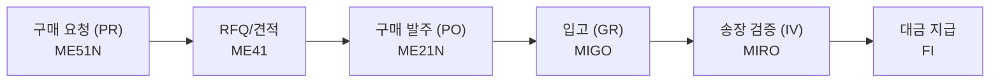

# SAP MM 전체 프로세스 허브

SAP MM(Materials Management) 모듈의 전체 흐름을 파악하고, 각 세부 섹션으로 연결하는 허브 페이지입니다.

---

## MM 모듈 핵심 프로세스 (P2P)

---

## 학습 섹션 연결

| 섹션 | 설명 |
|------|------|
| [🔄 MM 모듈 개요]({{ '/process/01-overview/' | relative_url }}) | 조직 구조, 핵심 개념 |
| [🔄 P2P 전체 흐름]({{ '/process/02-flow/' | relative_url }}) | 프로세스 단계별 상세 + MRP |
| [🔄 타 모듈 통합]({{ '/process/03-integration/' | relative_url }}) | FI, PP, SD 연계 |
| [📦 기준 정보]({{ '/master-data/index/' | relative_url }}) | 자재, 공급업체, Info Record |
| [🛒 구매관리]({{ '/purchasing/index/' | relative_url }}) | PR - PO - GR |
| [📊 재고관리]({{ '/inventory/index/' | relative_url }}) | Movement Type, 재고 유형 |
| [🧾 송장 검증]({{ '/invoice/index/' | relative_url }}) | 3-way Matching, MIRO |
