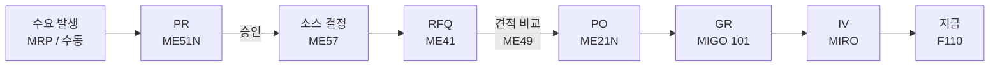

# 표준 구매 (Standard Purchase)

## 1. 언제 사용하는가

- 처음 거래하는 공급업체 또는 기존 계약이 없는 경우
- 단가를 시장에서 비교하여 최적 공급업체를 선정해야 할 때
- 가장 기본적인 P2P 프로세스

---

## 2. 프로세스 흐름

---

## 3. 단계별 핵심 정리

### PR - 구매 요청 (Purchase Requisition)

| 항목 | 내용 |
|------|------|
| T-code | ME51N (생성) / ME52N (변경) / ME53N (조회) |
| 문서 유형 | NB (표준) |
| 주요 필드 | 자재번호, 수량, 납기일, Plant, 구매 그룹 |
| 승인 | 릴리스 전략에 따라 금액/조직 기준 자동 라우팅 |

### RFQ - 견적 요청 (Request for Quotation)

| 항목 | 내용 |
|------|------|
| T-code | ME41 (RFQ 생성) / ME47 (견적 입력) / ME49 (가격 비교) |
| 문서 유형 | AN |
| 목적 | 복수 공급업체에 가격/납기 조건 요청 후 비교 |
| 결과 | 최저가 또는 최적 조건 공급업체 선정 → PO 전환 |

#### RFQ를 생략할 수 있는 경우

표준 구매 흐름에 RFQ가 포함되지만, 실무에서는 아래 조건 중 하나라도 해당하면 RFQ 없이 바로 PO를 생성한다.

| 생략 조건 | 설명 |
|---------|------|
| **소스 자동 결정** | Info Record / Source List / Contract가 있으면 ME57이 공급업체를 자동 배정 - PO 직접 전환 가능 |
| **기존 거래처 반복 구매** | 단가·납기 조건을 이미 알고 있는 경우. Info Record에 조건이 기록되어 있음 |
| **장기 계약(Contract) 존재** | 수량 계약(MK) 또는 금액 계약(WK)이 있으면 단가가 고정되어 있어 견적 불필요 |
| **소액 또는 긴급 구매** | 견적 비교 절차 비용이 절감 효과보다 크거나, 납기가 긴급한 경우 |
| **단일 공급원 (Sole Source)** | 독점 부품, 전용 사양 자재 등 대안 공급업체가 없는 경우 |

> **핵심 원칙**: RFQ는 "공급업체를 모를 때" 쓰는 절차다. 공급업체가 이미 정해져 있다면 RFQ 없이 바로 PO를 생성하는 것이 표준 실무다.
{: .callout .callout-note}

### PO - 구매 오더 (Purchase Order)

| 항목 | 내용 |
|------|------|
| T-code | ME21N (생성) / ME22N (변경) / ME23N (조회) |
| 문서 유형 | NB |
| Header | 공급업체, 통화, 지급조건, 인코텀즈 |
| Item | 자재, 수량, 단가, 납기일, Plant, 계정지정 |
| 계정 지정 | 없음 (재고 자재) |

### GR - 입고 (Goods Receipt)

| 항목 | 내용 |
|------|------|
| T-code | MIGO |
| 이동 유형 | **101** (PO 기준 입고) |
| 자동 생성 | 자재 문서 + 회계 전표 |
| 회계 처리 | 재고 계정(BSX) 차변 / GR/IR 계정(WRX) 대변 |

### IV - 송장 검증 (Invoice Verification)

| 항목 | 내용 |
|------|------|
| T-code | MIRO (입력) / MIR4 (조회) / MRBR (블록 해제) |
| 3-Way Matching | PO 단가 ↔ GR 수량 ↔ Invoice 금액 |
| 회계 처리 | GR/IR 계정(WRX) 차변 / 공급업체 채무(AP) 대변 |

---

## 4. 회계 전표 흐름

| 단계 | 차변 | 대변 |
|------|------|------|
| PO 생성 | (없음) | (없음) |
| GR 입고 | 재고 계정 (BSX) | GR/IR 계정 (WRX) |
| IV 송장 | GR/IR 계정 (WRX) | 공급업체 채무 (AP) |
| FI 지급 | 공급업체 채무 (AP) | 은행 (Bank) |

---

## 5. 주요 체크포인트

| 단계 | 확인 사항 |
|------|---------|
| PR 생성 | 납기일 현실성, 구매 그룹 지정 |
| RFQ | 최소 2~3개 업체 견적 확보, 가격 비교 (ME49) |
| PO 생성 | 납품 Plant, 지급조건, 인코텀즈 확인 |
| GR | PO 수량 대비 실수령 수량 확인, 보관 위치 지정 |
| IV | 가격 허용차 내 일치 여부 확인 |

---

## 6. 관련 T-code 정리

| T-code | 설명 |
|--------|------|
| ME51N | PR 생성 |
| ME57 | PR 소스 지정 및 PO 전환 |
| ME41 | RFQ 생성 |
| ME47 | 견적 입력 |
| ME49 | 가격 비교표 |
| ME21N | PO 생성 |
| ME2N | PO 목록 조회 |
| MIGO | 입고 처리 |
| MB52 | 창고 재고 조회 |
| MIRO | 송장 입력 |
| F110 | 자동 지급 |
