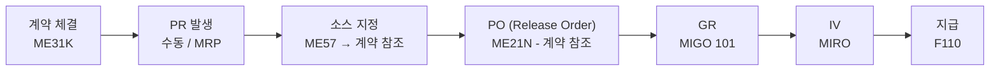

# 계약 기반 구매 (Contract-based Purchase)

## 1. 언제 사용하는가

- 장기 거래 공급업체와 사전에 단가/조건을 합의한 경우
- 동일 자재를 반복적으로 구매하는 경우
- RFQ 없이 바로 발주하여 조달 리드타임을 단축하고 싶을 때

---

## 2. 계약 유형

| 유형 | 코드 | 설명 |
|------|------|------|
| 수량 계약 (Quantity Contract) | MK | 계약 기간 동안 총 수량 약정. 수량 소진 시 계약 종료 |
| 금액 계약 (Value Contract) | WK | 계약 기간 동안 총 금액 약정. 금액 소진 시 계약 종료 |

---

## 3. 프로세스 흐름

---

## 4. 단계별 핵심 정리

### 계약 생성 (Contract)

| 항목 | 내용 |
|------|------|
| T-code | ME31K (생성) / ME32K (변경) / ME33K (조회) |
| 문서 유형 | MK (수량) / WK (금액) |
| 유효 기간 | Validity Start ~ End 일자 설정 필수 |
| 주요 내용 | 공급업체, 자재, 합의 단가, 통화, 납품 Plant |

> 계약 단가는 Info Record보다 우선 적용된다. PO 생성 시 자동으로 계약 단가가 제안된다.
{: .callout .callout-note}

### PO - Release Order (출고 오더)

- 계약을 참조하여 생성하는 PO를 **Release Order**라고 부름
- PO Item에 계약 번호와 행 번호가 자동 연결됨
- 계약 잔여 수량/금액이 자동으로 차감됨

| 항목 | 내용 |
|------|------|
| T-code | ME21N |
| 계약 참조 | PO 생성 시 계약 번호 직접 입력 또는 ME57에서 자동 연결 |
| 단가 | 계약에서 자동 적용 (수동 변경 불가 또는 허용차 내 변경) |

### 계약 소진 모니터링

| T-code | 설명 |
|--------|------|
| ME3M | 자재별 계약 조회 |
| ME3L | 공급업체별 계약 조회 |
| ME3N | 계약 번호로 직접 조회 |

---

## 5. 표준 구매와의 차이점

| 구분 | 표준 구매 | 계약 기반 구매 |
|------|---------|------------|
| RFQ | 필요 | 불필요 (계약 시 이미 협상 완료) |
| 단가 결정 | PO 생성 시 | 계약 체결 시 사전 확정 |
| 반복 발주 | 매번 단가 협상 필요 | 계약 내 자동 적용 |
| 조달 속도 | 느림 | 빠름 |

---

## 6. 주요 체크포인트

| 단계 | 확인 사항 |
|------|---------|
| 계약 생성 | 유효 기간, 최소 발주 수량, 가격 조건 |
| PO 생성 | 계약 잔여 수량 초과 여부 |
| 계약 만료 전 | 갱신 또는 신규 계약 협상 필요 |

---

## 7. 관련 T-code 정리

| T-code | 설명 |
|--------|------|
| ME31K | 계약 생성 |
| ME32K | 계약 변경 |
| ME33K | 계약 조회 |
| ME3M | 자재별 계약 목록 |
| ME57 | PR 소스 지정 (계약 연결) |
| ME21N | Release Order (PO) 생성 |
| MIGO | 입고 (101) |
| MIRO | 송장 검증 |
