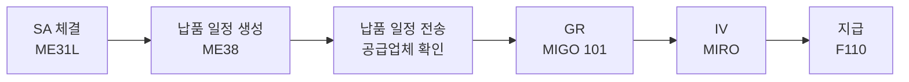

# 스케줄링 어그리먼트 (Scheduling Agreement)

## 1. 언제 사용하는가

- 동일 공급업체에게 **정기적으로 반복 납품**을 받는 경우
- 자동차, 전자 제조업 등 **JIT(Just-In-Time) 납품** 환경
- 납품 일정을 시스템으로 관리하고 자동으로 공급업체에 전송하고 싶을 때

---

## 2. 유형

| 유형 | 코드 | 설명 |
|------|------|------|
| LP (스케줄링 어그리먼트) | LP | 납품 일정을 수동으로 생성. 가장 일반적 |
| LPA (납품 일정 스케줄링 어그리먼트) | LPA | 자동 납품 일정 생성. SA를 참조한 별도 납품 일정 전표 사용 |

---

## 3. 프로세스 흐름

---

## 4. 단계별 핵심 정리

### SA 생성 (Scheduling Agreement)

| 항목 | 내용 |
|------|------|
| T-code | ME31L (생성) / ME32L (변경) / ME33L (조회) |
| 문서 유형 | LP / LPA |
| 주요 내용 | 공급업체, 자재, 합의 단가, 유효 기간, 총 계약 수량 |

> SA는 PO를 생성하지 않는다. 대신 **납품 일정(Delivery Schedule)**이 발주 역할을 한다.
{: .callout .callout-note}

### 납품 일정 생성 (Delivery Schedule)

| 항목 | 내용 |
|------|------|
| T-code | ME38 (납품 일정 유지) |
| 내용 | 날짜별 납품 수량 입력 (예: 매주 월요일 100ea) |
| 전송 | ME9L로 EDI/팩스/이메일로 공급업체에 자동 전송 가능 |

### GR 및 이후 프로세스

- 계약 기반 구매와 동일: MIGO(101) → MIRO → F110
- GR 시 SA 번호가 자동 참조됨

---

## 5. 표준 구매와의 차이점

| 구분 | 표준 구매 | 스케줄링 어그리먼트 |
|------|---------|----------------|
| 발주 단위 | PO (건별) | 납품 일정 (기간별) |
| 반복 발주 | 매번 PO 생성 | 납품 일정만 업데이트 |
| JIT 지원 | 어려움 | 용이 (시간 단위 일정 가능) |
| 공급업체 통보 | PO 발행 | 납품 일정 전송 |

---

## 6. 주요 체크포인트

| 단계 | 확인 사항 |
|------|---------|
| SA 생성 | 유효 기간, 총 계약 수량 설정 |
| 납품 일정 | 일정 확정 전 공급업체와 협의 |
| GR | 납품 일정 대비 실입고 수량 차이 모니터링 |
| SA 잔여 수량 | 계약 수량 소진 전 갱신 협상 |

---

## 7. 관련 T-code 정리

| T-code | 설명 |
|--------|------|
| ME31L | SA 생성 |
| ME32L | SA 변경 |
| ME33L | SA 조회 |
| ME38 | 납품 일정 유지 (Delivery Schedule) |
| ME3L | 공급업체별 SA 목록 |
| ME9L | 납품 일정 메시지 출력 (공급업체 전송) |
| MIGO | 입고 (101) |
| MIRO | 송장 검증 |
