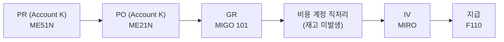

# 무재고/소모성 구매 (Non-stock Purchase)

## 1. 언제 사용하는가

- **재고로 관리하지 않는** 소모품, 간접재, 서비스 구매 시
- 구매 즉시 비용으로 처리해야 하는 경우
- 예: 사무용품, 청소용역, 마케팅 비용, 복리후생비

---

## 2. 프로세스 흐름

---

## 3. 핵심 개념: Account Assignment (계정 지정)

PO Item의 **Account Assignment Category**를 설정하면 GR 시 재고 계정이 아닌 **비용 계정으로 직접 처리**된다.

| 코드 | 유형 | 사용 예 | 필요 입력값 |
|------|------|--------|-----------|
| **K** | 코스트센터 | 소모품, 간접비 | Cost Center |
| **P** | 프로젝트 | 프로젝트 자재비 | WBS Element |
| **A** | 자산 | 고정자산 구매 | Asset Number |
| **F** | 생산 오더 | 생산 직접재 | Order Number |

---

## 4. 단계별 핵심 정리

### PR/PO 생성

| 항목 | 표준 구매 | 무재고 구매 |
|------|---------|----------|
| Account Assignment | 없음 | K (또는 P, A) |
| 자재 번호 | 필수 | 선택 (텍스트 입력 가능) |
| GR 후 재고 | 발생 | 미발생 |

> Account Assignment K 설정 시 PO Item에 **코스트센터**를 반드시 입력해야 한다.
{: .callout .callout-note}

### GR 처리

| 구분 | 표준 구매 | 무재고 구매 (K) |
|------|---------|--------------|
| 이동 유형 | 101 | 101 |
| 재고 발생 | O | X |
| 회계 처리 | 재고 계정(BSX) 차변 | **비용 계정 차변** |
| GR/IR 계정 | 대변 | 대변 (동일) |

**무재고 GR 회계 전표:**

| 차변 | 대변 |
|------|------|
| 비용 계정 (코스트센터 귀속) | GR/IR 정산 계정 (WRX) |

### IV 처리

- 표준 구매와 동일: MIRO → GR/IR 상쇄 → AP 채무 발생

---

## 5. GR 없이 처리하는 경우 (GR-Based IV 미설정)

PO에서 **GR-Based Invoice Verification** 체크를 해제하면 GR 없이 바로 MIRO에서 송장 처리 가능.

> 단, 이 경우 3-Way Matching이 불완전해져 내부 통제가 약해진다. 소액 소모품에만 제한적으로 사용 권장.
{: .callout .callout-note}

---

## 6. 표준 구매와의 차이점

| 구분 | 표준 구매 | 무재고 구매 |
|------|---------|----------|
| Account Assignment | 없음 | K / P / A |
| GR 후 재고 | 발생 | 미발생 |
| 비용 처리 시점 | 자재 출고 시 | GR 시점 즉시 |
| 자재 마스터 | 필수 | 불필요 (텍스트 구매 가능) |

---

## 7. 관련 T-code 정리

| T-code | 설명 |
|--------|------|
| ME51N | PR 생성 (Account K 설정) |
| ME21N | PO 생성 (Account K 설정) |
| MIGO | GR 처리 (101, 비용 직처리) |
| MIRO | 송장 검증 |
| KS03 | 코스트센터 조회 |
| CJ20N | WBS Element (프로젝트) 조회 |
