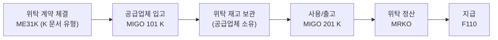

# 위탁 구매 (Consignment)

## 1. 언제 사용하는가

- 공급업체가 **자사 창고에 재고를 보관**하고, 사용(출고) 시에만 대금을 지급하는 방식
- 재고 부족 리스크를 줄이면서 자본 비용도 절감하고 싶을 때
- 예: 반도체 원자재, 부품 업체가 공장 내 창고 운영

---

## 2. 위탁 재고의 특성

| 구분 | 일반 재고 | 위탁 재고 (Consignment) |
|------|---------|----------------------|
| 소유권 | 구매사 | **공급업체** |
| 보관 위치 | 구매사 창고 | 구매사 창고 (동일) |
| 대금 발생 시점 | 입고(GR) 시 | **출고(사용) 시** |
| 재고 표시 | Unrestricted Stock | **Consignment Stock (K)** |

---

## 3. 프로세스 흐름

---

## 4. 단계별 핵심 정리

### 위탁 계약 또는 Info Record 설정

- 위탁 Info Record 생성: ME11 (Info Category: K - Consignment)
- 위탁 계약: ME31K (문서 유형 MK, 위탁 조건 설정)

### 위탁 입고 (Consignment GR)

| 항목 | 내용 |
|------|------|
| T-code | MIGO |
| 이동 유형 | **101 K** (위탁 입고) |
| 재고 유형 | Consignment Stock (K) |
| 회계 전표 | **발생 안 함** (소유권이 공급업체에 있으므로) |

> 일반 입고(101)와 달리 위탁 입고(101 K)는 회계 전표가 생성되지 않는다. 공급업체 소유 재고이기 때문.
{: .callout .callout-note}

### 위탁 출고 / 사용 (Consignment Withdrawal)

| 항목 | 내용 |
|------|------|
| T-code | MIGO |
| 이동 유형 | **201 K** (위탁 재고 소비 - 코스트센터로) |
| 효과 | 위탁 재고 → 자사 소유로 전환 + 비용 발생 |
| 회계 처리 | 비용 계정 차변 / 위탁 채무 계정 대변 |

### 위탁 정산 (Consignment Settlement)

| 항목 | 내용 |
|------|------|
| T-code | **MRKO** |
| 실행 주기 | 보통 월 1회 (합의된 정산 주기) |
| 내용 | 출고된 위탁 재고를 집계하여 공급업체에 청구서 발행 |
| 결과 | AP 채무 발생 → F110으로 지급 |

---

## 5. 위탁 재고 조회

| T-code | 설명 |
|--------|------|
| MB52 | 창고별 재고 조회 (위탁 재고 포함) |
| MB54 | 위탁 재고 전용 조회 |

---

## 6. 표준 구매와의 차이점

| 구분 | 표준 구매 | 위탁 구매 |
|------|---------|--------|
| 입고 시 소유권 | 구매사로 이전 | 공급업체 유지 |
| 입고 시 회계 전표 | 발생 | **미발생** |
| 대금 발생 시점 | 입고(GR) 시 | 출고(사용) 시 |
| 정산 | MIRO (건별) | MRKO (일괄 정산) |

---

## 7. 관련 T-code 정리

| T-code | 설명 |
|--------|------|
| ME11 | 위탁 Info Record 생성 (Category K) |
| MIGO 101 K | 위탁 입고 |
| MIGO 201 K | 위탁 출고 (소비) |
| MB52 | 재고 조회 (위탁 포함) |
| MB54 | 위탁 재고 전용 조회 |
| MRKO | 위탁 정산 실행 |
| F110 | 자동 지급 |

---

## 실습 가이드

단계별 T-code 조작 방법, 스크린 가이드, 오류 처리는 아래 실습 가이드를 참고한다.

- [위탁 구매 Step-by-Step 실습 가이드]({{ '/purchasing-scenarios/tasks/consignment-scenario/' | relative_url }})
