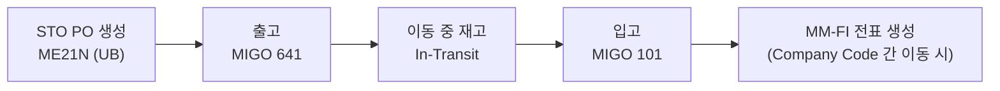

# 플랜트 간 이동 (Stock Transfer Order / STO)

## 1. 언제 사용하는가

- **자사 플랜트 간에 자재를 이동**해야 할 때
- 외부 공급업체 없이 내부 재고를 재배치하는 경우
- 예: 수원 공장(Plant 1001) → 구미 공장(Plant 1002)으로 반제품 이동

---

## 2. STO 유형

| 유형 | 설명 | 특징 |
|------|------|------|
| One-Step Transfer | 직접 이동 전표 | 출고/입고 동시 처리, 이동 중 재고(In-Transit) 없음 |
| Two-Step Transfer | 출고 → 입고 분리 | 실제 운송 시간이 있을 때 사용. 이동 중 재고 관리 가능 |

---

## 3. 프로세스 흐름 (Two-Step)

---

## 4. 단계별 핵심 정리

### STO PO 생성

| 항목 | 내용 |
|------|------|
| T-code | ME21N |
| 문서 유형 | **UB** (Stock Transport Order) |
| 공급 플랜트 | 재고를 보내는 Plant (Header에 설정) |
| 수령 플랜트 | 재고를 받는 Plant (Item의 납품처 Plant) |
| 공급업체 | 없음 (내부 이동) |

> UB 유형의 PO는 공급업체 필드가 없다. 대신 **공급 플랜트(Supplying Plant)**를 지정한다.
{: .callout .callout-note}

### 출고 (Goods Issue)

| 항목 | 내용 |
|------|------|
| T-code | MIGO |
| 이동 유형 | **641** (STO 출고 - Two-Step) / **351** (One-Step) |
| 처리 Plant | 공급 Plant에서 실행 |
| 결과 | 공급 Plant 재고 감소, In-Transit 재고 발생 |

### 입고 (Goods Receipt)

| 항목 | 내용 |
|------|------|
| T-code | MIGO |
| 이동 유형 | **101** (STO PO 기준 입고) |
| 처리 Plant | 수령 Plant에서 실행 |
| PO 참조 | STO PO 번호 참조 |
| 결과 | In-Transit 재고 감소, 수령 Plant 재고 증가 |

---

## 5. 회계 처리 (Company Code 간 이동 시)

동일 Company Code 내 플랜트 간 이동은 재고 계정만 이동하지만,
**다른 Company Code 간 이동**은 내부 매출/매입 전표가 자동 생성된다.

| 구분 | 동일 Company Code | 다른 Company Code |
|------|-----------------|-----------------|
| 출고 전표 | 재고 계정 간 대체 | 내부 매출 전표 생성 |
| 입고 전표 | 재고 계정 증가 | 내부 매입 전표 생성 |
| IV (MIRO) | 불필요 | 필요 (내부 정산) |

---

## 6. 이동 중 재고 조회

| T-code | 설명 |
|--------|------|
| MB52 | 플랜트별 재고 조회 |
| MMBE | 자재별 재고 현황 (In-Transit 포함) |
| ME2O | STO 출고 모니터링 (공급 Plant 기준) |

---

## 7. 표준 구매와의 차이점

| 구분 | 표준 구매 | STO |
|------|---------|-----|
| 공급업체 | 외부 공급업체 | 내부 플랜트 |
| PO 문서 유형 | NB | UB |
| 출고 이동 유형 | 없음 (공급업체가 처리) | 641 (공급 Plant) |
| 입고 이동 유형 | 101 | 101 |
| 송장 (IV) | 필요 (MIRO) | 동일 CC: 불필요 / 다른 CC: 필요 |

---

## 8. 관련 T-code 정리

| T-code | 설명 |
|--------|------|
| ME21N | STO PO 생성 (문서 유형 UB) |
| ME23N | STO PO 조회 |
| MIGO 641 | STO 출고 (Two-Step) |
| MIGO 101 | STO 입고 (수령 Plant) |
| MMBE | 자재별 재고 현황 (In-Transit 포함) |
| MB52 | 창고별 재고 조회 |
| ME2O | STO 출고 모니터링 |
