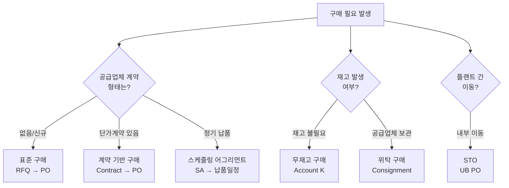

# 구매 시나리오 (Purchasing Scenarios)

SAP MM에서 자재/서비스를 조달하는 방법은 상황에 따라 다르다.
각 시나리오는 **공급업체와의 계약 방식**, **재고 처리 방법**, **프로세스 복잡도**에 따라 구분된다.

---

## 시나리오 선택 가이드

---

## 시나리오별 비교

| 시나리오 | 프로세스 흐름 | 재고 발생 | 공급업체 | 주요 특징 |
|---------|-------------|:--------:|:-------:|---------|
| [표준 구매]({{ '/purchasing-scenarios/01-standard-purchase/' | relative_url }}) | PR → RFQ → PO → GR → IV | O | 외부 | 기본 구매 프로세스 |
| [계약 기반 구매]({{ '/purchasing-scenarios/02-contract-based/' | relative_url }}) | Contract → PO → GR → IV | O | 외부 | RFQ 생략, 단가 고정 |
| [스케줄링 어그리먼트]({{ '/purchasing-scenarios/03-scheduling-agreement/' | relative_url }}) | SA → 납품일정 → GR → IV | O | 외부 | 정기 납품, JIT |
| [무재고 구매]({{ '/purchasing-scenarios/04-non-stock-purchase/' | relative_url }}) | PO(K) → GR → IV | - | 외부 | 비용 직처리, 재고 미발생 |
| [위탁 구매]({{ '/purchasing-scenarios/05-consignment/' | relative_url }}) | 보관 → 출고 → MRKO | - | 외부 | 사용 시점 정산 |
| [플랜트 간 이동 (STO)]({{ '/purchasing-scenarios/06-sto/' | relative_url }}) | UB PO → 출고(641) → 입고(101) | O | 내부 | 공급업체 없음 |

---

## 언제 어떤 시나리오를 쓰나?

| 상황 | 추천 시나리오 |
|------|------------|
| 처음 거래하는 공급업체, 단가 미정 | 표준 구매 (RFQ 필수) |
| 단가계약 맺은 공급업체 반복 구매 | 계약 기반 구매 |
| 매월 정해진 수량 납품받는 경우 | 스케줄링 어그리먼트 |
| 소모품, 복리후생비, 마케팅 비용 | 무재고 구매 (Account K) |
| 공급업체가 우리 창고에 보관, 사용 시 정산 | 위탁 구매 |
| 자사 플랜트 간 자재 이동 | STO |
