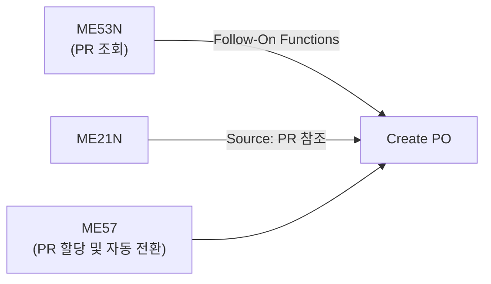

# 구매 요청서 (Purchase Requisition / PR)

## 개요

PR은 내부 부서에서 구매팀으로 자재/서비스 구매를 요청하는 **내부 문서**입니다.
공급업체에게는 보이지 않으며, 승인 후 PO로 전환됩니다.

---

## PR 생성 방법

1. **수동 생성**: ME51N - 담당자가 직접 작성
2. **MRP 자동 생성**: MD01/MD02 실행 시 재고 부족으로 자동 생성
3. **생산 오더**: PP 오더 확정 시 자동 생성

---

## 화면 구조 (ME51N)

### 헤더 (Header)
- Document Type (NB: Standard)
- PR 번호 (자동 채번)

### 아이템 (Item)
| 필드 | 설명 |
|------|------|
| Item Category | 공백(표준) / D(서비스) / K(위탁) |
| Material | 자재 번호 |
| Short Text | 자재 설명 (자재 번호 없을 때) |
| Quantity | 요청 수량 |
| Unit | 단위 |
| Delivery Date | 납기일 |
| Plant | 조달 플랜트 |
| Storage Location | 보관 위치 |
| Purchasing Group | 구매 그룹 |
| Account Assignment | 계정 지정 (비재고 구매 시) |

---

## Account Assignment (계정 지정)

비재고 구매 또는 소비 직접 처리 시 필요:

| 카테고리 | 코드 | 설명 |
|---------|------|------|
| 원가 센터 | K | 소모품, 운영 비용 |
| 내부 오더 | F | 프로젝트/이벤트 비용 |
| WBS 요소 | P | Project 구매 |
| 자산 | A | 자산 취득 |

---

## PR → PO 전환

---

## T-code

| T-code | 설명 |
|--------|------|
| ME51N | PR 생성 |
| ME52N | PR 변경 |
| ME53N | PR 조회 |
| ME5A | PR 목록 조회 |
| ME57 | PR 할당/처리 (소스 지정 + PO 전환) |
| ME54N | PR 승인 |

---

## 스크린샷

> 스크린샷은 실제 SAP 시스템에서 캡쳐 후 아래에 추가합니다.
> 이미지 경로: `assets/img/purchasing/me51n-{순번}-{설명}.png`

<!-- 예시:  -->
<!-- 예시:  -->

---

## 필드 → 마스터 연관

| 화면 필드 | 데이터 출처 | 설정/관리 위치 | 비고 |
|---------|-----------|-------------|------|
| Material | 자재 마스터 | MM01 (자재 생성) | F4 검색 도움 |
| Plant | 조직 구조 | SPRO → Enterprise Structure → Logistics | |
| Storage Location | 자재 마스터 | MM01 General Plant Storage | |
| Purchasing Group | 자재 마스터 | MM01 Purchasing View | 기본값 자동 로드 |
| Account Assignment Category | 계정 지정 카테고리 | SPRO → MM → Purchasing → Account Assignment → Define AA Categories | K, F, P, A 유형 |
| Delivery Date | 수동 입력 | - | 자재 마스터 Planned Deliv. Time 참고 |
| Document Type | 문서 유형 마스터 | SPRO → MM → Purchasing → Define Document Types for PR | NB (표준) |

---

## 관련 SPRO 설정

→ [구매 설정 가이드](/mm/config-guide/purchasing/) 참조
