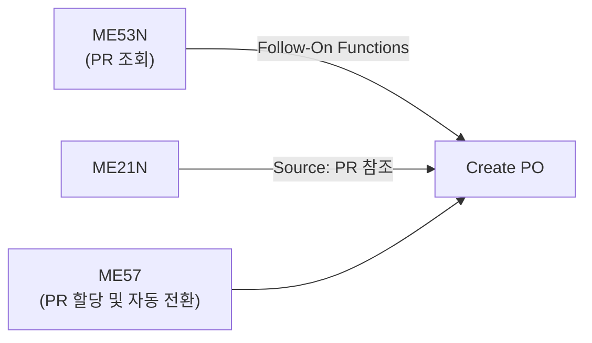

# 구매 요청서 (Purchase Requisition / PR)

## 개요

PR은 내부 부서에서 구매팀으로 자재/서비스 구매를 요청하는 **내부 문서**입니다.
공급업체에게는 보이지 않으며, 승인 후 PO로 전환됩니다.

생성된 PR은 다음 방법으로 처리됩니다:
- **RFQ 발행** - 업체에 견적 요청
- **소스 지정 (Source Assignment)** - 특정 업체/계약 지정 후 PO 전환
- **자동 발주** - Info Record, Source List 기준으로 자동 PO 생성
- **개별 발주** - 구매담당자가 직접 PO 생성

---

## PR 생성 방법

| 방법 | 설명 |
|------|------|
| **수동 생성 (ME51N)** | 담당자가 직접 작성. 구매 대상 품목, 수량, 납기 직접 입력 |
| **MRP 자동 생성** | MD01/MD02 실행 시 재고 부족으로 자동 생성 |
| **PM/PS 자동 생성** | 설비 정비 오더(PM) 또는 프로젝트 시스템(PS)에서 자동 생성 |

---

## ME51N - PR 생성 화면 구조

PR은 **헤더 - 품목 개요 - 품목 세부사항** 세 그룹으로 구분됩니다.

### 품목 개요 (Item Overview) 주요 필드

| 번호 | 필드명 | 설명 |
|------|-------|------|
| 1 | **품목 범주 (Item Category)** | 구매 요청하려는 자재의 유형. 공백=표준 구매 자재, K=위탁 자재, L=무상사급 자재 |
| 2 | **자재 번호 (Material Number)** | 구매 요청할 자재번호 입력 (F4 검색 도움 사용 가능) |
| 3 | **요청 수량** | 필요한 수량 입력. 단위는 Info Record, 자재 마스터를 참고하여 주문단위 자동 설정 |
| 4 | **납품일** | 자재가 도착하기 원하는 날짜. 자재 마스터 Planned Delivery Time을 참조하여 자동 입력 |
| 5 | **요청자** | 구매 요청을 작성하는 사람이나 부서명 입력 |
| 6 | **추적번호 (Tracking Number)** | 이 자재의 구매요청 처리 진행 상태를 나중에 추적할 때 사용하는 번호. ME5A에서 검색 키로 사용 |
| 7 | **구매그룹** | 이 구매 요청을 처리할 구매 담당자. 자재 마스터의 구매 그룹 정보에 따라 자동 입력 |

### 품목 세부사항 - 수량/일자 탭 (Quantities/Dates)

| 번호 | 필드명 | 설명 |
|------|-------|------|
| 1 | **수량 (Quantity)** | 요청수량 |
| 2 | **오더수량 (Quantity Ordered)** | 구매오더로 전환된 수량 |
| 3 | **미결수량 (Quantity Open)** | 구매오더로 전환되지 않은 수량 |
| 4 | **납품일 (Delivery Date)** | 자재의 납품 또는 서비스 제공이 수행될 날짜 |
| 5 | **요청일 (Request Date)** | 구매요청이 생성된 날짜 |
| 6 | **릴리스일 (Release Date)** | 구매요청이 구매오더로 변환이 되어야 하는 날짜. 입력된 날짜까지 구매요청 승인이 이루어져야 함 |
| 7 | **계획 납품 기간 (Planned Delivery Time)** | 자재를 외부에서 조달하는 데 소요되는 일반적인 날짜. **달력일수(Calendar Day, 역일)**로 계산 |
| 8 | **입고소요일수 (GR Processing Time)** | 자재 입고 처리하는 데 걸리는 날짜. **영업일수(Business Day, Working Day)**로 계산 |
| 9 | **마감 (Closed)** | 구매요청을 더 이상 구매오더로 전환하지 않을 경우 사용 |

> **납품 기간 계산 차이**: Planned Delivery Time은 달력일수(토/일 포함), GR Processing Time은 영업일수(근무일 기준)로 계산됩니다.
{: .callout .callout-note}

---

## Account Assignment (계정 지정)

비재고 구매 또는 소비 직접 처리 시 필요. 구매 비용을 특정 회계 개체에 귀속:

| 카테고리 | 코드 | 설명 | 예시 |
|---------|------|------|------|
| 표준 (재고 구매) | 공백 | 일반 재고 자재 구매. 재고 계정으로 자동 전기 | 원자재, 부품 등 |
| 원가 센터 | K | 소모품, 운영 비용. 코스트센터에 비용 귀속 | 사무용품, MRO |
| 내부 오더 | F | 프로젝트/이벤트 비용 | 특정 프로젝트 비용 |
| WBS 요소 | P | 프로젝트 구매 (PS 모듈 연계) | 건설 프로젝트 |
| 자산 | A | 자산 취득. 자산 번호와 G/L 계정 입력 | 설비, 비품 |

---

## PR → PO 전환 방법

| 방법 | 설명 |
|------|------|
| ME53N Follow-On | PR 조회 화면에서 직접 PO 생성 메뉴 실행 |
| ME21N 참조 | PO 생성 화면에서 문서개요(Document Overview)를 통해 PR 선택 후 복사 |
| ME57 자동 전환 | PR 목록을 조회하고 소스 지정 후 일괄 PO 전환 |

---

## ME5A - PR 목록 조회 검색 조건

| 번호 | 필드명 | 설명 |
|------|-------|------|
| 1 | **구매요청 번호** | 특정 PR 번호로 조회 |
| 2 | **구매그룹** | 구매그룹(구매담당자/팀) 지정하여 조회 |
| 3 | **요청 추적번호 (Requirement Tracking Number)** | PR 품목 세부 화면에서 입력한 Tracking Number와 동일한 PR만 조회 |
| 4 | **구매요청 담당자 (Requisitioner)** | 요청자 정보가 기록된 PR만 표시 |
| 5 | **지정된 구매요청** | 이미 공급업체가 할당된 PR만 조회 시 체크. 체크 해제 시 미할당 PR만 조회 |
| 6 | **마감된 요청** | 미결 수량이 없는 PR만 조회 |
| 7 | **분할 오더 요청** | 일부만 PO로 전환되어 미결 수량이 있는 PR만 조회 |
| 8 | **릴리즈된 요청만** | 승인(릴리스) 완료된 PR만 조회 (승인 프로세스 사용 시) |

---

## PR 승인 (Release)

| T-code | 설명 |
|--------|------|
| ME54N | PR 개별 릴리스 - 품목별로 각각 릴리스 수행 |
| ME55 | PR 일괄 릴리스 - 전체 릴리스 리스트 확인 후 해당 PR에 릴리스 진행 |

---

## T-code

| T-code | 설명 |
|--------|------|
| ME51N | PR 생성 |
| ME52N | PR 변경 |
| ME53N | PR 조회 |
| ME5A | PR 목록 조회 |
| ME54N | PR 개별 승인 (릴리스) |
| ME55 | PR 일괄 승인 (릴리스) |
| ME57 | PR 할당/처리 (소스 지정 + PO 전환) |

---

## 스크린샷

> 스크린샷은 실제 SAP 시스템에서 캡쳐 후 아래에 추가합니다.
> 이미지 경로: `assets/img/purchasing/me51n-{순번}-{설명}.png`

<!-- 예시:  -->
<!-- 예시:  -->

---

필드 - 마스터 연관

| 화면 필드 | 데이터 출처 | 설정/관리 위치 | 비고 |
|---------|-----------|-------------|------|
| Material | 자재 마스터 | MM01 (자재 생성) | F4 검색 도움 |
| Plant | 조직 구조 | SPRO - Enterprise Structure - Logistics | |
| Storage Location | 자재 마스터 | MM01 General Plant Storage | |
| Purchasing Group | 자재 마스터 | MM01 Purchasing View | 기본값 자동 로드 |
| Account Assignment Category | 계정 지정 카테고리 | SPRO - MM - Purchasing - Account Assignment - Define AA Categories | K, F, P, A 유형 |
| Delivery Date | 수동 입력 | - | 자재 마스터 Planned Deliv. Time 참고 |
| Document Type | 문서 유형 마스터 | SPRO - MM - Purchasing - Define Document Types for PR | NB (표준) |

---

## 관련 SPRO 설정

- [구매 설정 가이드](/mm/config-guide/purchasing/) 참조
