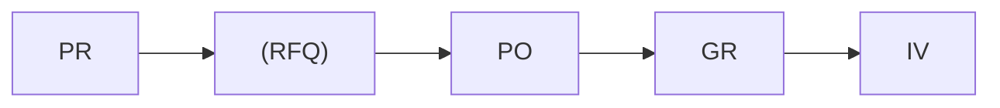
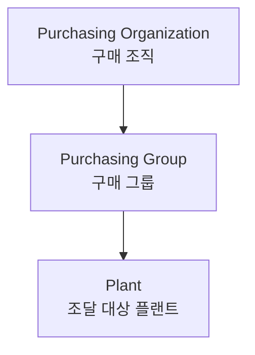

# 구매관리 (Purchasing)

SAP MM 구매 프로세스는 **P2P (Purchase to Pay)** 흐름으로 구성됩니다.

---

## 구매 프로세스 흐름

| 단계 | 문서 | T-code |
|------|------|--------|
| [구매 요청](/mm/purchasing/01-purchase-requisition/) | PR | ME51N |
| [RFQ / 견적](/mm/purchasing/02-rfq-quotation/) | RFQ | ME41 |
| [구매 발주](/mm/purchasing/03-purchase-order/) | PO | ME21N |
| [입고 처리](/mm/purchasing/04-goods-receipt/) | 자재 문서 | MIGO |
| [특수 조달](/mm/purchasing/05-special-procurement/) | 다양 | 다양 |

---

## 구매 조직 구조

- **구매 조직**: 공급업체와의 계약/협상 단위
- **구매 그룹**: 실무 담당자/팀 (PO 생성 기본값)
