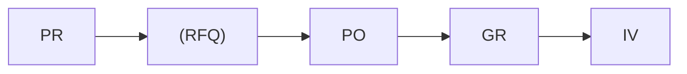
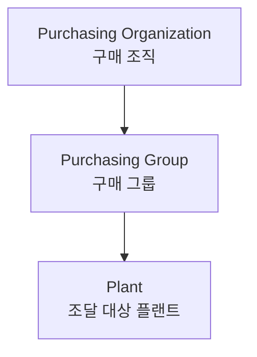

# 구매관리 (Purchasing)

SAP MM 구매 프로세스는 **P2P (Purchase to Pay)** 흐름으로 구성됩니다.

---

## 구매 프로세스 흐름

  

    <h4><a href="{{ '/purchasing/01-purchase-requisition/' | relative_url }}">구매 요청 (PR)</a></h4>
    
구매 요청서 생성 및 관리

    ME51N
  

  

    <h4><a href="{{ '/purchasing/02-rfq-quotation/' | relative_url }}">RFQ / 견적</a></h4>
    
견적 요청 및 공급업체 비교

    ME41
  

  

    <h4><a href="{{ '/purchasing/03-purchase-order/' | relative_url }}">구매 발주 (PO)</a></h4>
    
구매 주문서 생성

    ME21N
  

  

    <h4><a href="{{ '/purchasing/04-goods-receipt/' | relative_url }}">입고 처리 (GR)</a></h4>
    
입고 및 자재 문서 생성

    MIGO
  

  

    <h4><a href="{{ '/purchasing/05-special-procurement/' | relative_url }}">특수 조달</a></h4>
    
외주, 위탁, STO 등

    다양
  

---

## 구매 조직 구조

- **구매 조직**: 공급업체와의 계약/협상 단위
- **구매 그룹**: 실무 담당자/팀 (PO 생성 기본값)
