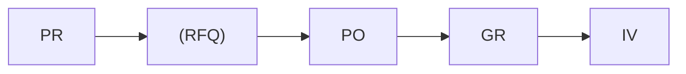
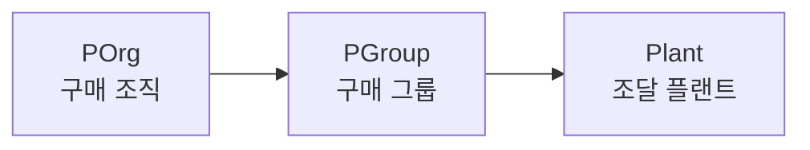

# 구매관리 (Purchasing)

SAP MM 구매 프로세스는 **P2P (Purchase to Pay)** 흐름으로 구성됩니다.

---

## 구매 프로세스 흐름

| 문서 | 설명 | T-code |
|------|------|--------|
| [구매 요청 (PR)]({{ '/purchasing/01-purchase-requisition/' | relative_url }}) | 구매 요청서 생성 및 관리 | ME51N |
| [RFQ / 견적]({{ '/purchasing/02-rfq-quotation/' | relative_url }}) | 견적 요청 및 공급업체 비교 | ME41 |
| [구매 발주 (PO)]({{ '/purchasing/03-purchase-order/' | relative_url }}) | 구매 주문서 생성 | ME21N |
| [입고 처리 (GR)]({{ '/purchasing/04-goods-receipt/' | relative_url }}) | 입고 및 자재 문서 생성 | MIGO |
| [특수 조달]({{ '/purchasing/05-special-procurement/' | relative_url }}) | 외주, 위탁, STO 등 | 다양 |

---

## 구매 조직 구조

- **구매 조직**: 공급업체와의 계약/협상 단위
- **구매 그룹**: 실무 담당자/팀 (PO 생성 기본값)
