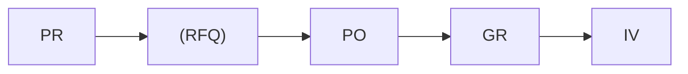
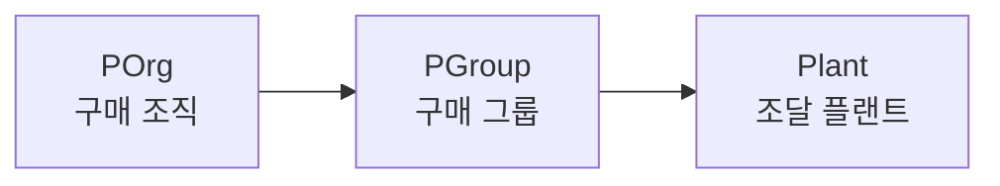

# 구매관리 (Purchasing)

SAP MM 구매 프로세스는 **P2P (Purchase to Pay)** 흐름으로 구성됩니다.

---

## 구매 프로세스 흐름

| 문서 | 설명 | T-code |
|------|------|--------|
| [구매 요청 (PR)]({{ '/purchasing/01-purchase-requisition/' | relative_url }}) | 구매 요청서 생성 및 관리 | ME51N |
| [RFQ / 견적]({{ '/purchasing/02-rfq-quotation/' | relative_url }}) | 견적 요청 및 공급업체 비교 | ME41 |
| [구매 발주 (PO)]({{ '/purchasing/03-purchase-order/' | relative_url }}) | 구매 주문서 생성 | ME21N |
| [입고 처리 (GR)]({{ '/purchasing/04-goods-receipt/' | relative_url }}) | 입고 및 자재 문서 생성 | MIGO |
| [특수 조달]({{ '/purchasing/05-special-procurement/' | relative_url }}) | 외주, 위탁, STO 등 | 다양 |

---

## 구매 조직 구조

- **구매 조직 (Purchasing Organization)**: 공급업체와 자재/서비스의 구매 조건(단가, 납기, 인코텀즈 등)을 협상하는 단위 조직. 1개 이상의 플랜트에 대한 구매를 관장하며, Info Record, 계약 등 구매 마스터의 기준 단위
- **구매 그룹 (Purchasing Group)**: 실제 구매 업무를 수행하는 담당자 또는 담당 부서. PR/PO 생성 시 자재 마스터에 설정된 구매 그룹이 기본값으로 자동 입력됨
- **플랜트 (Plant)**: 자재가 실제 입고되는 조달 대상 단위. 구매 조직은 1개 이상의 플랜트에 할당 가능 (N:M 관계)
